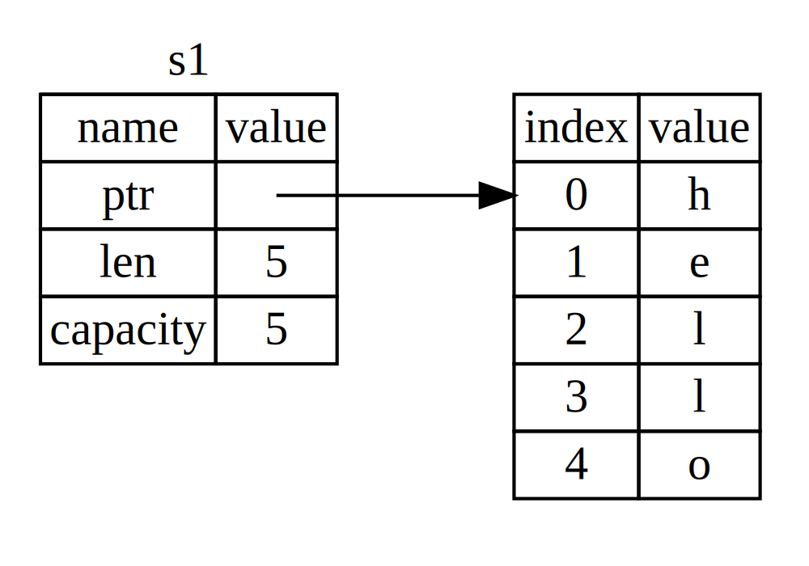
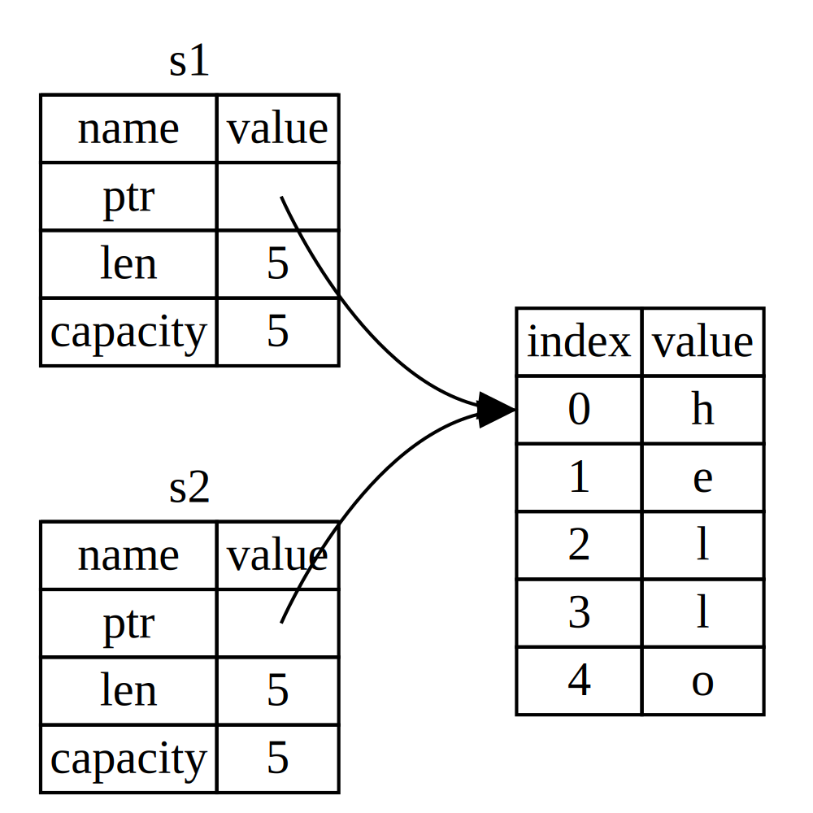
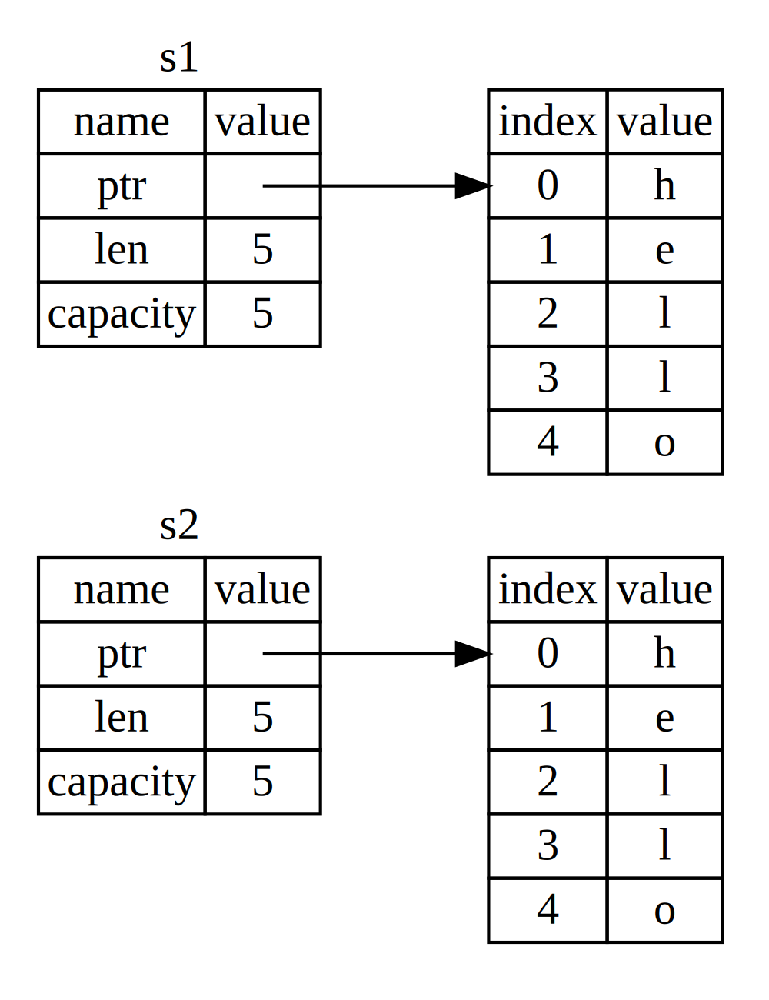

## 소유권이 뭔가요?

러스트의 핵심 기능은 바로 소유권입니다. 이 기능은 직관적으로 설명할 수 있지만, 언어의 나머지 부분에
깊은 영향을 끼칩니다.

모든 프로그램은 실행하는 동안 컴퓨터의 메모리를 사용하는 방법을 관리해야 합니다. 몇몇 언어들은 프로그램이
실행될 때 더이상 사용하지 않는 메모리를 끊임없이 찾는 가비지 콜렉션을 갖고 있습니다; 다른 언어들에서는
프로그래머가 직접 명시적으로 메모리를 할당하고 해제해야 합니다. 러스트는 제 3의 접근법을 이용합니다:
메모리는 컴파일 타임에 컴파일러가 체크할 규칙들로 구성된 소유권 시스템을 통해 관리됩니다. 소유권 기능들의
어떤 것도 런타임 비용이 발생하지 않습니다.

소유권이란 개념이 많은 프로그래머들에게 새로운 것이기 때문에, 이해하고 사용하는 데에는 약간의 시간이
걸립니다만, 좋은 소식은 여러분이 러스트와 소유권 시스템의 규칙에 더 많은 경험을 할수록, 여러분은 더
안전하고 더 효율적인 코드를 자연스럽게 개발할 수 있게될 것이라는 거죠. 견뎌내세요!

여러분이 소유권을 이해했을 때, 여러분은 러스트를 유니크하게 만드는 기능들을 이해하기 위한 견고한 기초를
가지게 될 것입니다. 이 장에서, 여러분은 매우 흔한 데이터 구조인 문자열에 집중된 몇가지 예제를 통해
소유권에 대해 배우게 될 것입니다.


<!-- PROD: START BOX -->

> ### 스택과 힙
>
> 많은 프로그래밍 언어들 안에서, 우리는 그렇게 자주 스택과 힙에 대한 생각을 할 필요가 없습니다. 그렇지만
> 러스트와 같은 시스템 프로그래밍 언어에서는, 값이 스택에 있는지 힙에 있는지의 여부가 언어의 동작 방식과
> 우리의 결단에 더 큰 영향을 줍니다. 우리는 이 장의 뒤쪽에서 스택과 힙에 관계된 소유권의 일부분을 기술할
> 것이기에, 여기서는 준비 삼아 간략한 설명만 하겠습니다.
>
> 스택과 힙 둘다 여러분의 코드상에서 런타임에 사용할 수 있는 메모리의 부분입니다만, 이들은 각기 다른
> 방식으로 구조화 되어 있습니다. 스택은 값을 받아들인 순서대로 값을 저장하고 반대 방향으로 값을 지웁니다.
> 이것을 *last in, first out*이라고 하죠. 쌓여있는 접시를 생각해보세요; 여러분이 접시를 더 추가하려면
> 접시더미의 꼭대기에 쌓아올리고, 여러분이 접시가 필요해지면 꼭대기에서부터 한장 꺼내게 됩니다. 중간이나
> 밑에서부터 접시를 추가하거나 제거하는 건 잘 안될겁니다! 데이터를 추가하는 것을 *스택에 푸시하기*
> (*pushing on the stack*)라고 부르고, 데이터를 제거하는 것을 *스택을 팝하기* (*popping off
> the stack*)라고 부릅니다.
>
> 스택은 데이터에 접근하는 방식 덕택에 빠릅니다: 이 방식은 새로운 데이터를 넣어두기 위한 공간 혹은 데이터를
> 가져올 공간을 검색할 필요가 전혀 없는데, 바로 그 공간이 항상 스택의 꼭대기(top)이기 때문입니다. 스택을
> 빠르게 해주는 또다른 특성은 스택에 담긴 모든 데이터가 결정되어 있는 고정된 크기를 갖고 있어야 한다는
> 점입니다.
>
> 컴파일 타임에 크기가 결정되어 있지 않거나 크기가 변경될 수 있는 데이터를 위해서는, 힙에 데이터를 저장할
> 수 있습니다. 힙은 조금 더 복잡합니다: 데이터를 힙에 넣을때, 먼저 저장할 공간이 있는지 물어봅니다. 그러면
> 운영체제가 충분히 커다란 힙 안의 빈 어떤 지점을 찾아서 이 곳을 사용중이라고 표시하고, 해당 지점의 포인터를
> 우리에게 돌려주죠. 이 절차를 *힙 공간 할당하기*(*allocating on the heap*)라고 부르고, 종종 그냥
> "할당(allocating)"으로 줄여 부릅니다. 스택에 포인터를 푸싱하는 것은 할당에 해당되지 않습니다. 포인터는
> 결정되어 있는 고정된 크기의 값이므로, 우리는 스택에 포인터를 저장할 수 있지만, 실제 데이터를 사용하고자
> 할 때는 포인터를 따라가야 합니다.
>
> 힙에 저장된 데이터에 접근하는 것은 스택에 저장된 데이터에 접근하는 것보다 느린데, 그 이유는 포인터가
> 가리킨 곳을 따라가야 하기 때문입니다. 현대 프로세서들은 메모리 내부를 덜 뛰어다닐 때 더 빨라집니다. 유사한
> 예로, 여러 테이블로부터 주문을 받는 레스토랑의 웨이터를 생각해보세요. 다음 테이블로 움직이기 전에 지금
> 테이블에서 모든 주문을 다 받는 것이 가장 효율적이겠죠. A 테이블에서 하나 주문 받고, 다시 B 테이블로
> 가서 하나 주문 받고, 다시 A로, 다시 B로 가며 하나씩 주문을 받으면 훨씬 느려질 겁니다. 이와 마찬가지로,
> 프로세서는 (힙에 있는 데이터와 같이) 멀리 떨어져 있는 데이터들 보다는 (스택에 있는 것과 같이) 붙어있는
> 데이터들에 대한 작업을 하면 더 빨라집니다. 힙으로부터 큰 공간을 할당받는것 또한 시간이 걸릴 수 있습니다.
>
> 코드의 어느 부분이 힙의 어떤 데이터를 사용하는지 추적하는 것, 힙의 중복된 데이터의 양을 최소화하는 것,
> 그리고 힙 내에 사용하지 않는 데이터를 제거하여 공간이 모자라지 않게 하는 것은 모두 소유권과 관계된
> 문제들입니다. 여러분이 소유권을 이해하고 나면, 여러분은 더이상 스택과 힙에 대한 생각이 자주 필요치 않게
> 될겁니다만, 힙 데이터를 관리하는 것이 곧 소유권의 존재 이유임을 알게 되는 것은 이것이 어떤 방식으로
> 작동하는지 설명하는데 도움을 줄 수 있습니다.
>
<!-- PROD: END BOX -->


### 소유권 규칙

먼저, 소유권 규칙을 알아봅시다. 이것들을 설명할 예제들을 보는 내내 다음의 소유권 규칙들을 명심하세요:

> 1. 러스트의 각각의 값은 해당값의 *오너*(*owner*)라고 불리우는 변수를 갖고 있다.
> 2. 한번에 딱 하나의 오너만 존재할 수 있다.
> 3. 오너가 스코프 밖으로 벗어나는 때, 값은 내려간다(dropped).


### 변수의 스코프

우리는 이미 2장에서 완성된 형태의 러스트 프로그램 예제를 살펴봤습니다. 이제 과거의 기초 문법 형태로
돌아가서, `fn main() {` 코드를 예제에 붙이지 않을테니, 여러분들이 코드를 따라하려면 `main` 함수에
직접 예제들을 넣어야 할 겁니다. 결과적으로, 우리의 예제들은 좀더 간략해저셔 보일러 플레이트 코드에 비해
실제 디테일에 초점을 맞출 수 있도록 해줄 것입니다.

소유권에 대한 첫 예제로서, 변수들의 스코프를 보겠습니다. 스코프란 프로그램 내에서 아이템이 유효함을
표시하기 위한 범위입니다. 아래처럼 생긴 변수가 있다고 해봅시다:

```rust
let s = "hello";
```

변수 `s`는 스트링 리터럴을 나타내는데, 스트링 리터럴의 값은 우리의 프로그램의 텍스트 내에 하드코딩되어
있습니다. 변수는 선언된 시점부터 현재의 *스코프*가 끝날 때까지 유효합니다. 아래 예제 Listing 4-1은
변수 `s`가 유효한 지점을 주석으로 표시했습니다:

```rust
{                      // s는 유효하지 않습니다. 아직 선언이 안됐거든요.
    let s = "hello";   // s는 이 지점부터 유효합니다.

    // s를 가지고 뭔가 합니다.
}                      // 이 스코프는 이제 끝이므로, s는 더이상 유효하지 않습니다.
```

<span class="caption">Listing 4-1: 변수와 이 변수가 유효한 스코프</span>

바꿔 말하면, 두가지 중요한 지점이 있습니다:

1. 스코프 *안에서* `s`가 등장하면, 유효합니다.
1. 이 유효기간은 스코프 *밖으로* 벗어날 때까지 지속됩니다.

이 지점에서, 스코프와 변수가 유효한 시점 간의 관계는 다른 프로그래밍 언어와 비슷합니다. 이제 우리는
이에 대한 이해를 기초로 하여 `String` 타입을 소개함으로써 계속 쌓아나갈 것입니다.

### `String` 타입

소유권 규칙을 설명하기 위하여, 우리는 3장에서 다룬 바 있는 타입보다 더 복잡한 데이터 타입이
필요합니다. 우리가 이전에 봐온 모든 데이터 타입들은 스텍에 저장되었다가 스코프를 벗어날 때
스택으로부터 팝 됩니다만, 우리는 이제 힙에 저장되는 데이터를 관찰하고 러스트는 과연 어떻게 이
데이터를 비워내는지 설명할 필요가 있습니다.

우리는 여기서 `String`을 예제로 활용하되, 소유권과 관련된 `String` 내용의 일부분에 집중할
것입니다. 이러한 관점은 표준 라이브러리나 여러분들이 만들 다른 복잡한 데이터 타입에도 적용됩니다.
`String`에 대해서는 8장에서 더 자세히 다루겠습니다.

스트링 리터럴을 이미 봤는데, 이 값은 프로그램 안에 하드코딩 되어 있습니다. 문자열 값은 편리하지만,
여러분이 텍스트를 필요로 하는 모든 경우에 대해 항상 적절하진 않습니다. 그 중 한가지 이유로, 문자열
값은 불변입니다(immutable). 또다른 이유는 모든 문자열이 우리가 프로그래밍 하는 시점에서 다 알수
있는 것이 아니란 점입니다: 예를 들면, 사용자의 입력을 받아 저장하고 싶다면요? 이러한 경우들에 대해서,
러스트는 두번째 문자열 타입인 `String`을 제공합니다. 이 타입은 힙에 할당되고 그런고로 컴파일 타임에는
우리가 알 수 없는 양의 텍스트를 저장할 수 있습니다. 여러분은 스트링 리터럴로부터 `from`이라는 함수를
이용해서 `String`을 아래처럼 만들 수 있습니다:

```rust
let s = String::from("hello");
```

더블 콜론(`::`)은 우리가 `string_from`과 같은 이름을 쓰기 보다는 `String` 타입 아래의
`from` 함수를 특정지을 수 있도록 해주는 네임스페이스 연산자입니다. 우리는 이러한 문접에 대해 5장의
"메소드 문법" 부분에서 더 자세히 다룰 것이고, 모듈에서의 네임스페이스와 관련한 이야기는 7장에서 할
것입니다.

이러한 종류의 문자열은 변경 가능합니다:

```rust
let mut s = String::from("hello");

s.push_str(", world!"); // push_str()은 해당 스트링 리터럴을 스트링에 붙여줍니다.

println!("{}", s); // 이 부분이 `hello, world!`를 출력할 겁니다.
```

그러니까, 여기서 어떤게 달라졌나요?, 왜 `String`은 변할 수 있는데 스트링 리터럴은 안될까요?
차이점은 두 타입이 메모리를 쓰는 방식에 있습니다.

### 메모리와 할당

스트링 리터럴의 경우, 우리는 내용물을 컴파일 타임에 알 수 있으므로 텍스트가 최종
실행파일에 직접 하드코딩 되었고, 이렇게 하면 스트링 리터럴이 빠르고 효율적이 됩니다.
그러나 이는 문자열이 변경되지 않는 것을 전재로 하는 특성입니다. 불행하게도, 우리는
컴파일 타임에 크기를 알 수 없는 경우 및 실행 중 크기가 변할 수도 있는 경우의 텍스트
조각을 바이너리 파일에 집어넣을 수 없습니다.

`String` 타입은 변경 가능하고 커질 수 있는 텍스트를 지원하기 위해 만들어졌고, 우리는
힙에서 컴파일 타임에는 알 수 없는 어느 정도 크기의 메모리 공간을 할당받아 내용물을
저장할 필요가 있습니다. 이는 즉 다음을 의미합니다:

1. 런타임에 운영체제로부터 메모리가 요정되어야 한다.
2. `String`의 사용이 끝났을 때 운영체제에게 메모리를 반납할 방법이 필요하다.

첫번째는 우리가 직접 수행합니다: 우리가 `String::from`을 호출하면, 구현부분에서
필요한 만큼의 메모리를 요청합니다. 이는 프로그래밍 언어들 사이에서 매우 일반적입니다.

하지만, 두번째는 다릅니다. *가비지 콜렉터(GC)*를 갖고 있는 언어들의 경우, GC가
더이상 사용하지 않는 메모리 조각을 계속해서 찾고 지워주며, 우리는 프로그래머로서
이와 관련한 생각을 안해도 됩니다. GC가 없을 경우, 할당받은 메모리가 더 필요없는
시점을 알아서 명시적으로 이를 반납하는 코드를 호출하는 것은 프로그래머의 책임입니다.
이를 올바르게 하는 것은 역사적으로 어려운 문제로 취급받았습니다. 우리가 잊어먹으면?
메모리를 낭비하는 것이죠. 너무 빨리 반납해버리면? 유효하지 않은 변수를 갖게 될 겁니다.
만일 반납을 두번하면? 이것도 버그죠. 우리는 딱 한번의 `allocate`와 한번의 `free` 쌍을
사용해야 합니다.

러스트는 다른 방식으로 이 문제를 다룹니다: 메모리는 변수가 소속되어 있는 스코프 밖으로
벗어나는 순간 자동으로 반납됩니다. 여기 스트링 리터럴 대신 `String`을 사용한 Listing
4-1의 스코프 예제가 있습니다:

```rust
{
    let s = String::from("hello"); // s는 여기서부터 유효합니다

    // s를 가지고 뭔가 합니다
}                                  // 이 스코프는 끝났고, s는 더 이상 
                                   // 유효하지 않습니다
```

`String`이 요구한 메모리를 운영체제에게 반납하는 자연스러운 지점이 있죠: `s`가 스코프
밖으로 벗어날 때입니다. 변수가 스코프 밖으로 벗어나면, 러스트는 우리를 위해 특별한 함수를
호출합니다. 이 함수를 `drop`이라고 부르고, `String`의 개발자가 메모리를 반환하도록 하는
코드를 집어넣을 수 있습니다. 러스트는 `}` 괄호가 닫힐때 자동적으로 `drop`을 호출합니다.

> 노트: C++에서는 이렇게 아이템의 수명주기의 끝나는 시점에 자원을 해제하는 패턴을 종종
> *자원 습득이 곧 초기화* (*Resource Acquisition Is Initialization, RAII*) 라고
> 부릅니다. 러스트의 `drop` 함수는 여러분이 RAII 패턴을 경험해본 적 있다면 익숙할
> 것입니다.

이 패턴은 러스트 코드가 작성되는 방법에 깊은 영향을 줍니다. 지금은 단순해 보이시겠지만,
우리가 힙에 할당시킨 데이터를 사용하는 여러 개의 변수를 사용하고자 할 경우와 같이 좀더
복잡한 상황에서, 코드의 동작은 예기치 못할 수 있습니다. 이제 그런 경우들을 좀더
탐험해봅시다.

#### 변수와 데이터가 상호작용하는 방법: 이동(move)

여러 개의 변수들은 러스트에서 서로 다른 방식으로 같은 데이터에 대해 상호작용을 할 수
있습니다. Listing 4-2의 정수형을 이용한 예제를 한번 보겠습니다:

```rust
let x = 5;
let y = x;
```

<span class="caption">Listing 4-2: 변수 `x`의 정수값을 `y`에 대입하기</span>

우리는 아마도 다른 언어들에서의 경험을 토대로 어떤 일이 벌어지는지 추측할 수 있습니다:
“정수값 `5`를 `x`에 묶어놓고; `x`의 값의 복사본을 만들어 `y`에 묶는다.” 우리는 이제
`x`와 `y` 두 개의 변수를 갖게 되었고, 둘 다 `5`와 같습니다. 정수값이 결정되어 있는
고정된 크기의 단순한 값이고, `5`라는 값들이 스택에 푸쉬되기 때문에, 실제로도 이렇게
됩니다.

이제 `String` 버전을 봅시다:

```rust
let s1 = String::from("hello");
let s2 = s1;
```

이 코드는 이전의 코드와 매우 유사해 보여서, 동작하는 방식도 동일할 것이라고 가정할지도
모르겠습니다: 즉, 두번째 줄이 `s1`의 복사본을 만들어서 `s2`에 묶어놓는 식으로 말이죠.
그렇지만 이는 실제 동작과 다른 생각입니다.

좀 더 완전히 설명하기 위해, `String`이 Figure 4-3에서와 같이 생겼다는 것을 주목합시다.
`String`은 그림의 완쪽과 같이 세 개의 부분으로 이루어져 있습니다: 문자열의 내용물을
담고 있는 메모리의 포인터, 길이, 그리고 용량입니다. 이 데이터의 그룹은 스택에 저장됩니다.
내용물을 담은 오른쪽의 것은 힙 메모리에 있습니다.



<span class="caption">Figure 4-3: `s1` 변수에 `"hello"`값이 저장된 `String`의
메모리 구조</span>

길이값은 바이트 단위로 `String`의 내용물이 얼마나 많은 메모리를 현재 사용하고 있는지를
말합니다. 용량값은 바이트 단위로 `String`이 운영체제로부터 얼마나 많은 양의 메모리를
할당 받았는지를 말합니다. 길이와 용량의 차이는 중요합니다만, 이번 내용에서는 아닙니다.
그러니까 현재로서는 용량값을 무시하셔도 좋겠습니다.

`s2`에 `s1`을 대입하면, `String` 데이터가 복사되는데, 이는 스택에 있는 포인터, 길이값,
그리고 용량값이 복사된다는 의미입니다. 포인터가 가리키고 있는 힙 메모리 상의 데이터는
복사되지 않습니다. 달리 말하면, 메모리 내의 데이터 구조는 Figure 4-4와 같이 됩니다.



<span class="caption">Figure 4-4: `s1`의 포인터, 길이값, 용량값이 복사된 `s2` 변수의
메모리 구조</span>

메모리 구조는 Figure 4-5와 같지 *않는데*, 이 그림은 러스트가 힙 메모리 상의 데이터까지도
복사한다면 벌어질 일입니다. 만일 러스트가 이렇게 동작한다면, 힙 안의 데이터가 클 경우
`s2 = s1` 연산은 런타임 상에서 매우 느려질 가능성이 있습니다.



<span class="caption">Figure 4-5: 러스트가 힙 데이터까지 복사하게 될 경우 `s2 = s1`가
만들 또다른 가능성</span>

앞서 우리는 변수가 스코프 밖으로 벗어날 때, 러스트는 자동적으로 `drop`함수를 호출하여
해당 변수가 사용하는 힙 메모리를 제거한다고 했습니다. 하지만 Figure 4-4에서는 두 데이터
포인터가 모두 같은 곳을 가리키고 있는 것이 보입니다. 이는 곧 문제가 됩니다: `s2`와 `s1`이
스코프 밖으로 벗어나게 되면, 둘 다 같은 메모리를 해제하려 할 것입니다. 이는 *두번 해제*
(*double free*) 오류라고 알려져 있으며 이전에 언급한 바 있는 메모리 안정성 버그들 중
하나입니다. 메모리를 두번 해제하는 것은 메모리 손상(memory corruption)의 원인이 되는데,
이는 보안 취약성 문제를 일으킬 가능성이 있습니다.

메모리 안정성을 보장하기 위해서, 러스트에서는 이런 경우 어떤 일이 일어나는지 한가지 더
디테일이 있습니다. 할당된 메모리를 복사하는 것을 시도하는 대신, 러스트에서는 `s1`이
더이상 유효하지 않다고 간주하고, 그러므로 러스트는 `s1`가 스코프 밖으로 벗어났을 때
이무것도 해제할 필요가 없어집니다. `s1`을 `s2`가 만들어진 후에 사용하려고 할때 어떤
일이 벌어지는지 확인해 봅시다:

```rust,ignore
let s1 = String::from("hello");
let s2 = s1;

println!("{}, world!", s1);
```

여러분은 아래와 같은 에러 메세지를 보게 될텐데, 그 이유는 러스트가 여러분으로부터
유효하지 않은 참조자를 사용하는 것을 막기 때문입니다:

```text
error[E0382]: use of moved value: `s1`
 --> src/main.rs:4:27
  |
3 |     let s2 = s1;
  |         -- value moved here
4 |     println!("{}, world!", s1);
  |                            ^^ value used here after move
  |
  = note: move occurs because `s1` has type `std::string::String`,
which does not implement the `Copy` trait
```

만일 여러분이 다른 언어로 프로그래밍 하는 동안 “얕은 복사(shallow copy)”와 “깊은
복사(deep copy)”라는 용어를 들어보셨다면, 데이터의 복사 없이 포인터와 길이값 및
용량값만 복사한다는 개념이 얕은 복사와 비슷하게 들릴지도 모르겠습니다. 하지만
러스트는 첫번째 변수를 무효화 시키기도 하기 때문에, 이를 얕은 복사라고 부르는 대신
*이동*(*move*)이라 말합니다. 여기서 우리는 `s1`이 `s2`로 *이동되었다*라고 말하는
식으로 위 코드를 읽을 것입니다. 그러므로 실제로 일어낸 일은 Figure 4-6과 같습니다.


<span class="caption">Figure 4-6: `s1`이 무효화된 후의 메모리 구조</span>

이것이 우리 문제를 해결해줍니다! 오직 `s2`만 유효한 상황에서, 스코프 밖으로 벗어나면
혼자 메모리를 해제할 것이고, 일이 잘 처리되겠습니다.

여기에 더해서, 이러한 경우가 함축하는 디자인 선택이 있습니다: 러스트는 결코 자동적으로
여러분의 데이터에 대한 “깊은” 복사본을 만들지 않을 것입니다. 그러므로, 어떠한
*자동적인* 복사라도 런타임 실행 과정에서 효율적일 것이라 가정할 수 있습니다.

#### 변수와 데이터가 상호작용하는 방법: 클론

만일 `String`의 스택 데이터 만이 아니라, 힙 데이터를 깊이 복사하기를 정말 원한다면,
`clone`이라 불리우는 공용 메소드를 사용할 수 있습니다. 이 메소드 문법에 대해서는
5장에서 다루게 될 것입니다만, 이 메소드가 많은 프로그래밍 언어들 사이에서 흔한
특성이기 때문에, 여려분은 아마도 전에 이런 것들을 본적이 있을지도 모르겠습니다.

`clone` 메소드가 동작하는 예제를 보겠습니다:

```rust
let s1 = String::from("hello");
let s2 = s1.clone();

println!("s1 = {}, s2 = {}", s1, s2);
```

이 코드는 잘 동작하고 Figure 4-5가 나타내는, 즉 힙 데이터가 *정말로* 복사되는 동작을
여러분이 명시적으로 만들어낼 수 있는 방법입니다. 

`clone`을 호출하는 부분을 보면, 어떤 비용이 많이 들어갈지도 모르는 코드가 실행되는
중이란 것을 알 수 있게 됩니다. 이는 무언가 다른 동작이 수행되는 것을 알려주는 시각적인
지시자입니다.

#### 스택에만 있는 데이터: 복사

우리가 아직 다루지 않은 또다른 부분이 있습니다. 아래 코드는 앞서 Listing 4-2에서
본 정수값을 이용하는 코드로, 잘 동작하며 유효합니다:

```rust
let x = 5;
let y = x;

println!("x = {}, y = {}", x, y);
```

하지만 이 코드는 우리가 방금 배운 것과 대립되는 것처럼 보입니다: `clone`을 호출하지
않았지만, `x`도 유효하며 `y`로 이동하지도 않았지요.

그 이유는 정수형과 같이 컴파일 타임에 결정되어 있는 크기의 타입은 스택에 모두 저장되기
때문에, 실제 값의 복사본이 빠르게 만들어질 수 있습니다. 이는 변수 `y`가 생성된 후에
`x`가 더 이상 유효하지 않도록 해야할 이유가 없다는 뜻입니다. 바꿔 말하면, 여기서는
깊은 복사와 얕은 복사 간의 차이가 없다는 것으로, `clone`을 호출하는 것이 보통의
얕은 복사와 아무런 차이점이 없어 우리는 이를 그냥 버릴 수 있다는 것입니다.

러스트는 정수형과 같이 스택에 저장할 수 있는 타입에 대해 달수 있는 `Copy` 트레잇이라고
불리우는 특별한 어노테이션(annotation)을 가지고 있습니다 (트레잇에 관해서는 10장에서
더 자세히 보겠습니다). 만일 어떤 타입이 `Copy` 트레잇을 갖고 있다면, 대입 과정 후에도
예전 변수를 계속 사용할 수 있습니다. 러스트는 만일 그 타입 혹은 그 타입이 가지고 있는
부분 중에서 `Drop` 트레잇을 구현한 것이 있다면 `Copy` 트레잇을 어노테이션 할 수 없게끔
합니다. 만일 어떤 타입이 스코프 밖으로 벗어났을 때 어떤 특수한 동작을 필요로 하고 우리가
그 타입에 대해 `Copy` 어노테이션을 추가한다면, 컴파일 타임 오류를 보게 됩니다. `Copy`
어노테이션을 여러분의 타입에 어떤 식으로 추가하는지 알고 싶다면, 부록 C의 파생 가능한
트레잇(Derivable Traits)을 보세요.

그래서 어떤 타입이 `Copy`가 될까요? 여러분은 주어진 타입에 대해 확신을 하기 위해 문서를
확인할 수도 있겠지만, 일반적인 규칙으로서 단순한 스칼라 값들의 묶음은 `Copy`가
가능하고, 할당이 필요하거나 어떤 자원의 형태인 경우 `Copy`를 사용할 수 없습니다.
`Copy`가 가능한 몇가지 타입을 나열해 보겠습니다:

* `u32`와 같은 모든 정수형 타입들
* `true`와 `false`값을 갖는 부울린 타입 `bool`
* `f64`와 같은 모든 부동 소수점 타입들
* `Copy`가 가능한 타입만으로 구성된 튜플들. `(i32, i32)`는 `Copy`가 되지만,
  `(i32, String)`은 안됩니다.

### 소유권과 함수

함수에게 값을 넘기는 의미론(semantics)은 값을 변수에 대입하는 것과 유사합니다.
함수에게 변수를 넘기는 것은 대입과 마찬가지로 이동하거나 복사될 것입니다. Listing
4-7은 변수가 스코프 안으로 들어갔다 밖으로 벗어나는 것을 주석과 함께 보여주는 예입니다:

<span class="filename">Filename: src/main.rs</span>

```rust
fn main() {
    let s = String::from("hello");  // s가 스코프 안으로 들어왔습니다.

    takes_ownership(s);             // s의 값이 함수 안으로 이동했습니다...
                                    // ... 그리고 이제 더이상 유효하지 않습니다.
    let x = 5;                      // x가 스코프 안으로 들어왔습니다.

    makes_copy(x);                  // x가 함수 안으로 이동했습니다만,
                                    // i32는 Copy가 되므로, x를 이후에 계속
                                    // 사용해도 됩니다.

} // 여기서 x는 스코프 밖으로 나가고, s도 그 후 나갑니다. 하지만 s는 이미 이동되었으므로,
  // 별다른 일이 발생하지 않습니다.

fn takes_ownership(some_string: String) { // some_string이 스코프 안으로 들어왔습니다.
    println!("{}", some_string);
} // 여기서 some_string이 스코프 밖으로 벗어났고 `drop`이 호출됩니다. 메모리는
  // 해제되었습니다.

fn makes_copy(some_integer: i32) { // some_integer이 스코프 안으로 들어왔습니다.
    println!("{}", some_integer);
} // 여기서 some_integer가 스코프 밖으로 벗어났습니다. 별다른 일은 발생하지 않습니다.
```

<span class="caption">Listing 4-7: 소유권과 스코프에 대한 설명이 주석으로 달린 함수들</span>

만일 우리가 `s`를 `takes_ownership` 함수를 호출한 이후에 사용하려 한다면, 러스트는
컴파일 타임 오류를 낼 것입니다. 이러한 정적 확인은 여러 실수들을 방지해 줍니다.
이후에 변수들을 사용할 수 있는지, 그리고 그러한 것을 소유권 규칙이 막아주는지를
확인해보려면 `main` 안에 `s`와 `x`에 관한 코드를 추가해보세요.

### 반환 값과 스코프

값의 반환 또한 소유권을 이동시킵니다. Listing 4-7과 비슷한 주석이 달린 예제를 하나
봅시다:

<span class="filename">Filename: src/main.rs</span>

```rust
fn main() {
    let s1 = gives_ownership();         // gives_ownership은 반환값을 s1에게
                                        // 이동시킵니다.

    let s2 = String::from("hello");     // s2가 스코프 안에 들어왔습니다.

    let s3 = takes_and_gives_back(s2);  // s2는 takes_and_gives_back 안으로
                                        // 이동되었고, 이 함수가 반환값을 s3으로도
                                        // 이동시켰습니다.

} // 여기서 s3는 스코프 밖으로 벗어났으며 drop이 호출됩니다. s2는 스코프 밖으로
  // 벗어났지만 이동되었으므로 아무 일도 일어나지 않습니다. s1은 스코프 밖으로
  // 벗어나서 drop이 호출됩니다.

fn gives_ownership() -> String {             // gives_ownership 함수가 반환 값을
                                             // 호출한 쪽으로 이동시킵니다.

    let some_string = String::from("hello"); // some_string이 스코프 안에 들어왔습니다.

    some_string                              // some_string이 반환되고, 호출한 쪽의
                                             // 함수로 이동됩니다.
}

// takes_and_gives_back 함수는 String을 하나 받아서 다른 하나를 반환합니다.
fn takes_and_gives_back(a_string: String) -> String { // a_string이 스코프
                                                      // 안으로 들어왔습니다.

    a_string  // a_string은 반환되고, 호출한 쪽의 함수로 이동됩니다.
}
```

변수의 소유권은 모든 순간 똑같은 패턴을 따릅니다: 어떤 값을 다른 변수에 대입하면
값이 이동됩니다. 힙에 데이터를 갖고 있는 변수가 스코프 밖으로 벗어나면, 해당 값은
데이터가 다른 변수에 의해 소유되도록 이동하지 않는한 `drop`에 의해 제거될 것입니다.

모든 함수가 소유권을 가졌다가 반납하는 것은 조금 지루해 보입니다.
만일 함수에게 값을 사용할 수 있도록 하되 소유권은 갖지 않도록 하고 싶다면요?
함수의 본체로부터 얻어진 결과와 더불어 우리가 넘겨주고자 하는 어떤 값을 다시 쓰고 싶어서
함께 반환받아야 한다면 꽤나 짜증나겠지요. 

이게 아래와 같이 튜플을 이용하여 여러 값을 돌려받는 식으로 가능하긴 합니다:

<span class="filename">Filename: src/main.rs</span>

```rust
fn main() {
    let s1 = String::from("hello");

    let (s2, len) = calculate_length(s1);

    println!("The length of '{}' is {}.", s2, len);
}

fn calculate_length(s: String) -> (String, usize) {
    let length = s.len(); // len() returns the length of a String.

    (s, length)
}
```

하지만 이건 너무 많이 나간 의례절차고 일반적인 개념로서는 과한 작업이 됩니다.
운좋게도, 러스트는 이를 위한 기능을 갖고 있으며, *참조자*(*references*)라고 부릅니다.
