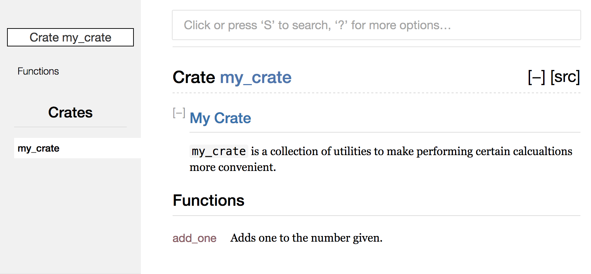

## Publishing a Crate to Crates.io

We’ve used packages from crates.io as dependencies of our project, but you can
also share your code for other people to use by publishing your own packages.
Crates.io distributes the source code of your packages, so it primarily hosts
code that’s open source.

Rust and Cargo have features that help make your published package easier for
people to find and use. We’ll talk about some of those features, then cover how
to publish a package.

### Making Useful Documentation Comments

Accurately documenting your packages will help other users know how and when to
use them, so it’s worth spending some time to write documentation. In Chapter
3, we discussed how to comment Rust code with `//`. Rust also has particular
kind of comment for documentation, known conveniently as *documentation
comments*, that will generate HTML documentation. The HTML displays the
contents of documentation comments for public API items, intended for
programmers interested in knowing how to *use* your crate, as opposed to how
your crate is *implemented*.

Documentation comments use `///` instead of `//` and support Markdown notation
for formatting the text if you’d like. You place documentation comments just
before the item they are documenting. Listing 14-1 shows documentation comments
for an `add_one` function in a crate named `my_crate`:

<span class="filename">Filename: src/lib.rs</span>

```rust,ignore
/// Adds one to the number given.
///
/// # Examples
///
/// ```
/// let five = 5;
///
/// assert_eq!(6, my_crate::add_one(5));
/// ```
pub fn add_one(x: i32) -> i32 {
    x + 1
}
```

<span class="caption">Listing 14-1: A documentation comment for a
function</span>

Here, we give a description of what the `add_one` function does, then start a
section with the heading “Examples”, and code that demonstrates how to use the
`add_one` function. We can generate the HTML documentation from this
documentation comment by running `cargo doc`. This command runs the `rustdoc`
tool distributed with Rust and puts the generated HTML documentation in the
*target/doc* directory.

For convenience, running `cargo doc --open` will build the HTML for your
current crate’s documentation (as well as the documentation for all of your
crate’s dependencies) and open the result in a web browser. Navigate to the
`add_one` function and you’ll see how the text in the documentation comments
gets rendered, shown here in Figure 14-2:


<span class="caption">Figure 14-2: HTML documentation for the `add_one`
function</span>

#### Commonly Used Sections

We used the `# Examples` markdown heading in Listing 14-1 to create a section
in the HTML with the title “Examples”. Some other sections that crate authors
commonly use in their documentation include:

* **Panics**: The scenarios in which this function could `panic!`. Callers of
  this function who don’t want their programs to panic should make sure that
  they don’t call this function in these situations.
* **Errors**: If this function returns a `Result`, describing the kinds of
  errors that might occur and what conditions might cause those errors to be
  returned can be helpful to callers so that they can write code to handle the
  different kinds of errors in different ways.
* **Safety**: If this function is `unsafe` to call (we will discuss unsafety in
  Chapter 19), there should be a section explaining why the function is unsafe
  and covering the invariants that this function expects callers to uphold.

Most documentation comment sections don’t need all of these sections, but this
is a good list to check to remind you of the kinds of things that people
calling your code will be interested in knowing about.

#### Documentation Comments as Tests

Adding examples in code blocks in your documentation comments is a way to
clearly demonstrate how to use your library, but it has an additional bonus:
running `cargo test` will run the code examples in your documentation as tests!
Nothing is better than documentation with examples. Nothing is worse than
examples that don’t actually work because the code has changed since the
documentation has been written. Try running `cargo test` with the documentation
for the `add_one` function like in Listing 14-1; you should see a section in
the test results like this:

```text
   Doc-tests my_crate

running 1 test
test src/lib.rs - add_one (line 5) ... ok

test result: ok. 1 passed; 0 failed; 0 ignored; 0 measured
```

Now try changing either the function or the example so that the `assert_eq!` in
the example will panic. Run `cargo test` again, and you’ll see that the doc
tests catch that the example and the code are out of sync from one another!

#### Commenting Contained Items

There’s another style of doc comment, `//!`, that adds documentation to the
item that contains the comments, rather than adding documentation to the items
following the comments. These are typically used inside the crate root file
(*src/lib.rs* by convention) or inside a module to document the crate or the
module as a whole.

For example, if we wanted to add documentation that described the purpose of
the `my_crate` crate that contains the `add_one` function, we can add
documentation comments that start with `//!` to the beginning of *src/lib.rs*
as shown in Listing 14-3:

<span class="filename">Filename: src/lib.rs</span>

```rust,ignore
//! # My Crate
//!
//! `my_crate` is a collection of utilities to make performing certain
//! calculations more convenient.

/// Adds one to the number given.
// ...snip...
```

<span class="caption">Listing 14-3: Documentation for the `my_crate` crate as a
whole</span>

Notice there isn’t any code after the last line that begins with `//!`. Because
we started the comments with `//!` instead of `///`, we’re documenting the item
that contains this comment rather than an item that follows this comment. In
this case, the item that contains this comment is the *src/lib.rs* file, which
is the crate root. These comments describe the entire crate.

If we run `cargo doc --open`, we’ll see these comments displayed on the front
page of the documentation for `my_crate` above the list of public items in the
crate, as shown in Figure 14-4:



<span class="caption">Figure 14-4: Rendered documentation for `my_crate`
including the comment describing the crate as a whole</span>

Documentation comments within items are useful for describing crates and
modules especially. Use them to talk about the purpose of the container overall
to help users of your crate understand your organization.

#### Exporting a Convenient Public API with `pub use`

In Chapter 7, we covered how to organize our code into modules with the `mod`
keyword, how to make items public with the `pub` keyword, and how to bring
items into a scope with the `use` keyword. The structure that makes sense to
you while you’re developing a crate may not be very convenient for your users,
however. You may wish to organize your structs in a hierarchy containing
multiple levels, but people that want to use a type you’ve defined deep in the
hierarchy might have trouble finding out that those types exist. They might
also be annoyed at having to type `use
my_crate::some_module::another_module::UsefulType;` rather than `use
my_crate::UsefulType;`.

The structure of your public API is a major consideration when publishing a
crate. People who use your crate are less familiar with the structure than you
are, and might have trouble finding the pieces they want to use if the module
hierarchy is large.

The good news is that, if the structure *isn’t* convenient for others to use
from another library, you don’t have to rearrange your internal organization:
you can choose to re-export items to make a public structure that’s different
to your private structure, using `pub use`. Re-exporting takes a public item in
one location and makes it public in another location as if it was defined in
the other location instead.

For example, say we made a library named `art` for modeling artistic concepts.
Within this library is a `kinds` module containing two enums named
`PrimaryColor` and `SecondaryColor` and a `utils` module containing a function
named `mix` as shown in Listing 14-5:

<span class="filename">Filename: src/lib.rs</span>

```rust,ignore
//! # Art
//!
//! A library for modeling artistic concepts.

pub mod kinds {
    /// The primary colors according to the RYB color model.
    pub enum PrimaryColor {
        Red,
        Yellow,
        Blue,
    }

    /// The secondary colors according to the RYB color model.
    pub enum SecondaryColor {
        Orange,
        Green,
        Purple,
    }
}

pub mod utils {
    use kinds::*;

    /// Combines two primary colors in equal amounts to create
    /// a secondary color.
    pub fn mix(c1: PrimaryColor, c2: PrimaryColor) -> SecondaryColor {
        // ...snip...
    }
}
```

<span class="caption">Listing 14-5: An `art` library with items organized into
`kinds` and `utils` modules</span>

The front page of the documentation for this crate generated by `cargo doc`
would look like Figure 14-6:


<span class="caption">Figure 14-6: Front page of the documentation for `art`
that lists the `kinds` and `utils` modules</span>

Note that the `PrimaryColor` and `SecondaryColor` types aren’t listed on the
front page, nor is the `mix` function. We have to click on `kinds` and `utils`
in order to see them.

Another crate depending on this library would need `use` statements that import
the items from `art` including specifying the module structure that’s currently
defined. Listing 14-7 shows an example of a crate that uses the `PrimaryColor`
and `mix` items from the `art` crate:

<span class="filename">Filename: src/main.rs</span>

```rust,ignore
extern crate art;

use art::kinds::PrimaryColor;
use art::utils::mix;

fn main() {
    let red = PrimaryColor::Red;
    let yellow = PrimaryColor::Yellow;
    mix(red, yellow);
}
```

<span class="caption">Listing 14-7: A crate using the `art` crate’s items with
its internal structure exported</span>

The author of the code in Listing 14-7 that uses the `art` crate had to figure
out that `PrimaryColor` is in the `kinds` module and `mix` is in the `utils`
module. The module structure of the `art` crate is more relevant to developers
working on the `art` crate than developers using the `art` crate. The internal
structure that organizes parts of the crate into the `kinds` module and the
`utils` module doesn’t add any useful information to someone trying to
understand how to use the `art` crate. The `art` crate’s module structure adds
confusion in having to figure out where to look and inconvenience in having to
specify the module names in the `use` statements.

To remove the internal organization from the public API, we can take the `art`
crate code from Listing 14-5 and add `pub use` statements to re-export the
items at the top level, as shown in Listing 14-8:

<span class="filename">Filename: src/lib.rs</span>

```rust,ignore
//! # Art
//!
//! A library for modeling artistic concepts.

pub use kinds::PrimaryColor;
pub use kinds::SecondaryColor;
pub use utils::mix;

pub mod kinds {
    // ...snip...
}

pub mod utils {
    // ...snip...
}
```

<span class="caption">Listing 14-8: Adding `pub use` statements to re-export
items</span>

The API documentation generated with `cargo doc` for this crate will now list
and link re-exports on the front page as shown in Figure 14-9, which makes
these types easier to find.


<span class="caption">Figure 14-9: Front page of the documentation for `art`
that lists the re-exports</span>

Users of the `art` crate can still see and choose to use the internal structure
as in Listing 14-7, or they can use the more convenient structure from Listing
14-8, as shown in Listing 14-10:

<span class="filename">Filename: src/main.rs</span>

```rust,ignore
extern crate art;

use art::PrimaryColor;
use art::mix;

fn main() {
    // ...snip...
}
```

<span class="caption">Listing 14-10: A program using the re-exported items from
the `art` crate</span>

In cases where there are many nested modules, re-exporting the types at the top
level with `pub use` can make a big difference in the experience of people who
use the crate.

Creating a useful public API structure is more of an art than a science, and
you can iterate to find the API that works best for your users. Choosing `pub
use` gives you flexibility in how you structure your crate internally, and
decouples that internal structure with what you present to your users. Take a
look at some of the code of crates you’ve installed to see if their internal
structure differs from their public API.

### Setting up a Crates.io Account

Before you can publish any crates, you need to create an account on crates.io
and get an API token. To do so, visit the home page at *https://crates.io* and
log in via a GitHub account—the GitHub account is a requirement for now, but
the site may support other ways of creating an account in the future. Once
you’re logged in, visit your account settings at *https://crates.io/me* and
retrieve your API key. Then run the `cargo login` command with your API key,
like this:

```text
$ cargo login abcdefghijklmnopqrstuvwxyz012345
```

This command will inform Cargo of your API token and store it locally in
*~/.cargo/credentials*. Note that this token is a *secret* and should not be
shared with anyone else. If it is shared with anyone for any reason, you should
revoke it and generate a new token on Crates.io.

### Before Publishing a New Crate

Now you have an account, and let’s say you already have a crate you want to
publish. Before publishing, you’ll need to add some metadata to your crate by
adding it to the `[package]` section of the crate’s *Cargo.toml*.

Your crate will first need a unique name. While you’re working on a crate
locally, you may name a crate whatever you’d like. However, crate names on
Crates.io are allocated on a first-come-first-serve basis. Once a crate name is
taken, no one else may publish a crate with that name. Search for the name
you’d like to use on the site to find out if it has been taken. If it hasn’t,
edit the name in *Cargo.toml* under `[package]` to have the name you want to
use for publishing like so:

<span class="filename">Filename: Cargo.toml</span>

```toml
[package]
name = "guessing_game"
```

Even if you’ve chosen a unique name, if you try to run `cargo publish` to
publish the crate at this point, you’ll get a warning and then an error:

```text
$ cargo publish
    Updating registry `https://github.com/rust-lang/crates.io-index`
warning: manifest has no description, license, license-file, documentation,
homepage or repository.
...snip...
error: api errors: missing or empty metadata fields: description, license.
```

This is because we’re missing some crucial information: a description and
license are required so that people will know what your crate does and under
what terms they may use it. To rectify this error, we need to include this
information in *Cargo.toml*.

Make a description that’s just a sentence or two, as it will appear with your
crate in search results and on your crate’s page. For the `license` field, you
need to give a *license identifier value*. The Linux Foundation’s Software
Package Data Exchange (SPDX) at *http://spdx.org/licenses/* lists the
identifiers you can use for this value. For example, to specify that you’ve
licensed your crate using the MIT License, add the `MIT` identifier:

<span class="filename">Filename: Cargo.toml</span>

```toml
[package]
name = "guessing_game"
license = "MIT"
```

If you want to use a license that doesn’t appear in the SPDX, you need to place
the text of that license in a file, include the file in your project, then use
`license-file` to specify the name of that file instead of using the `license`
key.

Guidance on which license is right for your project is out of scope for this
book. Many people in the Rust community choose to license their projects in the
same way as Rust itself, with a dual license of `MIT/Apache-2.0`—this
demonstrates that you can also specify multiple license identifiers separated
by a slash.

So, with a unique name, the version, and author details that `cargo new` added
when you created the crate, your description, and the license you chose added,
the *Cargo.toml* for a project that’s ready to publish might look like this:

<span class="filename">Filename: Cargo.toml</span>

```toml
[package]
name = "guessing_game"
version = "0.1.0"
authors = ["Your Name <you@example.com>"]
description = "A fun game where you guess what number the computer has chosen."
license = "MIT/Apache-2.0"

[dependencies]
```

[Cargo’s documentation](https://doc.rust-lang.org/cargo/) describes other
metadata you can specify to ensure your crate can be discovered and used more
easily!

### Publishing to Crates.io

Now that you’ve created an account, saved your API token, chosen a name for
your crate, and specified the required metadata, you’re ready to publish!
Publishing a crate uploads a specific version to crates.io for others to use.

Take care when publishing a crate, because a publish is *permanent*. The
version can never be overwritten, and the code cannot be deleted. One major
goal of Crates.io is to act as a permanent archive of code so that builds of
all projects that depend on crates from Crates.io will continue to work.
Allowing deletion of versions would make fulfilling that goal impossible.
However, there is no limit to the number of versions of a crate you can publish.

Let’s run the `cargo publish` command again. It should succeed now:

```text
$ cargo publish
 Updating registry `https://github.com/rust-lang/crates.io-index`
Packaging guessing_game v0.1.0 (file:///projects/guessing_game)
Verifying guessing_game v0.1.0 (file:///projects/guessing_game)
Compiling guessing_game v0.1.0
(file:///projects/guessing_game/target/package/guessing_game-0.1.0)
 Finished dev [unoptimized + debuginfo] target(s) in 0.19 secs
Uploading guessing_game v0.1.0 (file:///projects/guessing_game)
```

Congratulations! You’ve now shared your code with the Rust community, and
anyone can easily add your crate as a dependency of their project.

### Publishing a New Version of an Existing Crate

When you’ve made changes to your crate and are ready to release a new version,
you change the `version` value specified in your *Cargo.toml* and republish.
Use the [Semantic Versioning rules][semver] to decide what an appropriate next
version number is based on the kinds of changes you’ve made. Then run `cargo
publish` to upload the new version.

[semver]: http://semver.org/

### Removing Versions from Crates.io with `cargo yank`

While you can’t remove previous versions of a crate, you can prevent any future
projects from adding them as a new dependency. This is useful when a version of
a crate ends up being broken for one reason or another. For situations such as
this, Cargo supports *yanking* a version of a crate.

Yanking a version prevents new projects from starting to depend on that version
while allowing all existing projects that depend on it to continue to download
and depend on that version. Essentially, a yank means that all projects with a
*Cargo.lock* will not break, while any future *Cargo.lock* files generated will
not use the yanked version.

To yank a version of a crate, run `cargo yank` and specify which version you
want to yank:

```text
$ cargo yank --vers 1.0.1
```

You can also undo a yank, and allow projects to start depending on a version
again, by adding `--undo` to the command:

```text
$ cargo yank --vers 1.0.1 --undo
```

A yank *does not* delete any code. The yank feature is not intended for
deleting accidentally uploaded secrets, for example. If that happens, you must
reset those secrets immediately.
