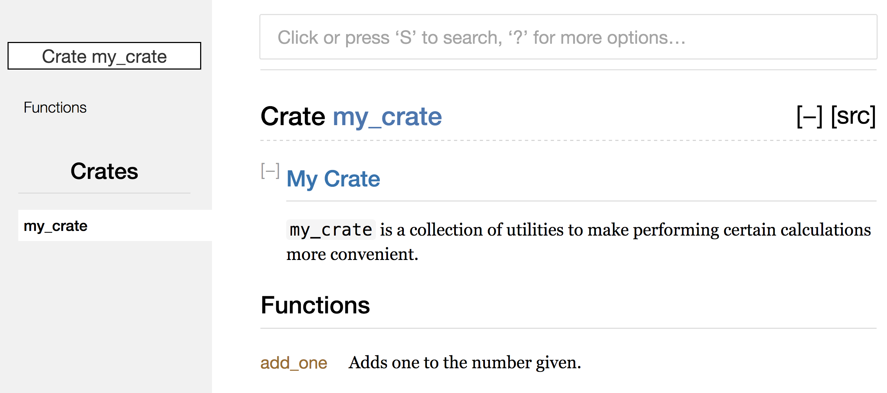

## Crates.io 에 크레이트 배포하기

우린 [crates.io](https://crates.io)<!-- ignore --> 의 패키지를 프로젝트의
의존성으로만 사용했지만 여러분이 직접 여러분의 패키지를 배포(publish)해서
코드를 다른 사람들과 공유 할 수도 있습니다.
[crates.io](https://crates.io)<!-- ignore --> 의 크레이트 등기소 (registry)는 여러분이 만든 패키지의 소스코드를 배포하므로,
[crates.io](https://crates.io)<!-- ignore --> 는 주로 오픈 소스인 코드를 관리합니다.

러스트와 Cargo 는 여러분이 배포한 패키지를 사람들이 더 쉽게 찾고 사용할 수
있도록 도와주는 기능이 있습니다. 다음 내용이 바로 이런 기능들 몇개에 대한
설명과 패키지를 배포하는 방법에 대한 설명입니다.

### 유용한 문서화 주석 만들기

여러분의 패키지를 시간을 들여서 자세하게 문서화하는 작업은 굉장히 가치있는 일
입니다. 문서는 다른 사람들이 그 패키지를 언제, 어떻게 써야할지 알게 해주는데
굉장히 도움이 되거든요. 3장에서 우린 슬래시 두 개(`//`) 를 이용해 러스트
코드에 주석을 남기는 법을 배웠습니다만, 러스트에는 *문서화 주석(documentation
comment)* 이라고 불리는 문서화를 위한 특별한 주석이 존재합니다. 이 주석은 HTML
문서를 생성할 수 있는데, 이 HTML 에는 여러분의 크레이트가 어떻게
*구현되었는지* 가 아닌 어떻게 *사용하는지* 에 관심 있는 프로그래머들을 위한
공개 API의 문서화 주석이 보여집니다.

문서화 주석은 슬래시 두 개가 아니라 세 개(`///`) 를 이용하며 텍스트 서식을
위한 마크다운 표기법을 지원합니다. 문서화 주석은 문서화할 대상 바로 이전에
배치하면 됩니다. Listing 14-1 은 `my_crate` 크레이트의 `add_one` 함수에 대한'
문서화 주석의 예시를 보여줍니다:

<span class="filename">Filename: src/lib.rs</span>

```rust,ignore
/// Adds one to the number given.
///
/// # Examples
///
/// ```
/// let five = 5;
///
/// assert_eq!(6, my_crate::add_one(5));
/// ```
pub fn add_one(x: i32) -> i32 {
    x + 1
}
```

<span class="caption">Listing 14-1: 함수에 대한
문서화 주석</span>

자, `add_one` 함수가 무슨 일을 하는지 설명을 적었고 `Example` 절에서
`add_one` 함수를 어떻게 사용하는지에 대한 예시 코드를 제공 했습니다.
이제 우린 `cargo doc` 을 이용해 이 문서화 주석으로부터
HTML 문서를 생성할 수 있습니다.
이 명령어는 러스트에 들어있는 `rustdoc` 툴을 실행시키고
생성된 HTML 문서를 *target/doc* 디렉토리에 저장합니다.

좀더 편리하게, `cargo doc --open` 을 실행시키면 여러분의 현재 크레이트의
문서에 대해 (심지어 여러분의 크레이트가 가진 모든 디펜던시의 문서까지)
HTML 을 생성하고 웹 브라우저에 띄워줄 겁니다. 이제 `add_one` 함수를 찾아보면
여러분은 문서화 주석의 내용이 어떻게 나타나는지 보실 수 있습니다.
Figure 14-1 처럼요:


<span class="caption">Figure 14-1: `add_one` 함수에 대한
HTML 문서화</span>

#### 자주 사용되는 구절

우린 Listing 14-1 에서 HTML 에 "Examples." 제목을 가진 구절을 만들기 위해
`# Examples` 마크다운 헤더를 사용했습니다. 이외에 크레이트의 제작자가
일반적으로 문서에 사용하는 구절은 다음과 같습니다.

* **Panics**: 문서화된 기능이 패닉을 일으킬 수 있는 시나리오입니다.
  함수를 호출하는 사람들에게 "프로그램이 패닉을 일으키지 않게 하려면
  이러한 상황에서는 이 함수를 호출하지 않아야 합니다" 라는 내용을 알려줍니다.
* **Errors**: 해당 함수가 `Result` 를 반환할 경우에는
  발생할 수 있는 에러의 종류와 해당 에러들이 발생하는 조건을
  설명해 주어서 호출하는 사람이 여러 에러를 여러 방법으로
  처리할 수 있도록 해야합니다.
* **Safety**: 함수가 `안전하지 않을(unsafe)` 경우에
  (19장에서 다루는 내용입니다) 왜 이 함수가 안전하지 않은지와 이 함수가
  호출하는 사람에게 지키길 기대하는 불변성에 대해 알려주는 구절이 있어야 합니다.

대부분의 문서화 주석은 이 구절들이 모두 필요하진 않습니다.
하지만 여러분의 코드를 사용하는 사람들이 관심을 가지고 알아보게 될 측면에 대해
곱씹어 보게 만드는 좋은 체크리스트가 될 수 있습니다.

#### 테스트로서의 문서화 주석

여러분의 문서화 주석에 예시 코드를 추가하는 건 여러분의 라이브러리를 어떻게
사용하는지 알려줄 수 있을뿐더러 또 다른 효과도 있습니다: 무려 `cargo test` 를
실행하면 여러분의 문서에 들어있던 예시 코드들이 테스트로서 실행됩니다! 백문이
불여일견이라는 말이 있듯이, 예시를 포함한 문서보다 좋은 문서는 없습니다.
다만, 코드를 변경하고 문서를 업데이트하지 않아서 예시 코드가 작동하지 않는
일은 절대 있어선 안되니 주의하세요. 우리가 Listing 14-1 의 `add_one` 함수에 대한
문서로 `cargo test` 를 실행하면 다음과 같은 테스트 결과를 보실수 있습니다.

```text
   Doc-tests my_crate

running 1 test
test src/lib.rs - add_one (line 5) ... ok

test result: ok. 1 passed; 0 failed; 0 ignored; 0 measured; 0 filtered out
```

이제 우리가 함수나 예제를 변경하고 예시 코드에서 패닉이 발생하는 상태로
`cargo test` 를 실행하면, 문서 테스트 기능이 더이상 예시 코드가
기능하지 못한다고 알려줄 겁니다.

#### 주석을 포함하는 항목을 문서화 하기

문서화 주석의 또 다른 스타일로 `//!` 가 있습니다.
이는 주석 뒤에 오는 항목을 문서화 하는게 아닌 주석을
포함하는 항목을 문서화 합니다. 일반적으로 크레이트의 루트 파일
(관례적으로 *src/lib.rs* 입니다) 이나 크레이트 혹은 모듈 전체를 문서화하는
모듈 내부에 이 문서화 주석을 작성합니다.

예시로, 만약 `add_one` 함수를 포함한 `my_crate` 크레이트를
설명하기 위한 목적으로 문서화를 진행한다면,
Listing 14-2 처럼 *src/lib.rs* 에 `//!` 로 시작하는
문서화 주석을 추가할 수 있습니다.

<span class="filename">Filename: src/lib.rs</span>

```rust,ignore
//! # My Crate
//!
//! `my_crate` is a collection of utilities to make performing certain
//! calculations more convenient.

/// Adds one to the number given.
// --snip--
```

<span class="caption">Listing 14-2: `my_crate` 크레이트 전체를 위한
문서화</span>

`//!` 로 시작하는 줄 중 마지막 줄에 코드가 뒤따르지 않는다는 점을 주목하세요.
우린 주석 뒤에 따라오는 항목이 아닌, 주석을 포함하는 항목을 문서화
할 것이기에 `///` 가 아니라 `//!` 로 시작하는 주석을 사용했습니다.
이 경우, 주석을 포함하는 항목은 크레이트의 루트 파일인 *src/lib.rs* 이며
주석은 전체 크레이트를 설명하게 됩니다.

`cargo doc --open` 을 실행하면,
Figure 14-2 처럼 `my_crate` 문서 첫 페이지 내용 중
크레이트의 공개 아이템들 상단에 이 주석의 내용이 표시될 것입니다.



<span class="caption">Figure 14-2: 전체 크레이트를 설명하는 주석이 포함된
`my_crate` 의 문서가 렌더링된 모습</span>

항목 내 문서화 주석은 크레이트나 모듈을 설명하는데 유용합니다.
이를 이용해 사용자들이 크레이트의 구조를 이해할 수 있도록
크레이트의 중심 목적을 설명하세요.

## `pub use` 를 이용해 공개 API 를 편리한 형태로 export 하기

7 장에서 우린 `mod` 키워드를 이용해 우리 코드를 체계화 하는 법과,
`pub` 키워드로 공개 아이템을 만드는 법, `use` 를 이용해 스코프 내로 가져오는
법을 다뤘습니다. 다만 여러분이 크레이트를 개발할때 만들어놓은 구조는
여러분의 크레이트를 사용할 사용자들에게는 그다지 편리하지 않을 수 있습니다.
여러분은 여러 단계의 계층 구조를 이용해 크레이트를 구성하고 싶으시겠지만,
여러분이 계층 구조상에서 깊은곳에 정의한 타입을 다른 사람들이 사용하기에는
상당히 어려움을 겪을 수 있습니다. 애초에 그런 타입이 존재하는지 알아내는 것
조차 힘들테니까요. 또한 알아내더라도 `use` `my_crate::UsefulType`; 가 아니라
`use` `my_crate::some_module::another_module::UsefulType;` 를 입력 하는 일은
꽤나 짜증이 날 테죠.

공개 API 의 구조는 크레이트를 배포하는데 있어서 중요한 고려사항 중 하나입니다.
여러분의 크레이트를 이용할 사람들은 해당 구조에 있어서 여러분보다 이해도가
떨어질 것이고, 만약 여러분의 크레이트가 거대한 구조로 되어 있다면 자신들이
원하는 부분을 찾기조차 힘들 겁니다.

좋은 소식은 여러분이 만든 구조가 다른 라이브러리에서 이용하는데 편리하지
*않다고* 해서 굳이 내부 구조를 뒤엎을 필요는 없다는 겁니다. 대신에 여러분은
`pub use` 를 이용해 내부 항목을 다시 export(*re-export*) 하여 기존의 private
구조와 다른 public 구조를 만들 수 있다는 겁니다. 다시 export 한다는 것은 한
위치에서 공개 항목(public item)을 가져오고
이것을 마치 다른 위치에서 정의한 것처럼 공개 항목으로 만드는 것을 의미합니다.

예를 들어, 우리가 예술적인 개념을 모델링 하기 위해 `art` 라는 라이브러리를
만들었다고 가정해 봅시다. 해당 라이브러리에는 두 모듈이 들어 있습니다:
`kinds` 모듈은 `PrimaryColor` 과 `SecondaryColor` 열거체를 포함하고,
`utils` 모듈은 `mix` 라는 이름의 함수를 포함합니다. Listing 14-3 처럼요.

<span class="filename">Filename: src/lib.rs</span>

```rust,ignore
//! # Art
//!
//! A library for modeling artistic concepts.

pub mod kinds {
    /// The primary colors according to the RYB color model.
    pub enum PrimaryColor {
        Red,
        Yellow,
        Blue,
    }

    /// The secondary colors according to the RYB color model.
    pub enum SecondaryColor {
        Orange,
        Green,
        Purple,
    }
}

pub mod utils {
    use kinds::*;

    /// Combines two primary colors in equal amounts to create
    /// a secondary color.
    pub fn mix(c1: PrimaryColor, c2: PrimaryColor) -> SecondaryColor {
        // --생략--
    }
}
```

<span class="caption">Listing 14-3: `kinds` 모듈과 `utils` 모듈로 이루어진
`art` 라이브러리</span>

Figure 14-3 은 `cargo doc` 으로 생성된 이 크레이트 문서의
첫 화면입니다:


<span class="caption">Figure 14-3: `kinds` 와 `utils` 모듈을 포함한 `art`
크레이트의 문서가 렌더링된 모습</span>

`PrimaryColor`, `SecondaryColor` 타입들과 `mix` 함수가
첫 화면에 나오지 않는 걸 주목하세요.
이들을 보려면 각각 `kinds` 와 `utils` 를 클릭하셔야 합니다.

이 라이브러리를 의존성으로 가지고 있는 다른 크레이트에서 `use` 를 이용해 `art`
의 항목을 가져오기 위해선, 현재 정의된 `art` 모듈의 구조대로 일일이 입력해야
합니다. Listing 14-4 에서 다른 크레이트에서 `art` 크레이트의 `PrimaryColor` 과
`mix` 를 이용하는 예시를 볼 수 있습니다.

<span class="filename">Filename: src/main.rs</span>

```rust,ignore
extern crate art;

use art::kinds::PrimaryColor;
use art::utils::mix;

fn main() {
    let red = PrimaryColor::Red;
    let yellow = PrimaryColor::Yellow;
    mix(red, yellow);
}
```

<span class="caption">Listing 14-4: `art` 크레이트의 내부 구조에 정의된 항목을
이용하는 또 다른 크레이트</span>

Listing 14-4 의 코드를 작성한, 즉 `art` 크레이트를 사용하는 사람은
`PrimaryColor` 이 `kinds` 모듈에 들어있고
`mix` 가 `utils` 모듈에 들어 있단 걸 알아내야 합니다.
이처럼 현재 `art` 크레이트의 구조는 크레이트를 사용하는
사람보다 크레이트를 개발하는 사람에게 적합한 구조로 되어 있습니다.
내부 구조상에서의 `kinds` 와 `utils` 모듈의 위치 같은 정보는
`art` 크레이트를 사용하는 입장에서는 전혀 필요 없는 정보이며,
또한 직접 구조상에서 자신이 찾는 것의 위치를 알아내야 하고
`use` 뒤에 모듈의 이름을 일일이 입력해야 한다는 건
혼란스럽고 불편한 일 이니까요.

공개 API 로부터 내부 구조의 흔적를 제거하려면
Listing 14-3 처럼 맨 위에서 `pub use` 를 이용해
다시 export 하도록 `art` 크레이트의 코드를 수정해야 합니다:

<span class="filename">Filename: src/lib.rs</span>

```rust,ignore
//! # Art
//!
//! A library for modeling artistic concepts.

pub use kinds::PrimaryColor;
pub use kinds::SecondaryColor;
pub use utils::mix;

pub mod kinds {
    // --snip--
}

pub mod utils {
    // --snip--
}
```

<span class="caption">Listing 14-5: Re-export 를 위해
`pub use` 추가</span>

`cargo doc` 를 이용해 현재 크레이트에 대한 API 문서를 생성하면 Figure 14-4
처럼 Re-exports 목록과 링크가 첫 페이지에 나타날 겁니다. 이로써 `PrimaryColor`,
`Secondary` 타입과 `mix` 함수를 훨씬 더 쉽게 찾을 수 있게 되었네요.


<span class="caption">Figure 14-4: Re-exports 목록이 포함된
`art` 크레이트 문서의 첫 페이지</span>

`art` 크레이트의 사용자는 기존의 Listing 14-3 의 내부 구조를 이용하여
Listing 14-4 처럼 사용하거나, 혹은 좀 더 편한 방식으로 Listing 14-5 의
구조를 이용하여 Listing 14-6 과 같이 사용할 수 있습니다:

<span class="filename">Filename: src/main.rs</span>

```rust,ignore
extern crate art;

use art::PrimaryColor;
use art::mix;

fn main() {
    // --생략--
}
```

<span class="caption">Listing 14-6: `art` 크레이트의 Re-export 된 항목들을
사용하는 프로그램</span>

만약 특정 부분에서 중첩된 모듈이 많을 경우,
모듈의 상위 계층에서 `pub use` 를 이용해 타입을 다시 export 함으로써
크레이트의 사용자들에게 더 뛰어난 경험을 제공할 수 있습니다.

쓰기 좋고 편한 형태의 공개 API 를 만드는 일은 기술보단 예술에 가까운 일입니다.
따라서 한번에 완벽한 형태를 만들려고 하기보다는 계속해서 사용자들을 위한
최적의 구조를 찾아 개선해 나가야 합니다. 이럴때 `pub use` 를 이용하면 크레이트
내부를 보다 유연하게 구조화 할 수 있고, 사용자에게 제공하는 것에서 내부 구조의
흔적을 없앨 수 있습니다. 한번 여러분이 설치한 크레이트 중에 아무거나 코드를
열어서 그의 공개 API 구조와 내부 구조를 비교해 보세요. 아마 상당히 다를걸요?

### Cartes.io 계정 설정하기

여러분은 첫 크레이트를 배포하기에 앞서,
[crates.io](https://crates.io)<!-- ignore --> 에 계정을 만들고 API 토큰을 얻어야 합니다.
[crates.io](https://crates.io)<!-- ignore --> 홈페이지에 방문하고 GitHub
계정을 통해 로그인 해주세요. (현재는 GitHub 계정이 필수지만, 추후에 사이트에서
다른 방법을 통한 계정 생성을 지원하게 될 수 있습니다) 로그인 하셨다면 계정
설정 페이지인[https://crates.io/me/](https://crates.io/me/)<!-- ignore -->
로 들어가 주세요. 그리고 페이지에서 API 키를 얻어온 후에,
여러분의 API 키를 이용해 `cargo login` 명령어를 실행해 주세요. 이런식으로요:

```text
$ cargo login abcdefghijklmnopqrstuvwxyz012345
```

이 명령어는 Cargo 에게 여러분의 API 토큰을 알려주고 내부
(*~/.cargo/credentials*) 에 저장하도록 합니다. 미리 말하지만 여러분의 토큰은
남들에겐 *비밀* 입니다: 어떤 이유로 남들에게 알려졌다면,
(그 사람을 처리하거나, 혹은) [crates.io](https://crates.io)<!-- ignore--> 에서
기존의 토큰을 무효화하고 새 토큰을 발급받으세요.

### 새 크레이트에 Metadata 추가하기

계정을 만들었으니, 여러분이 크레이트를 배포하려고 한다고 가정합시다.
여러분은 배포하기 전에 *Cargo.toml* 파일에 `[package]` 구절을
추가하여 메타데이터(metadata) 를 추가해야합니다.

여러분의 크레이트명은 고유해야 합니다. 여러분이 로컬에서 작업 할 땐 문제
없지만, [crates.io](https://crates.io)<!-- ignore --> 에 올라갈 크레이트의
이름은 선착순으로 배정되기에, 여러분이 정한 크레이트명을 누군가 이미 쓰고
있다면 해당 크레이트명으로는 크레이트를 배포할 수 없습니다. 크레이트를
배포하기 전에 사이트에서 여러분이 사용하려는 이름을 검색해보고 해당
크레이트명이 이미 사용중인지 확인하세요. 만약 아직 사용중이지 않다면 다음과
같이 *Cargo.toml* 파일 내 `[package]` 절 아래의 이름을 수정하세요:

<span class="filename">Filename: Cargo.toml</span>

```toml
[package]
name = "guessing_game"
```

고유한 이름을 선택하고, 크레이트를 배포하기 위해 `cargo publish` 를 실행하면
다음과 같은 경고와 에러가 나타날 겁니다.

```text
$ cargo publish
    Updating registry `https://github.com/rust-lang/crates.io-index`
warning: manifest has no description, license, license-file, documentation,
homepage or repository.
--snip--
error: api errors: missing or empty metadata fields: description, license.
```

이 에러는 중요한 정보를 몇개 입력하지 않았다는 의미입니다: 설명(description)
과 라이센스(license) 는 필수적인데, 이들은 각각 사람들에게 해당 크레이트가
어떤 작업을 하는지와 해당 크레이트를 이용할 수 있는 조건을 알려줍니다.
이 에러를 고치려면 이 정보들을 *Cargo.toml* 에 포함시켜야 합니다.

설명은 한 문장이나 두 문장정도면 충분합니다. 크레이트를 검색 했을때의 결과에
여러분의 크레이트명과 같이 표시되거든요. `license` 필드엔
*라이센스 식별자 값(license identifier value)* 을 부여해야 합니다.
[Linux Foundation’s Software Package Data Exchange (SPDX)][spdx] 에
여러분이 사용할 수 있는 식별자가 나열되어 있으니 참고 바랍니다.
예를 들어, 만약 여러분의 크레이트에 MIT 라이센스를 적용하고 싶으시다면, 다음과 같이 `MIT` 식별자를 추가하시면 됩니다.

[spdx]: http://spdx.org/licenses/

<span class="filename">Filename: Cargo.toml</span>

```toml
[package]
name = "guessing_game"
license = "MIT"
```

SPDX 에 없는 라이센스를 사용하고 싶으실 경우엔
해당 라이센스의 텍스트를 파일로 만들고
자신의 프로젝트에 해당 파일을 포함시킨 뒤,
`license` 대신 `license-file` 을 추가해 해당 파일의 이름을 넣으시면 됩니다.

여러분의 프로젝트에 어떤 라이센스가 적합한지에 대해 알아보는 내용은 이 책 범위
이상의 내용입니다. 다만 알아두실 건 러스트 커뮤니티의 많은 이들은 자신의
프로젝트에 러스트 자체가 쓰는 라이센스인 `MIT OR Apache-2.0` 이중 라이센스를
사용한다는 겁니다, 즉 여러분은 프로젝트의 라이선스에 `OR` 을 이용해
여러 라이센스 식별자를 명시할 수 있습니다.

고유한 프로젝트명, 버전, `cargo new` 로 크레이트를 생성할때 추가된 작성자 정보,
설명, 라이센스를 모두 추가하셨다면 배포할 준비가 끝났습니다.
이때 *Cargo.toml* 파일의 모습은 다음과 같은 형태일 겁니다:

<span class="filename">Filename: Cargo.toml</span>

```toml
[package]
name = "guessing_game"
version = "0.1.0"
authors = ["Your Name <you@example.com>"]
description = "A fun game where you guess what number the computer has chosen."
license = "MIT OR Apache-2.0"

[dependencies]
```

[Cargo 공식 문서](https://doc.rust-lang.org/cargo/) 에 다른 사람들이
여러분의 크레이트를 좀 더 찾기 쉽게 해주고, 쓰기 편하게 해주는
나머지 메타데이터들이 설명 되어 있으니, 참고 바랍니다.

### Crates.io 에 배포하기

계정도 만들었고, API 토큰도 얻었고, 크레이트명도 정했고,
메타데이터도 작성했으니 이제 여러분은 크레이트를 배포할 준비 만전이에요!
크레이트를 배포한다는 것은 다른 사람이 사용할 특정 버전을
[crates.io](https://crates.io)<!-- ignore --> 에 올리는 것입니다.

크레이트를 배포할땐 주의하시기 바랍니다. 기본적으로 낙장불입이거든요.
버전은 중복될 수 없으며, 한번 올라간 코드는 수정할 수 없습니다.
[crates.io](https://crates.io)<!-- ignore --> 의 원대한 목표중 하나는
[crates.io](https://crates.io)<!-- ignore --> 에 등록된 크레이트들에 의존하는
모든 프로젝트의 빌드가 계속 작동할 수 있도록 영구적인 코드 보관소의 역할을 맡는 것이기 때문에,
버전을 삭제하거나 수정하는 행위는 용납하지 않습니다. 만약 용납한다면 목표를 이룰 수 없으니까요.
대신 버전의 개수에 대한 제한은 없으니 버전을 올리는 것 자체는 얼마든지 가능합니다.

`cargo publish` 명령어를 재실행 해보면 이번엔 성공할 겁니다:

```text
$ cargo publish
 Updating registry `https://github.com/rust-lang/crates.io-index`
Packaging guessing_game v0.1.0 (file:///projects/guessing_game)
Verifying guessing_game v0.1.0 (file:///projects/guessing_game)
Compiling guessing_game v0.1.0
(file:///projects/guessing_game/target/package/guessing_game-0.1.0)
 Finished dev [unoptimized + debuginfo] target(s) in 0.19 secs
Uploading guessing_game v0.1.0 (file:///projects/guessing_game)
```

축하합니다! 이제 여러분의 코드는 러스트 커뮤니티와 공유되고, 아무나 여러분의
크레이트를 자신들의 프로젝트 의존성 목록에 쉽게 추가할 수 있을 겁니다.

### 이미 배포한 크레이트의 버전 업데이트하기

여러분의 크레이트에 변경사항을 적용하고 새 버전을 릴리즈하려면
*Cargo.toml* 파일의 `version` 값을 새 버전으로 변경하면 됩니다.
이때 변경사항의 종류에 맞춰서 적절한 버전을 결정하는 방법은
[유의적 버전 규칙(Semantic Versioning rules)][semver] 을 참고하시기 바랍니다.
버전을 변경하고 나면 `cargo publish` 를 실행해 새 버전을 배포합시다.

[semver]: http://semver.org/

### `cargo yank` 를 이용해 Crates.io 에서 버전 제거하기

크레이트의 이전 버전을 제거할 순 없지만, Cargo 는 크레이트의 버전을
*yanking(끌어내리는)* 기능을 지원합니다. 이는 특정 크레이트의 버전이 어떤
이유에선가 문제가 생긴 등의 경우에 새롭게 만들어지는 프로젝트들이
해당 버전을 종속성으로 추가할 수 없도록 막아주는 주는 기능입니다. (역주: *yank* 의 사전적 의미는 *홱 당기다* 입니다)

버전을 끌어내려도 해당 버전에 의존하던 기존의 프로젝트들은 계속해서 그 버전에
의존성을 가질 수 있고 해당 버전을 다운로드 받을 수도 있지만, 새로운
프로젝트들이 끌어내려진 버전을 의존성으로 가지는 시작하는것은 불가능합니다.
근본적인 yank 의 의미는 *Cargo.lock* 을 가진 모든 프로젝트는 문제가 없을 것이며,
추후에 새로 생성될 *Cargo.lock* 파일은 끌어내려진 버전을 사용하지 않을 것이란 의미입니다.

크레이트의 버전을 yank 하기 위해서는 `cargo yank` 에
yank 하고자 하는 버전을 명시하고 실행하시면 됩니다:

```text
$ cargo yank --vers 1.0.1
```

또한 여러분은 `--undo` 를 붙여서 yank 를 취소하고 다시 새 프로젝트들이
해당 버전을 의존성으로 갖는 것을 허용할 수 있습니다:

```text
$ cargo yank --vers 1.0.1 --undo
```

yank 는 어떤 코드도 삭제하지 *않습니다*. 예를 들어, 여러분이 실수로 자신의
비밀 정보를 업로드한 상황에 대한 해결책으로 yank 기능을 사용하셨다면, 이는
잘못된 방법입니다. 만약 그런 일이 일어나면 비밀 정보를 재설정하셔야 합니다.
