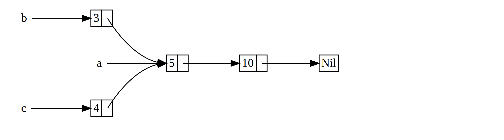

## `Rc<T>`, the Reference Counted Smart Pointer

In the majority of cases, ownership is clear: you know exactly which variable
owns a given value. However, there are cases when a single value may have
multiple owners. For example, in graph data structures, multiple edges may
point to the same node, and that node is conceptually owned by all of the edges
that point to it. A node shouldn’t be cleaned up unless it doesn’t have any
edges pointing to it.

<!-- Can you give an example or two for when a variable needs multiple owners?
-->
<!-- Done /Carol -->

In order to enable multiple ownership, Rust has a type called `Rc<T>`. Its name
is an abbreviation for reference counting. *Reference counting* means keeping
track of the number of references to a value in order to know if a value is
still in use or not. If there are zero references to a value, the value can be
cleaned up without any references becoming invalid.

Imagine it like a TV in a family room. When one person enters to watch TV, they
turn it on. Others can come into the room and watch the TV. When the last
person leaves the room, they turn the TV off because it’s no longer being used.
If someone turns the TV off while others are still watching it, there’d be
uproar from the remaining TV watchers!

`Rc<T>` is used when we want to allocate some data on the heap for multiple
parts of our program to read, and we can’t determine at compile time which part
will finish using the data last. If we did know which part would finish last,
we could just make that the owner of the data and the normal ownership rules
enforced at compile time would kick in.

Note that `Rc<T>` is only for use in single-threaded scenarios; Chapter 16 on
concurrency will cover how to do reference counting in multithreaded programs.

### Using `Rc<T>` to Share Data

Let’s return to our cons list example from Listing 15-6, as we defined it using
`Box<T>`. This time, we want to create two lists that both share ownership of a
third list, which conceptually will look something like Figure 15-11:



<span class="caption">Figure 15-11: Two lists, `b` and `c`, sharing ownership
of a third list, `a`</span>

We’ll create list `a` that contains 5 and then 10, then make two more lists:
`b` that starts with 3 and `c` that starts with 4. Both `b` and `c` lists will
then continue on to the first `a` list containing 5 and 10. In other words,
both lists will try to share the first list containing 5 and 10.

Trying to implement this using our definition of `List` with `Box<T>` won’t
work, as shown in Listing 15-12:

<span class="filename">Filename: src/main.rs</span>

```rust,ignore
enum List {
    Cons(i32, Box<List>),
    Nil,
}

use List::{Cons, Nil};

fn main() {
    let a = Cons(5,
        Box::new(Cons(10,
            Box::new(Nil))));
    let b = Cons(3, Box::new(a));
    let c = Cons(4, Box::new(a));
}
```

<span class="caption">Listing 15-12: Demonstrating we’re not allowed to have
two lists using `Box<T>` that try to share ownership of a third list</span>

If we compile this, we get this error:

```text
error[E0382]: use of moved value: `a`
  --> src/main.rs:13:30
   |
12 |     let b = Cons(3, Box::new(a));
   |                              - value moved here
13 |     let c = Cons(4, Box::new(a));
   |                              ^ value used here after move
   |
   = note: move occurs because `a` has type `List`, which does not
   implement the `Copy` trait
```

The `Cons` variants own the data they hold, so when we create the `b` list, `a`
is moved into `b` and `b` owns `a`. Then, when we try to use `a` again when
creating `c`, we’re not allowed to because `a` has been moved.

We could change the definition of `Cons` to hold references instead, but then
we’d have to specify lifetime parameters. By specifying lifetime parameters,
we’d be specifying that every element in the list will live at least as long as
the list itself. The borrow checker wouldn’t let us compile `let a = Cons(10,
&Nil);` for example, since the temporary `Nil` value would be dropped before
`a` could take a reference to it.

Instead, we’ll change our definition of `List` to use `Rc<T>` in place of
`Box<T>` as shown here in Listing 15-13. Each `Cons` variant now holds a value
and an `Rc` pointing to a `List`. When we create `b`, instead of taking
ownership of `a`, we clone the `Rc` that `a` is holding, which increases the
number of references from 1 to 2 and lets `a` and `b` share ownership of the
data in that `Rc`. We also clone `a` when creating `c`, which increases the
number of references from 2 to 3. Every time we call `Rc::clone`, the reference
count to the data within the `Rc` is increased, and the data won’t be cleaned
up unless there are zero references to it:

<!-- And what will Rc do that's different here, how will the ownership of a b
c change? Could you write a paragraph equivalent to the one describing the cons
variants above? That was really useful -->
<!-- I'm not sure which paragraph about cons you're talking about, but I've
tried to guess /Carol -->

<span class="filename">Filename: src/main.rs</span>

```rust
enum List {
    Cons(i32, Rc<List>),
    Nil,
}

use List::{Cons, Nil};
use std::rc::Rc;

fn main() {
    let a = Rc::new(Cons(5, Rc::new(Cons(10, Rc::new(Nil)))));
    let b = Cons(3, Rc::clone(&a));
    let c = Cons(4, Rc::clone(&a));
}
```

<span class="caption">Listing 15-13: A definition of `List` that uses
`Rc<T>`</span>

We need to add a `use` statement to bring `Rc` into scope because it’s not in
the prelude. In `main`, we create the list holding 5 and 10 and store it in a
new `Rc` in `a`. Then when we create `b` and `c`, we call the `Rc::clone`
function and pass a reference to the `Rc` in `a` as an argument.

We could have called `a.clone()` rather than `Rc::clone(&a)`, but Rust
convention is to use `Rc::clone` in this case. The implementation of `clone`
doesn’t make a deep copy of all the data like most types’ implementations of
`clone` do. `Rc::clone` only increments the reference count, which doesn’t take
very much time. Deep copies of data can take a lot of time, so by using
`Rc::clone` for reference counting, we can visually distinguish between the
deep copy kinds of clones that might have a large impact on runtime performance
and memory usage and the types of clones that increase the reference count that
have a comparatively small impact on runtime performance and don’t allocate new
memory.

### Cloning an `Rc<T>` Increases the Reference Count

Let’s change our working example from Listing 15-13 so that we can see the
reference counts changing as we create and drop references to the `Rc` in `a`.

<!-- Below -- can you let the reader know why we are doing this? What does it
show us/improve? Is this our working version of the code, or just illustrating
reference count? -->
<!-- This is illustrating reference counting /Carol -->

In Listing 15-14, we’ll change `main` so that it has an inner scope around list
`c`, so that we can see how the reference count changes when `c` goes out of
scope. At each point in the program where the reference count changes, we’ll
print out the reference count, which we can get by calling the
`Rc::strong_count` function. We’ll talk about why this function is named
`strong_count` rather than `count` in the section later in this chapter about
preventing reference cycles.

<!-- If we need to talk about this later, that might indicate that this chapter
is out of order --- should the section on reference cycles come first? -->
<!-- It's not possible to create reference cycles until we've explained both
`Rc` and `RefCell`, so we don't see a way to reorder these sections. The
"strong" is the only detail from that section relevant here; we just want to
have the reader ignore that detail for now but know that we will explain it in
a bit. /Carol -->

<span class="filename">Filename: src/main.rs</span>

```rust
# enum List {
#     Cons(i32, Rc<List>),
#     Nil,
# }
#
# use List::{Cons, Nil};
# use std::rc::Rc;
#
fn main() {
    let a = Rc::new(Cons(5, Rc::new(Cons(10, Rc::new(Nil)))));
    println!("count after creating a = {}", Rc::strong_count(&a));
    let b = Cons(3, Rc::clone(&a));
    println!("count after creating b = {}", Rc::strong_count(&a));
    {
        let c = Cons(4, Rc::clone(&a));
        println!("count after creating c = {}", Rc::strong_count(&a));
    }
    println!("count after c goes out of scope = {}", Rc::strong_count(&a));
}
```

<span class="caption">Listing 15-14: Printing out the reference count</span>

This will print out:

```text
count after creating a = 1
count after creating b = 2
count after creating c = 3
count after c goes out of scope = 2
```

<!-- is there a reason we call `a` rc here, and not just `a`? -->
<!-- Yes, because it's not `a`, it's the strong count of the `Rc` in `a`. We've
changed the text to hopefully be clearer. /Carol -->

We’re able to see that the `Rc` in `a` has an initial reference count of one,
then each time we call `clone`, the count goes up by one. When `c` goes out of
scope, the count goes down by one. We don’t have to call a function to decrease
the reference count like we have to call `Rc::clone` to increase the reference
count; the implementation of the `Drop` trait decreases the reference count
automatically when an `Rc` value goes out of scope.

What we can’t see from this example is that when `b` and then `a` go out of
scope at the end of `main`, the count is then 0, and the `Rc` is cleaned up
completely at that point. Using `Rc` allows a single value to have multiple
owners, and the count will ensure that the value remains valid as long as any
of the owners still exist.

`Rc<T>` allows us to share data between multiple parts of our program for
reading only, via immutable references. If `Rc<T>` allowed us to have multiple
mutable references too, we’d be able to violate one of the the borrowing rules
that we discussed in Chapter 4: multiple mutable borrows to the same place can
cause data races and inconsistencies. But being able to mutate data is very
useful! In the next section, we’ll discuss the interior mutability pattern and
the `RefCell<T>` type that we can use in conjunction with an `Rc<T>` to work
with this restriction on immutability.
