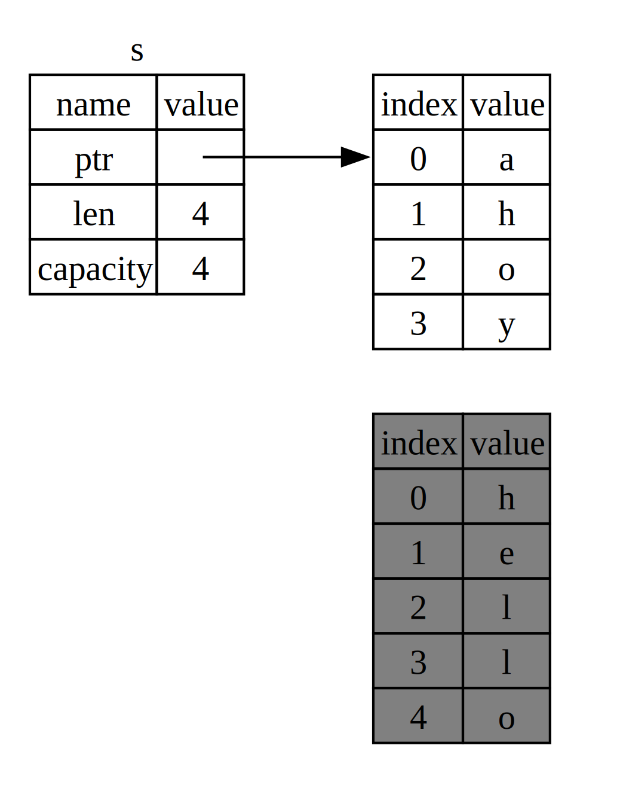

## مالکیت چیست؟

_مالکیت_ مجموعه‌ای از قوانین است که نحوه مدیریت حافظه را در برنامه‌های Rust تعیین می‌کند. همه برنامه‌ها باید نحوه استفاده از حافظه کامپیوتر را در هنگام اجرا مدیریت کنند. برخی زبان‌ها از جمع‌آوری زباله استفاده می‌کنند که به طور منظم حافظه‌ای را که دیگر استفاده نمی‌شود بررسی می‌کند؛ در دیگر زبان‌ها، برنامه‌نویس باید حافظه را به صورت صریح تخصیص داده و آزاد کند. Rust از یک روش سوم استفاده می‌کند: حافظه از طریق سیستمی از مالکیت با مجموعه‌ای از قوانین مدیریت می‌شود که کامپایلر آن‌ها را بررسی می‌کند. اگر هر یک از این قوانین نقض شود، برنامه کامپایل نخواهد شد. هیچ‌یک از ویژگی‌های مالکیت برنامه شما را در هنگام اجرا کند نمی‌کند.

از آنجا که مالکیت یک مفهوم جدید برای بسیاری از برنامه‌نویسان است، زمان می‌برد تا به آن عادت کنید. خبر خوب این است که هر چه بیشتر با Rust و قوانین سیستم مالکیت آن آشنا شوید، نوشتن کدی که امن و کارآمد باشد برایتان آسان‌تر خواهد شد. به تلاش ادامه دهید!

وقتی مالکیت را درک کنید، پایه‌ای محکم برای درک ویژگی‌هایی که Rust را منحصر به فرد می‌کنند خواهید داشت. در این فصل، مالکیت را با کار بر روی چند مثال که بر یک ساختار داده بسیار رایج تمرکز دارند یاد خواهید گرفت: رشته‌ها.

> ### استک (Stack) و هیپ (Heap)
>
> بسیاری از زبان‌های برنامه‌نویسی نیاز ندارند که
> شما زیاد درباره‌ی استک و هیپ فکر کنید. اما در زبان‌های
> برنامه‌نویسی سیستمی مانند Rust، محل قرارگیری مقدار
> روی استک یا هیپ روی رفتار زبان و تصمیماتی که باید
> بگیرید تأثیر می‌گذارد. بخش‌هایی از مالکیت (ownership)
> در ارتباط با استک و هیپ در ادامه‌ی این فصل شرح داده
> خواهند شد، بنابراین در اینجا توضیح کوتاهی در
> آماده‌سازی برای آن ارائه می‌دهیم.
>
> استک و هیپ هر دو بخش‌هایی از حافظه هستند که
> در زمان اجرا برای کد شما در دسترس‌اند، اما ساختار
> متفاوتی دارند. استک مقادیر را به ترتیبی که دریافت
> می‌کند ذخیره کرده و آن‌ها را به ترتیب معکوس حذف می‌کند.
> به این مدل *آخرین وارد شده، اولین خارج شده* (last in, first out)
> گفته می‌شود. تصور کنید یک دسته بشقاب: زمانی که
> بشقاب جدیدی اضافه می‌کنید، آن را روی بالای دسته قرار
> می‌دهید و وقتی بخواهید بشقابی بردارید، از بالای دسته
> برمی‌دارید. اضافه یا حذف کردن بشقاب از وسط یا پایین
> دسته به خوبی کار نخواهد کرد! افزودن داده به استک
> را *push کردن روی استک* و حذف داده را *pop کردن از استک*
> می‌نامند. تمامی داده‌های ذخیره‌شده روی استک باید
> اندازه‌ای مشخص و ثابت داشته باشند. داده‌هایی که اندازه
> آن‌ها هنگام کامپایل مشخص نیست یا ممکن است تغییر کند،
> باید روی هیپ ذخیره شوند.
>
> هیپ ساختار کمتری دارد: وقتی داده‌ای را روی هیپ می‌گذارید،
> فضایی مشخص درخواست می‌کنید. تخصیص‌دهنده‌ی حافظه
> (memory allocator) محلی خالی در هیپ پیدا می‌کند که
> به‌اندازه کافی بزرگ باشد، آن را به‌عنوان فضای استفاده‌شده
> علامت‌گذاری می‌کند و یک *اشاره‌گر* که آدرس آن مکان است
> بازمی‌گرداند. این فرایند را *تخصیص در هیپ* می‌نامند
> و گاهی به‌سادگی *تخصیص* خوانده می‌شود (push کردن روی
> استک به‌عنوان تخصیص محسوب نمی‌شود). چون اندازه
> اشاره‌گر روی هیپ ثابت و مشخص است، می‌توانید اشاره‌گر را
> روی استک ذخیره کنید، اما وقتی به داده‌ی واقعی نیاز دارید،
> باید از طریق آن اشاره‌گر مراجعه کنید. این موضوع را
> می‌توان به نشستن در رستوران تشبیه کرد: وقتی وارد
> می‌شوید، تعداد افراد گروه را می‌گویید، میزبان
> میز خالی‌ای پیدا می‌کند که همه را در خود جای دهد
> و شما را به آن‌جا هدایت می‌کند. اگر کسی دیر برسد،
> می‌تواند بپرسد شما کجا نشسته‌اید تا شما را پیدا کند.
>
> افزودن داده به استک سریع‌تر از تخصیص در هیپ است،
> زیرا تخصیص‌دهنده نیازی به جستجوی جای خالی برای داده
> جدید ندارد؛ این مکان همیشه بالای استک است. در مقایسه،
> تخصیص فضای هیپ نیازمند کار بیشتری است، چون ابتدا
> باید فضای کافی پیدا شود و سپس اقدامات لازم برای
> مدیریت تخصیص بعدی انجام شود.
>
> دسترسی به داده‌های روی هیپ معمولاً کندتر از داده‌های
> روی استک است، چون باید اشاره‌گر را دنبال کنید.
> پردازنده‌های امروزی زمانی سریع‌تر کار می‌کنند که پرش
> کمتری در حافظه داشته باشند. با ادامه‌ی تشبیه، فرض کنید
> یک پیشخدمت در رستوران سفارش‌های میزهای مختلف را می‌گیرد.
> کارآمدترین روش این است که همه سفارش‌های یک میز را
> کامل دریافت کند و سپس به میز بعدی برود. گرفتن سفارش از
> میز A، سپس میز B، دوباره میز A و سپس میز B، روندی
> بسیار کندتر خواهد بود. به همین ترتیب، پردازنده معمولاً
> بهتر کار می‌کند اگر روی داده‌هایی کار کند که به داده‌های
> دیگر نزدیک باشند (مثل داده‌های روی استک) نه داده‌هایی
> که دورتر هستند (مثل داده‌های روی هیپ).
>
> وقتی کد شما تابعی را فراخوانی می‌کند، مقادیری که به
> تابع داده می‌شوند (شامل اشاره‌گرهایی به داده‌های روی هیپ)
> و متغیرهای محلی تابع روی استک قرار می‌گیرند. وقتی تابع
> به پایان رسید، این داده‌ها از استک حذف می‌شوند.
>
> پیگیری اینکه کدام بخش‌های کد از کدام داده‌ها روی هیپ
> استفاده می‌کنند، کمینه‌سازی داده‌های تکراری روی هیپ،
> و پاک‌سازی داده‌های استفاده‌نشده روی هیپ تا فضای کافی
> باقی بماند، همه مسائلی هستند که مالکیت (ownership) به آن‌ها
> می‌پردازد. وقتی مالکیت را درک کنید، نیاز نیست زیاد درباره‌ی
> استک و هیپ فکر کنید، اما دانستن اینکه هدف اصلی مالکیت
> مدیریت داده‌های روی هیپ است، می‌تواند توضیح دهد چرا
> مالکیت این‌گونه عمل می‌کند.

### قوانین مالکیت

ابتدا، بیایید نگاهی به قوانین مالکیت بیندازیم. این قوانین را در ذهن داشته باشید زیرا با مثال‌هایی که آن‌ها را نشان می‌دهند کار می‌کنیم:

- هر مقدار در Rust یک _مالک_ دارد.
- در یک زمان فقط می‌تواند یک مالک وجود داشته باشد.
- زمانی که مالک از دامنه خارج شود، مقدار _حذف_ خواهد شد.

### دامنه متغیر

حال که از سینتکس پایه Rust گذشته‌ایم، در مثال‌ها کد کامل `fn main() {` را نخواهیم آورد. بنابراین، اگر دنبال می‌کنید، مطمئن شوید که مثال‌های زیر را به صورت دستی داخل یک تابع `main` قرار دهید. در نتیجه، مثال‌های ما کمی مختصرتر خواهند بود و می‌توانیم بر روی جزئیات واقعی به جای کد ابتدایی تمرکز کنیم.

به عنوان اولین مثال از مالکیت، به _دامنه_ برخی متغیرها نگاه می‌کنیم. دامنه محدوده‌ای است که در آن یک آیتم در یک برنامه معتبر است. به متغیر زیر توجه کنید:

```rust
let s = "hello";
```

متغیر `s` به یک رشته‌ی ثابت اشاره دارد، جایی که مقدار رشته به صورت ثابت در متن برنامه ما کدنویسی شده است. این متغیر از نقطه‌ای که اعلام شده معتبر است تا انتهای _دامنه_ جاری. لیست 4-1 برنامه‌ای را با توضیحاتی که نشان می‌دهند متغیر `s` در کجا معتبر است، نمایش می‌دهد.

<Listing number="4-1" caption="یک متغیر و دامنه‌ای که در آن معتبر است">

```rust
{{#rustdoc_include ../listings/ch04-understanding-ownership/listing-04-01/src/main.rs:here}}
```

</Listing>

به عبارت دیگر، در اینجا دو نقطه‌ی مهم زمانی وجود دارد:

- وقتی `s` وارد دامنه می‌شود، معتبر است.
- تا زمانی که از دامنه خارج شود معتبر باقی می‌ماند.

در این نقطه، رابطه بین دامنه‌ها و زمان‌هایی که متغیرها معتبر هستند مشابه با زبان‌های برنامه‌نویسی دیگر است. حالا بر اساس این درک، نوع `String` را معرفی می‌کنیم.

### نوع `String`

برای نشان دادن قوانین مالکیت، به نوع داده‌ای نیاز داریم که پیچیده‌تر از آن‌هایی باشد که در بخش [“انواع داده”][data-types]<!-- ignore --> فصل ۳ بررسی کردیم. انواعی که قبلاً پوشش داده شد، اندازه‌ی مشخصی دارند، می‌توانند در استک ذخیره شوند و وقتی دامنه‌شان تمام شد از استک برداشته شوند و می‌توانند به سرعت و به سادگی برای ساختن یک نمونه‌ی جدید و مستقل کپی شوند اگر قسمت دیگری از کد بخواهد همان مقدار را در دامنه‌ی دیگری استفاده کند. اما ما می‌خواهیم به داده‌هایی نگاه کنیم که در هیپ ذخیره شده‌اند و بررسی کنیم چگونه Rust می‌داند چه زمانی باید این داده‌ها را پاکسازی کند، و نوع `String` یک مثال عالی است.

ما روی بخش‌هایی از `String` تمرکز خواهیم کرد که به مالکیت مربوط می‌شوند. این جنبه‌ها همچنین به سایر انواع داده‌های پیچیده اعمال می‌شوند، چه آن‌هایی که توسط کتابخانه استاندارد ارائه شده‌اند و چه آن‌هایی که خودتان ایجاد کرده‌اید. ما `String` را در فصل [۸][ch8]<!-- ignore --> با جزئیات بیشتری بررسی خواهیم کرد.

قبلاً رشته‌های ثابت را دیده‌ایم، جایی که مقدار رشته در کد ما به صورت ثابت قرار گرفته است. رشته‌های ثابت راحت هستند، اما برای هر موقعیتی که ممکن است بخواهیم از متن استفاده کنیم مناسب نیستند. یکی از دلایل این است که آن‌ها تغییرناپذیر هستند. دلیل دیگر این است که نمی‌توان هر مقدار رشته را هنگام نوشتن کد خود دانست: به عنوان مثال، اگر بخواهیم ورودی کاربر را بگیریم و ذخیره کنیم چه؟ برای این شرایط، Rust یک نوع رشته‌ی دیگر به نام `String` دارد. این نوع داده‌های تخصیص‌یافته در هیپ را مدیریت می‌کند و به همین دلیل می‌تواند مقدار متنی را ذخیره کند که اندازه‌ی آن در زمان کامپایل برای ما ناشناخته است. شما می‌توانید یک `String` را از یک رشته‌ی ثابت با استفاده از تابع `from` ایجاد کنید، به این صورت:

```rust
let s = String::from("hello");
```

عملگر `::` به ما اجازه می‌دهد این تابع `from` خاص را تحت نوع `String` نام‌گذاری کنیم به جای استفاده از نوعی نام مانند `string_from`. این سینتکس را بیشتر در بخش [“سینتکس متد”][method-syntax]<!-- ignore --> فصل ۵ و هنگامی که در مورد نام‌گذاری با ماژول‌ها صحبت می‌کنیم در بخش [“مسیرها برای ارجاع به یک آیتم در درخت ماژول”][paths-module-tree]<!-- ignore --> فصل ۷ بررسی خواهیم کرد.

این نوع رشته _می‌تواند_ تغییر کند:

```rust
{{#rustdoc_include ../listings/ch04-understanding-ownership/no-listing-01-can-mutate-string/src/main.rs:here}}
```

پس، تفاوت اینجا چیست؟ چرا `String` می‌تواند تغییر کند اما رشته‌های ثابت نمی‌توانند؟ تفاوت در نحوه‌ی مدیریت حافظه توسط این دو نوع است.

### حافظه و تخصیص

در مورد یک رشته‌ی ثابت، ما محتوا را در زمان کامپایل می‌دانیم، بنابراین متن به طور مستقیم در فایل اجرایی نهایی کدنویسی شده است. به همین دلیل رشته‌های ثابت سریع و کارآمد هستند. اما این ویژگی‌ها فقط از تغییرناپذیری رشته‌ی ثابت ناشی می‌شوند. متأسفانه، نمی‌توانیم یک تکه حافظه را برای هر قطعه متنی که اندازه‌ی آن در زمان کامپایل ناشناخته است و ممکن است در حین اجرای برنامه تغییر کند، در فایل باینری قرار دهیم.

با نوع `String`، برای پشتیبانی از یک متن قابل تغییر و قابل رشد، ما نیاز داریم مقداری حافظه را در هیپ تخصیص دهیم که در زمان کامپایل ناشناخته است تا محتوا را نگه داریم. این به این معناست که:

- حافظه باید در زمان اجرا از تخصیص‌دهنده حافظه درخواست شود.
- ما نیاز داریم راهی برای بازگرداندن این حافظه به تخصیص‌دهنده زمانی که کارمان با `String` تمام شد، داشته باشیم.

قسمت اول توسط ما انجام می‌شود: وقتی که `String::from` را فراخوانی می‌کنیم، پیاده‌سازی آن حافظه‌ای را که نیاز دارد درخواست می‌کند. این تقریباً در تمام زبان‌های برنامه‌نویسی رایج است.

اما قسمت دوم متفاوت است. در زبان‌هایی که دارای _جمع‌کننده زباله (GC)_ هستند، GC حافظه‌ای را که دیگر استفاده نمی‌شود پیگیری و پاک‌سازی می‌کند و ما نیازی به فکر کردن در مورد آن نداریم. در بیشتر زبان‌هایی که GC ندارند، این مسئولیت بر عهده ماست که مشخص کنیم چه زمانی حافظه دیگر استفاده نمی‌شود و کدی را برای آزادسازی صریح آن فراخوانی کنیم، دقیقاً همان‌طور که آن را درخواست کرده‌ایم. انجام درست این کار در تاریخ برنامه‌نویسی یک مشکل دشوار بوده است. اگر فراموش کنیم، حافظه هدر می‌رود. اگر خیلی زود این کار را انجام دهیم، یک متغیر نامعتبر خواهیم داشت. اگر دو بار این کار را انجام دهیم، این هم یک باگ است. ما نیاز داریم دقیقاً یک `allocate` را با دقیقاً یک `free` جفت کنیم.

Rust مسیر متفاوتی را طی می‌کند: حافظه به طور خودکار وقتی که متغیری که مالک آن است از دامنه خارج می‌شود بازگردانده می‌شود. در اینجا نسخه‌ای از مثال دامنه ما از فهرست ۴-۱ وجود دارد که از یک `String` به جای یک رشته‌ی ثابت استفاده می‌کند:

```rust
{{#rustdoc_include ../listings/ch04-understanding-ownership/no-listing-02-string-scope/src/main.rs:here}}
```

یک نقطه طبیعی وجود دارد که می‌توانیم حافظه‌ای را که `String` ما نیاز دارد به تخصیص‌دهنده بازگردانیم: وقتی `s` از دامنه خارج می‌شود. وقتی یک متغیر از دامنه خارج می‌شود، Rust یک تابع خاص را برای ما فراخوانی می‌کند. این تابع [`drop`][drop]<!-- ignore --> نامیده می‌شود، و اینجا جایی است که نویسنده `String` می‌تواند کدی برای بازگرداندن حافظه قرار دهد. Rust به طور خودکار `drop` را در زمان بستن آکولاد فراخوانی می‌کند.

> نکته: در C++، این الگو که منابع در انتهای دوره عمر یک آیتم آزاد می‌شوند گاهی اوقات _Resource Acquisition Is Initialization (RAII)_ نامیده می‌شود. تابع `drop` در Rust برای کسانی که از الگوهای RAII استفاده کرده‌اند آشنا خواهد بود.

این الگو تأثیر عمیقی بر نحوه نوشتن کد در Rust دارد. ممکن است اکنون ساده به نظر برسد، اما رفتار کد می‌تواند در موقعیت‌های پیچیده‌تر که می‌خواهیم متغیرهای متعددی از داده‌هایی که در هیپ تخصیص داده‌ایم استفاده کنند، غیرمنتظره باشد. اکنون به بررسی برخی از این موقعیت‌ها می‌پردازیم.

<a id="ways-variables-and-data-interact-move"></a>

#### تعامل متغیرها و داده‌ها با انتقال (Move)

متغیرهای مختلف می‌توانند در Rust به روش‌های مختلفی با داده‌ها تعامل داشته باشند. بیایید به مثالی با استفاده از یک عدد صحیح در فهرست ۴-۲ نگاه کنیم.

<Listing number="4-2" caption="اختصاص مقدار عدد صحیح متغیر `x` به `y`">

```rust
{{#rustdoc_include ../listings/ch04-understanding-ownership/listing-04-02/src/main.rs:here}}
```

</Listing>

ما احتمالاً می‌توانیم حدس بزنیم این کد چه می‌کند: "مقدار `5` را به `x` اختصاص بده؛ سپس یک کپی از مقدار `x` بگیر و آن را به `y` اختصاص بده." اکنون دو متغیر داریم، `x` و `y`، و هر دو برابر `5` هستند. این دقیقاً همان چیزی است که اتفاق می‌افتد، زیرا اعداد صحیح مقادیر ساده‌ای با اندازه‌ی مشخص هستند، و این دو مقدار `5` به استک اضافه می‌شوند.

اکنون بیایید به نسخه `String` نگاه کنیم:

```rust
{{#rustdoc_include ../listings/ch04-understanding-ownership/no-listing-03-string-move/src/main.rs:here}}
```

این بسیار مشابه به نظر می‌رسد، بنابراین ممکن است فرض کنیم که نحوه عملکرد آن نیز مشابه است: یعنی، خط دوم یک کپی از مقدار موجود در `s1` می‌گیرد و آن را به `s2` اختصاص می‌دهد. اما این دقیقاً چیزی نیست که اتفاق می‌افتد.

به شکل ۴-۱ نگاه کنید تا ببینید که در پشت صحنه با `String` چه اتفاقی می‌افتد. یک `String` از سه بخش تشکیل شده است که در سمت چپ نشان داده شده‌اند: یک اشاره‌گر (Pointer) به حافظه‌ای که محتوای رشته را نگه می‌دارد، یک طول، و یک ظرفیت. این گروه داده‌ها روی استک ذخیره می‌شوند. در سمت راست، حافظه روی هیپ قرار دارد که محتوای رشته را نگه می‌دارد.


<span class="caption">شکل ۴-۱: نمایش در حافظه یک `String` که مقدار `"hello"` به `s1` متصل است</span>

طول مشخص می‌کند که محتوای `String` در حال حاضر چقدر حافظه به بایت استفاده می‌کند. ظرفیت مقدار کل حافظه‌ای است که `String` از تخصیص‌دهنده دریافت کرده است. تفاوت بین طول و ظرفیت اهمیت دارد، اما نه در این زمینه، بنابراین در حال حاضر می‌توان ظرفیت را نادیده گرفت.

وقتی `s1` را به `s2` اختصاص می‌دهیم، داده‌های `String` کپی می‌شوند، به این معنی که اشاره‌گر (Pointer)، طول، و ظرفیت موجود روی استک را کپی می‌کنیم. ما داده‌های روی هیپ را که اشاره‌گر (Pointer) به آن اشاره می‌کند، کپی نمی‌کنیم. به عبارت دیگر، نمایش داده‌ها در حافظه به شکل ۴-۲ به نظر می‌رسد.


<span class="caption">شکل ۴-۲: نمایش در حافظه متغیر `s2` که یک کپی از اشاره‌گر (Pointer)، طول، و ظرفیت `s1` دارد</span>

نمایش داده‌ها _به این شکل_ نیست که در شکل ۴-۳ آمده است، که نشان می‌دهد حافظه به گونه‌ای باشد که Rust همچنین داده‌های هیپ را کپی کند. اگر Rust این کار را انجام می‌داد، عملیات `s2 = s1` می‌توانست از نظر عملکرد زمان اجرا بسیار گران باشد اگر داده‌های روی هیپ بزرگ بودند.


<span class="caption">شکل ۴-۳: یک امکان دیگر برای آنچه که `s2 = s1` ممکن است انجام دهد اگر Rust داده‌های هیپ را نیز کپی کند</span>

قبلاً گفتیم که وقتی یک متغیر از دامنه خارج می‌شود، Rust به طور خودکار تابع `drop` را فراخوانی می‌کند و حافظه هیپ را برای آن متغیر پاک‌سازی می‌کند. اما شکل ۴-۲ نشان می‌دهد که هر دو اشاره‌گر (Pointer) داده‌ها به یک مکان اشاره می‌کنند. این یک مشکل است: وقتی `s2` و `s1` از دامنه خارج می‌شوند، هر دو سعی می‌کنند همان حافظه را آزاد کنند. این به عنوان یک خطای _آزادسازی دوباره_ شناخته می‌شود و یکی از مشکلات ایمنی حافظه است که قبلاً ذکر کردیم. آزادسازی حافظه دو بار می‌تواند منجر به خراب شدن حافظه شود، که به طور بالقوه می‌تواند منجر به آسیب‌پذیری‌های امنیتی شود.

برای اطمینان از ایمنی حافظه، پس از خط `let s2 = s1;`، Rust متغیر `s1` را دیگر معتبر نمی‌داند. بنابراین، Rust نیازی به آزادسازی هیچ چیزی ندارد وقتی `s1` از دامنه خارج می‌شود. بررسی کنید که وقتی سعی می‌کنید `s1` را پس از ایجاد `s2` استفاده کنید، چه اتفاقی می‌افتد؛ این کار جواب نمی‌دهد:

```rust,ignore,does_not_compile
{{#rustdoc_include ../listings/ch04-understanding-ownership/no-listing-04-cant-use-after-move/src/main.rs:here}}
```

شما خطایی مشابه این دریافت خواهید کرد زیرا Rust از استفاده از مرجع نامعتبر جلوگیری می‌کند:

```console
{{#include ../listings/ch04-understanding-ownership/no-listing-04-cant-use-after-move/output.txt}}
```

اگر اصطلاحات _کپی سطحی_ و _کپی عمیق_ را هنگام کار با زبان‌های دیگر شنیده‌اید، مفهوم کپی کردن اشاره‌گر (Pointer)، طول، و ظرفیت بدون کپی کردن داده احتمالاً شبیه به انجام یک کپی سطحی است. اما به دلیل اینکه Rust همچنین متغیر اول را نامعتبر می‌کند، به جای اینکه آن را کپی سطحی بنامند، به عنوان یک _انتقال_ شناخته می‌شود. در این مثال، می‌توانیم بگوییم که `s1` به `s2` _منتقل_ شده است. بنابراین، آنچه در واقع اتفاق می‌افتد در شکل ۴-۴ نشان داده شده است.


<span class="caption">شکل ۴-۴: نمایش در حافظه پس از اینکه `s1` نامعتبر شده است</span>

این مشکل ما را حل می‌کند! با تنها `s2` که معتبر است، وقتی از دامنه خارج می‌شود، تنها آن حافظه را آزاد خواهد کرد و کار ما تمام است.

علاوه بر این، یک انتخاب طراحی وجود دارد که از این نتیجه‌گیری می‌شود: Rust هرگز به طور خودکار "کپی عمیق" داده‌های شما را ایجاد نمی‌کند. بنابراین، هر گونه کپی _خودکار_ می‌تواند به‌عنوان عملی ارزان از نظر عملکرد زمان اجرا در نظر گرفته شود.

#### دامنه و انتساب

عکس این رابطه بین دامنه‌بندی، مالکیت، و آزادسازی حافظه از طریق تابع `drop` نیز صحیح است. وقتی یک مقدار کاملاً جدید به یک متغیر موجود اختصاص می‌دهید، Rust تابع `drop` را فراخوانی می‌کند و حافظه مقدار اصلی را بلافاصله آزاد می‌کند. به این کد توجه کنید:

```rust
{{#rustdoc_include ../listings/ch04-understanding-ownership/no-listing-04b-replacement-drop/src/main.rs:here}}
```

ابتدا یک متغیر `s` را اعلان می‌کنیم و آن را به یک `String` با مقدار `"hello"` اختصاص می‌دهیم. سپس بلافاصله یک `String` جدید با مقدار `"ahoy"` ایجاد می‌کنیم و آن را به `s` اختصاص می‌دهیم. در این نقطه، هیچ چیزی به مقدار اصلی روی هیپ اشاره نمی‌کند.



<span class="caption">شکل ۴-۵: نمایش در حافظه پس از اینکه مقدار اولیه به طور کامل جایگزین شده است.</span>

رشته اصلی بلافاصله از دامنه خارج می‌شود. Rust تابع `drop` را روی آن اجرا می‌کند و حافظه آن بلافاصله آزاد می‌شود. وقتی مقدار را در انتها چاپ می‌کنیم، مقدار `"ahoy, world!"` خواهد بود.

<!-- Old heading. Do not remove or links may break. -->

<a id="ways-variables-and-data-interact-clone"></a>

#### تعامل متغیرها و داده‌ها با Clone

اگر بخواهیم داده‌های هیپ `String` را عمیقاً کپی کنیم، نه فقط داده‌های استک، می‌توانیم از یک متد معمول به نام `clone` استفاده کنیم. ما نحو متدها را در فصل ۵ بررسی خواهیم کرد، اما از آنجا که متدها یک ویژگی رایج در بسیاری از زبان‌های برنامه‌نویسی هستند، احتمالاً قبلاً آنها را دیده‌اید.

در اینجا یک مثال از روش `clone` در عمل آورده شده است:

```rust
{{#rustdoc_include ../listings/ch04-understanding-ownership/no-listing-05-clone/src/main.rs:here}}
```

این کد به خوبی کار می‌کند و به وضوح رفتار نشان داده شده در شکل ۴-۳ را تولید می‌کند، جایی که داده‌های هیپ _کپی_ می‌شوند.

وقتی یک فراخوانی به `clone` می‌بینید، می‌دانید که کدی دلخواه اجرا می‌شود و ممکن است این کد هزینه‌بر باشد. این یک شاخص بصری است که نشان می‌دهد چیزی متفاوت در حال رخ دادن است.

#### داده‌های فقط استک: Copy

یک نکته دیگر وجود دارد که هنوز درباره آن صحبت نکرده‌ایم. این کد که از اعداد صحیح استفاده می‌کند - بخشی از آن در لیستینگ ۴-۲ نشان داده شده است - کار می‌کند و معتبر است:

```rust
{{#rustdoc_include ../listings/ch04-understanding-ownership/no-listing-06-copy/src/main.rs:here}}
```

اما این کد به نظر می‌رسد با آنچه که به تازگی یاد گرفتیم تناقض دارد: ما یک فراخوانی به `clone` نداریم، اما `x` همچنان معتبر است و به `y` منتقل نشده است.

دلیل این است که انواعی مانند اعداد صحیح که اندازه مشخصی در زمان کامپایل دارند، به طور کامل روی استک ذخیره می‌شوند، بنابراین کپی کردن مقادیر واقعی سریع است. این به این معناست که هیچ دلیلی وجود ندارد که بخواهیم `x` پس از ایجاد متغیر `y` نامعتبر شود. به عبارت دیگر، در اینجا تفاوتی بین کپی عمیق و کپی سطحی وجود ندارد، بنابراین فراخوانی `clone` کاری متفاوت از کپی سطحی معمول انجام نمی‌دهد و می‌توانیم آن را حذف کنیم.

Rust دارای یک نشانه‌گذاری ویژه به نام ویژگی `Copy` است که می‌توانیم روی انواعی که روی استک ذخیره می‌شوند (مانند اعداد صحیح) اعمال کنیم (ما در [فصل ۱۰][traits]<!-- ignore --> بیشتر درباره ویژگی‌ها صحبت خواهیم کرد). اگر یک نوع ویژگی `Copy` را پیاده‌سازی کند، متغیرهایی که از آن استفاده می‌کنند جابه‌جا نمی‌شوند، بلکه به سادگی کپی می‌شوند و پس از اختصاص به متغیر دیگری همچنان معتبر باقی می‌مانند.

Rust به ما اجازه نمی‌دهد یک نوع را با `Copy` نشانه‌گذاری کنیم اگر نوع یا هر یک از اجزای آن ویژگی `Drop` را پیاده‌سازی کرده باشند. اگر نوع به چیزی خاص نیاز داشته باشد تا زمانی که مقدار از دامنه خارج شود و ما ویژگی `Copy` را به آن نوع اضافه کنیم، یک خطای زمان کامپایل دریافت خواهیم کرد. برای یادگیری نحوه افزودن ویژگی `Copy` به نوع خود برای پیاده‌سازی این ویژگی، به [“ویژگی‌های قابل اشتقاق”][derivable-traits]<!-- ignore --> در ضمیمه ج مراجعه کنید.

پس، چه نوع‌هایی ویژگی `Copy` را پیاده‌سازی می‌کنند؟ می‌توانید برای اطمینان، مستندات نوع داده شده را بررسی کنید، اما به عنوان یک قانون کلی، هر گروه از مقادیر ساده و اسکالر می‌توانند ویژگی `Copy` را پیاده‌سازی کنند و هیچ چیزی که نیاز به تخصیص یا نوعی منبع داشته باشد نمی‌تواند ویژگی `Copy` را پیاده‌سازی کند. در اینجا تعدادی از انواعی که ویژگی `Copy` را پیاده‌سازی می‌کنند آورده شده است:

- تمام انواع اعداد صحیح، مانند `u32`.
- نوع بولی، `bool`، با مقادیر `true` و `false`.
- تمام انواع اعشاری، مانند `f64`.
- نوع کاراکتر، `char`.
- تاپل‌ها، اگر تنها شامل انواعی باشند که ویژگی `Copy` را نیز پیاده‌سازی می‌کنند. برای مثال، `(i32, i32)` ویژگی `Copy` را پیاده‌سازی می‌کند، اما `(i32, String)` این کار را نمی‌کند.

### مالکیت و توابع

مکانیزم‌های انتقال یک مقدار به یک تابع مشابه زمانی است که مقداری را به یک متغیر اختصاص می‌دهیم. انتقال یک متغیر به یک تابع به همان صورت که تخصیص انجام می‌شود، جابه‌جا یا کپی می‌شود. لیستینگ ۴-۳ مثالی با برخی حاشیه‌نویسی‌ها دارد که نشان می‌دهد متغیرها کجا وارد و از دامنه خارج می‌شوند.

<Listing number="4-3" file-name="src/main.rs" caption="توابع با مالکیت و دامنه حاشیه‌نویسی شده">

```rust
{{#rustdoc_include ../listings/ch04-understanding-ownership/listing-04-03/src/main.rs}}
```

</Listing>

اگر بخواهیم از `s` پس از فراخوانی به `takes_ownership` استفاده کنیم، Rust یک خطای زمان کامپایل صادر می‌کند. این بررسی‌های استاتیک ما را از اشتباهات محافظت می‌کنند. سعی کنید کدی به `main` اضافه کنید که از `s` و `x` استفاده کند تا ببینید کجا می‌توانید از آن‌ها استفاده کنید و کجا قوانین مالکیت مانع شما می‌شوند.

### مقادیر بازگشتی و دامنه

بازگرداندن مقادیر نیز می‌تواند مالکیت را منتقل کند. لیستینگ ۴-۴ مثالی از یک تابع که مقداری را بازمی‌گرداند نشان می‌دهد، با حاشیه‌نویسی‌هایی مشابه آنچه در لیستینگ ۴-۳ وجود داشت.

<Listing number="4-4" file-name="src/main.rs" caption="انتقال مالکیت مقادیر بازگشتی">

```rust
{{#rustdoc_include ../listings/ch04-understanding-ownership/listing-04-04/src/main.rs}}
```

</Listing>

مالکیت یک متغیر همیشه از یک الگوی یکسان پیروی می‌کند: تخصیص یک مقدار به متغیر دیگر آن را جابه‌جا می‌کند. زمانی که یک متغیر شامل داده‌هایی در هیپ از دامنه خارج می‌شود، مقدار با استفاده از `drop` پاک‌سازی می‌شود مگر اینکه مالکیت داده‌ها به متغیر دیگری منتقل شده باشد.

در حالی که این روش کار می‌کند، گرفتن مالکیت و سپس بازگرداندن آن با هر تابع کمی خسته‌کننده است. اگر بخواهیم اجازه دهیم یک تابع از یک مقدار استفاده کند اما مالکیت آن را نگیرد، چه می‌شود؟ این که هر چیزی که به تابع ارسال می‌کنیم باید بازگردانده شود تا بتوانیم دوباره از آن استفاده کنیم، علاوه بر هر داده‌ای که از بدنه تابع ممکن است بخواهیم بازگردانیم، کمی آزاردهنده است.

Rust به ما اجازه می‌دهد مقادیر متعددی را با استفاده از یک tuple بازگردانیم، همانطور که در لیستینگ ۴-۵ نشان داده شده است.

<Listing number="4-5" file-name="src/main.rs" caption="بازگرداندن مالکیت پارامترها">

```rust
{{#rustdoc_include ../listings/ch04-understanding-ownership/listing-04-05/src/main.rs}}
```

</Listing>

اما این کار بسیار رسمی و زمان‌بر است برای مفهومی که باید رایج باشد. خوشبختانه، Rust ویژگی‌ای برای استفاده از یک مقدار بدون انتقال مالکیت دارد که _ارجاعات_ نامیده می‌شود.

[data-types]: ch03-02-data-types.html#data-types
[ch8]: ch08-02-strings.html
[traits]: ch10-02-traits.html
[derivable-traits]: appendix-03-derivable-traits.html
[method-syntax]: ch05-03-method-syntax.html#method-syntax
[paths-module-tree]: ch07-03-paths-for-referring-to-an-item-in-the-module-tree.html
[drop]: https://doc.rust-lang.org/std/ops/trait.Drop.html#tymethod.drop

