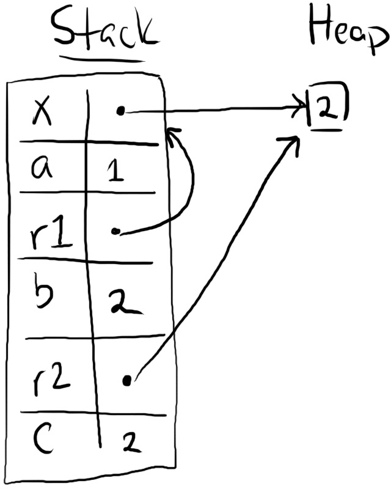
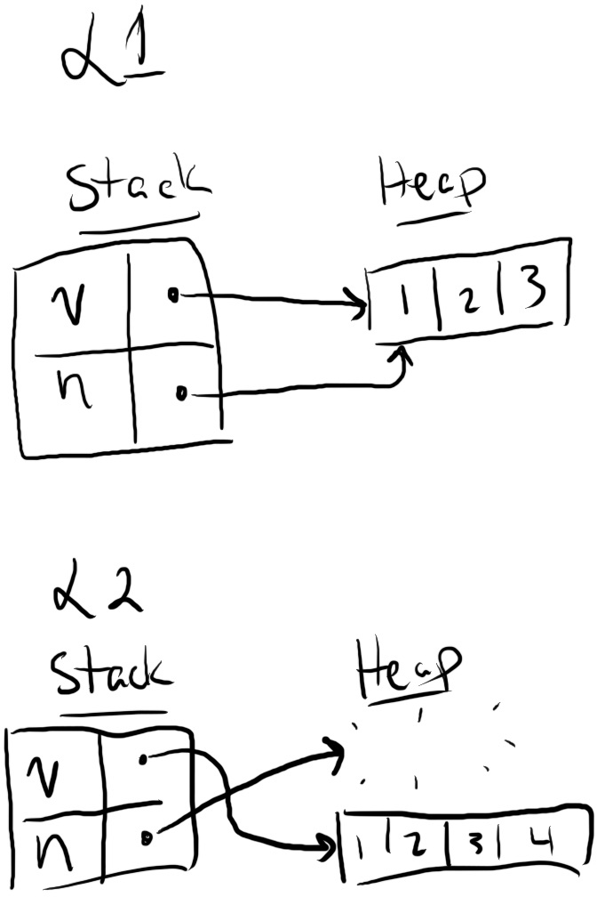

## References and Borrowing

Ownership, boxes, and moves provide a foundation for safely programming with heap data. However, move-only APIs can be inconvenient to use. For example, say you want to read a string to print it out:

```rust
fn main() {
    let m1 = String::from("Hello");
    let m2 = String::from("world");
    greet(m1, m2);
    // We can't use `m1` or `m2` anymore!
}

fn greet(g1: String, g2: String) {
    println!("{} {}!", g1, g2);
}
```

In this example, calling `greet` moves `m1` and `m2` into `greet`. Both strings are dropped at the end of `greet`, and therefore cannot be used within `main`. 

This move behavior is extremely inconvenient. Programs often need to use a string more than once. Hypothetically, an alternative `greet` can return ownership of the strings:

```rust
fn main() {
    let m1 = String::from("Hello");
    let m2 = String::from("world");
    let (m1, m2) = greet(m1, m2);
    // We can use `m1` and `m2` here... but at what cost?
}

fn greet(g1: String, g2: String) -> (String, String) {
    println!("{} {}!", g1, g2);
    (g1, g2)
}
```

However, this style of program is quite verbose. Rust provides a more concise style of reading and writing movable objects with references.

### References Are Non-Owning Pointers

A **reference** is a kind of pointer. Here's an example of a reference that rewrites our `greet` program in a more convenient manner:

```rust
fn main() {
    let m1 = String::from("Hello");
    let m2 = String::from("world");
    // L1
    greet(&m1, &m2); // note the ampersands
    // L3
}

fn greet(g1: &String, g2: &String) { // note the ampersands
    // L2
    println!("{} {}!", g1, g2);
}
```

The expression `&m1` uses the ampersand operator to create a reference to `m1` on the stack. The type of `g1` is also changed to `&String`, meaning "a reference to a `String`". At runtime, the references look like this:


Observe at L2 that there are two steps from `g1` to the string "Hello". `g1` is a reference that points to `m1` on the stack, and `m1` is a box that points to "Hello" on the heap.

While `m1` owns the heap data "Hello", `g1` does *not* own either `m1` or "Hello". Therefore after `greet` ends and the program reaches L3, no heap data has been deallocated. Only the stack frame for `greet` disappears. This fact is consistent with our Moved Heap Data Principle: because `g1` did not own "Hello", Rust did not deallocate "Hello" on behalf of `g1`. 

References are **non-owning pointers**, because they do not own the data they point-to.

### Dereferencing a Pointer Accesses Its Data

The previous examples using boxes and strings have not shown how Rust "follows" a pointer to its data. For example, the `println!` macro has mysteriously worked for inputs that were both plain strings of type `String`, and references to strings of type `&String`. The underlying mechanism is the **dereference** operator, written with an asterisk (`*`). For example, here's a program that uses dereferences in a few different ways:

```rust
# fn main() {
let mut x: Box<i32> = Box::new(1);
let a: i32 = *x;
*x += 1;

let r1: &Box<i32> = &x;
let b: i32 = **r1;

let r2: &i32 = &*x;
let c: i32 = *r2;
// L1
# }
```

And here is the state of memory at the end of the program:



Let's walk through each line:
1. First, we create a box `x` with `Box::new(1)`.
2. The expression `*x` dereferences `x`, which copies the value `1` off the heap. Then `let a = *x` puts `1` into the stack slot for `a`.
3. By putting the dereference on the left-hand side of `*x += 1`, we are modifying the heap data in-place. The heap value for `x` now contains `2`.
4. The statement `let r1 = &x` creates a reference to `x`, which points to `x` on the stack. `r1` has type `&Box<i32>`, a reference to a box of a 32-bit integer.
5. The statement `let b = **r1` follows the two-step pointer: `*r` goes to `x`, and `**r1` goes to the heap value `2`, therefore `b` is bound to `2`.
6. The statement `let r2 = &*x` dereferences `x` to its heap data, and gets a pointer to the heap. `r2` then points *directly* to the heap, bypassing `x`.
7. The statement `let c = *r2` dereferences `r2` once, getting the value `2` from the heap.

You probably won't see the dereference operator very often when you read Rust code. This is because Rust implicitly inserts both dereferences and references in certain cases, such as calling a method with the dot operator. For example, this program shows two equivalent ways of calling the [`i32::abs`](https://doc.rust-lang.org/std/primitive.i32.html#method.abs) (absolute value) and [`str::len`](https://doc.rust-lang.org/std/primitive.str.html#method.len) (string length) functions:

```rust
# fn main()  {
let x: Box<i32> = Box::new(-1);
let r: &Box<i32> = &x;
let n1: i32 = r.abs();       // implicit dereference
let n2: i32 = i32::abs(**r); // explicit dereference
assert_eq!(n1, n2);

let s = String::from("Hello");
let n1 = s.len();      // implicit reference
let n2 = str::len(&s); // explicit reference
assert_eq!(n1, n2);
# }
```

The `i32::abs` function expects an input of type `i32`, so by providing an `&Box<i32>`, Rust will insert two dereferences. The `str::len` function expects an input of type `&str`, so by providing an owned `String`, Rust will insert a single reference.

We will say more about method calls and implicit conversions in later chapters. For now, the important takeaway is to recognize that these conversions are happening, especially with method calls. We want to unravel all the "magic" of Rust so you can have a clear mental model of what happens at runtime.


### Rust Avoids Simultaneous Aliasing and Mutation 

Pointers are a powerful and dangerous feature because they enabling **aliasing**: accessing the same data through different variables. On its own, aliasing is harmless. But combined with **mutation**, we have a recipe for disaster. One variable can "pull the rug out" from another variable in many ways, for example:
* By deallocating the aliased data, leaving the other variable to point to deallocated memory.
* By mutating the aliased data, invalidating runtime properties expected by the other variable.
* By *concurrently* mutating the aliased data, causing a tricky data race with nondeterministic behavior for the other variable.

Therefore Rust follows a basic principle to prevent undefined behavior:

> **Pointer Safety Principle**: data should never be aliased and mutated at the same time.

Data is allowed to be aliased. Data is allowed to be mutated. But data is *not* allowed to be *both* aliased *and* mutated. For example, Rust enforces this principle for boxes (owned pointers) by disallowing aliasing. Assigning a box from one variable to another will move ownership, invalidating the previous variable. Owned data can only be accessed through the owner &mdash; no aliases.

However, references need different rules to enforce the Pointer Safety Principle because they are non-owning pointers. By design, references are meant to temporarily create aliases. In the remainder of this section, we will explain the basics of how Rust checks for the safety of programs with references.

### References Change Permissions on Paths

The core idea is that variables have three kinds of **permissions** on their data:
* **Read** (R): data can be copied to another location.
* **Write** (W): data can be mutated in-place.
* **Own** (O): data can be moved or dropped.

By default, a variable has read and own permissions (`RO`) on its data, as well as write (`W`) if annotated with `let mut`. However, a reference can temporarily change those permissions. Here is a simple example that is annotated with changes in permissions after each line in the program:

<pre class="aquascope">
fn main() {
    let mut x = 1;
    let y = &x;
    println!("{} = {}", x, *y);
    x += 1;
}
</pre>

Let's walk through each line:

1. After `let mut x = 1`, the variable `x` has been initialized (indicated by <i class="fa fa-level-up"></i>). It gains read/write/own permissions.
2. After `let y = &x`, the variable `x` has been **borrowed** by `y` (indicated by <i class="fa fa-arrow-right"></i>). Three things happen:
    * The borrow removes write/own permissions from `x`: it cannot write or own its data, but it can still read its data. 
    * The variable `y` has gained read/own permissions. `y` is not writable because it was not marked `let mut`.
    * The **path** `*y` has gained read permissions.
3. After `println!("{} = {}", x, *y)`, `y` is no longer in use, and `x` is no longer borrowed. Therefore:
    * `x` regains its write/own permissions (indicated by <i class="fa fa-rotate-left"></i>).
    * `y` and `*y` have lost all of their permissions (indicated by <i class="fa fa-level-down"></i>).
4. After `x += 1`, `x` is no longer in use, and it loses all of its permissions.

Permissions are not just defined on variables (like `x` or `y`), but also on **paths** (like `*y`). A path is anything you can put on the left-hand side of an assignment. Paths include:
* Variables, like `a`.
* Dereferences of paths, like `*a`.
* Array accesses of paths, like `a[0]`.
* Fields of paths, like `a.0` for tuples or `a.field` for structs (discussed next section).
* Any combination of the above, like `(*a)[0].1`.

For example, here's a program that shows how you can borrow one field of a tuple, and write to a different field of the same tuple:

<pre class="aquascope">
fn main() {
    let mut x = (1, 2);
    let y = &x.0;    
    x.1 += 1;
    println!("{:?} {}", x, y);
}
</pre>

The statement `let y = &x.0` borrows `x.0` which removes write/own permissions from `x.0` and `x`. However, `x.1` still retains write permissions, so doing `x.1 += 1` is a valid operation.

Returning to the Pointer Safety Principle, the goal of these permissions is to ensure that data cannot be mutated if it is aliased. Creating a reference to data ("borrowing" it) makes that data temporarily read-only until the reference is no longer used.

<!-- The key thing to observe is that a variable's *type* is not the same as its *permissions*. A variable always has the same type, but its permissions will change depending on context. Specifically, a variable loses permissions when its contents are borrowed by a reference. It regains those permissions when the reference is no longer used.

Permissions are a compile-time concept, not a run-time concept. The Rust compiler has a program analyzer called the "borrow checker" which statically checks your program for permissions violations. -->

### The Borrow Checker Finds Permission Violations

Rust uses these permissions in its **borrow checker**. The borrow checker determines whether a program is doing potentially unsafe operations involving references. For example, let's say we moved the `x += 1` statement inbetween the definition of `y` and the use of `*y`, like this: 

```rust,ignore,does_not_compile
# fn main() {
let mut x = 1;
let y = &x;
x += 1;
println!("{} = {}", x, *y);
# }
```

Then the Rust compiler will reject this program with the following error:

```text
error[E0506]: cannot assign to `x` because it is borrowed
 --> src/main.rs:4:1
  |
3 | let y = &x;
  |         -- borrow of `x` occurs here
4 | x += 1;
  | ^^^^^^ assignment to borrowed `x` occurs here
5 | println!("{} = {}", x, *y);
  |                        -- borrow later used here
```

This error reflects the fact that `x` does not have write permissions inbetween `let y = &x` and `println!(..)`.

Now you may think that Rust is being overzealous here &mdash; what's the harm in incrementing `x`? That won't affect the reference `y`. But here is a similar example with an actual safety issue:


```rust,ignore,does_not_compile
# fn main() {
let mut v = vec![1, 2, 3];
let n = &v[0];
// L1
v.push(4);
// L2
println!("{:?}, {}", v, *n);
# }
```

This program could possibly have the following states at L1 and L2:



The function `v.push(4)` could potentially resize `v`, deallocating its original contents. This operation would invalidate the reference `n`, leading it to point to deallocated memory. The subsequent read of `*n` would therefore be undefined behavior. 

Thankfully, Rust rejects this program. The statement `&v[0]` borrows the vector `v`, which removes write permissions from `v`, so `v.push(4)` is flagged as a permissions violation. 

In sum, Rust's borrow checker prevents *all* unsafe uses of references (like `v.push(4)`). However, it also prevents *some* safe uses of references (like `x += 1`). Understanding this distinction will help you deal with Rust compiler errors. 

Safe operations can often be rewritten using data structures designed to work around Rust's limitations. For example, you could rewrite the `x += 1` program using a different construct like a [`Cell`](https://doc.rust-lang.org/std/cell/struct.Cell.html) or an [`AtomicUsize`](https://doc.rust-lang.org/std/sync/atomic/struct.AtomicUsize.html):

```rust
# use std::cell::Cell;
# use std::sync::atomic::{Ordering, AtomicUsize};
# fn main() {
let x = Cell::new(1);
let y = &x;
x.set(x.get() + 1);
println!("{} {}", x.get(), y.get());

let x = AtomicUsize::new(1);
let y = &x;
x.fetch_add(1, Ordering::SeqCst);
println!("{} {}", x.load(Ordering::SeqCst), y.load(Ordering::SeqCst))
# }
```

We will cover these constructs in detail in later chapters. For now, the takeaway is that there are constructs specialized for safely working around limitations of the borrow checker.

Unsafe operations cannot generally be fixed with a straightforward rewrite. For example, you simply cannot hold a reference to a vector's element while also resizing the vector. In this setting, one fix would be to hold the numeric index of an element, but not an actual reference, like this:

```rust
# fn main() {
let mut v = vec![1, 2, 3];
let n_idx = 0;
v.push(4);
println!("{:?}, {}", v, v[n_idx]);    
# }
```

Or to move the borrow after the mutation, like this:

```rust
# fn main() {
let mut v = vec![1, 2, 3];
v.push(4);
let n = &v[0];
println!("{:?}, {}", v, *n);    
# }
```

The right solution will naturally depend on the specific circumstances of your codebase. But at the very least, whenever you get an error from Rust's borrow checker, you should ask: is my code actually unsafe? The answer will guide how you can change your code to satisfy Rust.


### Mutable References Provide Unique and Non-Owning Access to Data

The references we have seen so far are read-only: **immutable references** (also called shared references). These references permit aliasing but disallow mutation. However, it is also convenient to be able to temporarily provide mutable access to data without moving ownership of it. For example, the [`Vec::push`](https://doc.rust-lang.org/std/vec/struct.Vec.html#method.push) should add an element to a vector without consuming ownership of it.

The mechanism for this is **mutable references** (also called unique references). Here's a simple example of a mutable reference with the accompanying permissions changes:

<pre class="aquascope">
fn main() {
    let mut x = 1;
    let y = &mut x;
    *y += 1;
    println!("{x}");
}
</pre>

A mutable reference is created with the syntax `&mut x`. The type of `y` is written as `&mut i32`. You can see two important differences in the transfer of permissions compared to the previous example:

1. When `y` was an immutable reference, `x` still had read permissions. Now that `y` is a mutable reference, `x` has lost *all* permissions while `y` is in use.
2. When `y` was an immutable reference, the path `*y` only had read permissions. Now that `y` is a mutable reference, `*y` has also gained write permissions.

The first observation is what makes mutable references safe. Mutable references allow mutation but prevent aliasing. The borrowed path becomes temporarily unusable (i.e. effectively not an alias).

The second observation is what makes mutable references useful. `x` can be mutated through `*y`. For example, `*y += 1` adds 1 to `x`.

Mutable references can also be temporarily "downgraded" to read-only references. For example:

<pre class="aquascope">
fn main() {
    let mut x = 1;
    let y = &mut x;
    let z = &*y;
    println!("{y} {z}");
}
</pre>

In this program, the operation `&*y` removes the write permission from `*y` but *not* the read permission, so `println!(..)` can read both `*y` and `*z`.