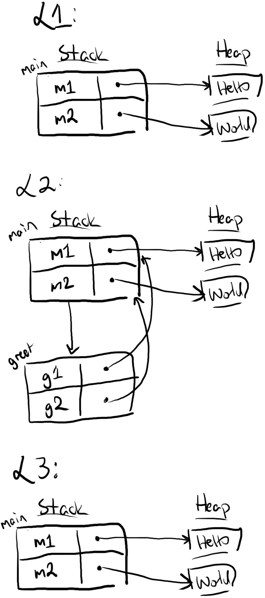

## References and Borrowing

Ownership, boxes, and moves provide a foundation for safely programming with the heap. However, move-only APIs can be inconvenient to use. For example, say you want to read some strings twice:

```aquascope,interpreter,shouldFail
fn main() {
    let m1 = String::from("Hello");
    let m2 = String::from("world");
    greet(m1, m2);
    let s = format!("{} {}", m1, m2);`[]` // Error: m1 and m2 are moved
}

fn greet(g1: String, g2: String) {
    println!("{} {}!", g1, g2);`[]`
}
```

In this example, calling `greet` moves the data from `m1` and `m2` into the parameters of `greet`. Both strings are dropped at the end of `greet`, and therefore cannot be used within `main`.

This move behavior is extremely inconvenient. Programs often need to use a string more than once. Hypothetically, an alternative `greet` can return ownership of the strings:

```aquascope,interpreter
fn main() {
    let m1 = String::from("Hello");
    let m2 = String::from("world");
    let (m1_again, m2_again) = greet(m1, m2);
    let s = format!("{} {}", m1_again, m2_again);`[]`
}

fn greet(g1: String, g2: String) -> (String, String) {
    println!("{} {}!", g1, g2);
    (g1, g2)
}
```

However, this style of program is quite verbose. Rust provides a more concise style of reading and writing without moves through references.

### References Are Non-Owning Pointers

A **reference** is a kind of pointer. Here's an example of a reference that rewrites our `greet` program in a more convenient manner:

```aquascope,interpreter
fn main() {
    let m1 = String::from("Hello");
    let m2 = String::from("world");`[]`
    greet(&m1, &m2);`[]` // note the ampersands
    let s = format!("{} {}", m1, m2);
}

fn greet(g1: &String, g2: &String) { // note the ampersands
    `[]`println!("{} {}!", g1, g2);
}
```

The expression `&m1` uses the ampersand operator to create a reference to (or "borrow") `m1`. The type of the `greet` parameter `g1` is changed to `&String`, meaning "a reference to a `String`". 

<!-- At runtime, the references look like this:

 -->

Observe at L2 that there are two steps from `g1` to the string "Hello". `g1` is a reference that points to `m1` on the stack, and `m1` is a String containing a box that points to "Hello" on the heap.

While `m1` owns the heap data "Hello", `g1` does _not_ own either `m1` or "Hello". Therefore after `greet` ends and the program reaches L3, no heap data has been deallocated. Only the stack frame for `greet` disappears. This fact is consistent with our *Moved Heap Data Principle*: because `g1` did not own "Hello", Rust did not deallocate "Hello" on behalf of `g1`.

References are **non-owning pointers**, because they do not own the data they point to.

### Dereferencing a Pointer Accesses Its Data

The previous examples using boxes and strings have not shown how Rust "follows" a pointer to its data. For example, the `println!` macro has mysteriously worked for inputs that were both plain strings of type `String`, and references to strings of type `&String`. The underlying mechanism is the **dereference** operator, written with an asterisk (`*`). For example, here's a program that uses dereferences in a few different ways:

```aquascope,interpreter
#fn main() {
let mut x: Box<i32> = Box::new(1);
let a: i32 = *x;         // *x reads the heap value, so a = 1
*x += 1;                 // *x on the left-side modifies the heap value, 
                         //     so x points to the value 2

let r1: &Box<i32> = &x;  // r1 points to x on the stack
let b: i32 = **r1;       // two dereferences get us to the heap value

let r2: &i32 = &*x;      // r2 points to the heap value directly
let c: i32 = *r2;`[]`    // so only one dereference is needed to read it
#}
```

Observe the difference between `r1` pointing to `x` on the stack, and `r2` pointing to the heap value `2`.

You probably won't see the dereference operator very often when you read Rust code. This is because Rust implicitly inserts both dereferences and references in certain cases, such as calling a method with the dot operator. For example, this program shows two equivalent ways of calling the [`i32::abs`](https://doc.rust-lang.org/std/primitive.i32.html#method.abs) (absolute value) and [`str::len`](https://doc.rust-lang.org/std/primitive.str.html#method.len) (string length) functions:

```rust,ignore
#fn main()  {
let x: Box<i32> = Box::new(-1);
let x_abs1 = i32::abs(*x); // explicit dereference
let x_abs2 = x.abs();      // implicit dereference
assert_eq!(x_abs1, x_abs2);

let r: &Box<i32> = &x;
let r_abs1 = i32::abs(**r); // explicit dereference (twice)
let r_abs2 = r.abs();       // implicit dereference (twice)
assert_eq!(r_abs1, r_abs2);

let s = String::from("Hello");
let s_len1 = str::len(&s); // explicit reference
let s_len2 = s.len();      // implicit reference
assert_eq!(s_len1, s_len2);
#}
```

This example shows implicit conversions in three ways:
1. The `i32::abs` function expects an input of type `i32`. To call `abs` with a `Box<i32>`, you can explicitly dereference the box like `i32::abs(*x)`, or you can implicitly dereference the box using method-call syntax like `x.abs()`. The dot syntax is syntactic sugar for the function-call syntax.

2. This implicit conversion works for multiple layers of pointers. For example, calling `abs` on a reference to a box `r: &Box<i32>` will insert two dereferences. 

3. This conversion also works the opposite direction: if a function like `str::len` expects a reference `&str`, then by providing an owned `String`, Rust will insert a single borrowing operator. (In fact, there is a further conversion from `String` to `str`!)

We will say more about method calls and implicit conversions in later chapters. For now, the important takeaway is to recognize that these conversions are happening, especially with method calls and some macros like `println`. We want to unravel all the "magic" of Rust so you can have a clear mental model of how Rust works.

{{#quiz ../quizzes/ch04-02-references-sec1-basics.toml}}

### Rust Avoids Simultaneous Aliasing and Mutation

Pointers are a powerful and dangerous feature because they enable **aliasing**: accessing the same data through different variables. On its own, aliasing is harmless. But combined with **mutation**, we have a recipe for disaster. One variable can "pull the rug out" from another variable in many ways, for example:

- By deallocating the aliased data, leaving the other variable to point to deallocated memory.
- By mutating the aliased data, invalidating runtime properties expected by the other variable.
- By _concurrently_ mutating the aliased data, causing a data race with nondeterministic behavior for the other variable.

Therefore Rust follows a basic principle to prevent undefined behavior:

> **Pointer Safety Principle**: data should never be aliased and mutated at the same time.

Data is allowed to be aliased. Data is allowed to be mutated. But data is _not_ allowed to be _both_ aliased _and_ mutated. For example, Rust enforces this principle for boxes (owned pointers) by disallowing aliasing. Assigning a box from one variable to another will move ownership, invalidating the previous variable. Owned data can only be accessed through the owner &mdash; no aliases.

However, references need different rules to enforce the Pointer Safety Principle because they are non-owning pointers. By design, references are meant to temporarily create aliases. In the remainder of this section, we will explain the basics of how Rust ensures the safety of programs with references through the **borrow checker.**

### References Change Permissions on Paths

The core idea is that variables have three kinds of **permissions** on their data:

- **Read** (<span class="perm read">R</span>): data can be copied to another location.
- **Write** (<span class="perm write">W</span>): data can be mutated in-place.
- **Own** (<span class="perm drop">O</span>): data can be moved or dropped.

These permissions don't exist at runtime, only within the compiler. They describe how the compiler "thinks" about your program before the program is ever executed.

By default, a variable has read/own permissions (<span class="perm read">R</span><span class="perm drop">O</span>) on its data. If a variable is annotated with `let mut`, then it also has write permissions (<span class="perm write">W</span>). The key idea is 
that **references can temporarily remove these permissions.** 

To illustrate this idea, we will use a new kind of diagram. This diagram shows the changes in permissions on each line of the program. For example:

<!-- TODO: can we show unchanged permissions for variables appearing in a table? -->
<!-- horizontal line should be vertical-aligned to bottom of the row, not middle
     to indicate that it describes after-permissions -->

```aquascope,permissions,stepper
#fn main() {
let mut x = String::from("Hello");
let y = &x;
println!("{} and {}", x, y);
x.push_str(" world");
#}
```

Let's walk through each line:

1. After `let mut x = (...)`, the variable `x` has been initialized (indicated by <i class="fa fa-level-up"></i>). It gains read/write/own permissions (the plus sign indicates gain).
2. After `let y = &x`, the data in `x` has been **borrowed** by `y` (indicated by <i class="fa fa-arrow-right"></i>). Three things happen:
   - The borrow removes write/own permissions from `x` (the slash indicates loss). `x` cannot be written or owned, but it can still be read.
   - The variable `y` has gained read/own permissions. `y` is not writable (the missing write permission is shown as a dash `-`) because it was not marked `let mut`.
   - The **path** `*y` has gained read permissions. Note that `y` is different from `*y`! `y` is a reference to a string, while `*y` is the string itself, accessed through a reference.
3. After `println!(...)`, `y` is no longer in use, so `x` is no longer borrowed. Therefore:
   - `x` regains its write/own permissions (indicated by <i class="fa fa-rotate-left"></i>).
   - `y` and `*y` have lost all of their permissions (indicated by <i class="fa fa-level-down"></i>).
4. After `x.push_str(...)`, `x` is no longer in use, and it loses all of its permissions.

Permissions are not just defined on variables (like `x` or `y`), but also on **paths** (like `*y`). A path is anything you can put on the left-hand side of an assignment. Paths include:

- Variables, like `a`.
- Dereferences of paths, like `*a`.
- Array accesses of paths, like `a[0]`.
- Fields of paths, like `a.0` for tuples or `a.field` for structs (discussed next section).
- Any combination of the above, like `*((*a)[0].1)`.

Note that permissions are *not* defined on data. For example, in the program above, the string "Hello" does not have permissions, but the paths to it (`x` and `*y`) do have permissions. In the discipline of ownership, it's not just *what* you're data accessing, but *how* you're accessing it.

Returning to the Pointer Safety Principle, the goal of these permissions is to ensure that data cannot be mutated if it is aliased. Creating a reference to data ("borrowing" it) causes that data to be temporarily read-only until the reference is no longer used.


### The Borrow Checker Finds Permission Violations

Rust uses these permissions in its **borrow checker**. The borrow checker determines whether a program is doing potentially unsafe operations involving references. For example, suppose we placed the `x.push_str(...)` statement in-between the definition of `y` and the use of `y`, like this:

```aquascope,permissions,boundaries,stepper,shouldFail
#fn main() {
let mut x = String::from("Hello");
let y = &x;`{}`
x.push_str(" world");`{}`
println!("{} and {}", x, y);
#}
```

This example shows another kind of visualization. Any time a path is *used*, Rust expects that path to have certain permissions. For example, the borrow `&x` requires that `x` is readable, therefore the permission <span class="perm read">R</span> is shown. The letter is filled-in because `x` has the read permission at that line. 

By contrast, the mutating operation `x.push_str(...)` requires that `x` is readable and writable, so both <span class="perm read">R</span> and <span class="perm write">W</span> are shown. However, `x` does not have write permissions (it is borrowed by `y`), so the letter <span class="perm write missing">W</span> is hollow, indicating that the write permission is *expected* but `x` does not have it.

If you try to compile this program, then the Rust compiler will reject this program with the following error:

```text
error[E0502]: cannot borrow `x` as mutable because it is also borrowed as immutable
 --> test.rs:4:1
  |
3 | let y = &x;
  |         -- immutable borrow occurs here
4 | x.push_str(" world");
  | ^^^^^^^^^^^^^^^^^^^^ mutable borrow occurs here
5 | println!("{} and {}", x, y);
  |                          - immutable borrow later used here
```

If Rust allowed this program to compile, we would violate memory safety. The operation `x.push_str(...)` could internally cause `x` to resize, reallocating its memory to a different heap location. This reallocation would invalidate the reference `y`, so reading it in the `println` is undefined behavior.


### Mutable References Provide Unique and Non-Owning Access to Data

The references we have seen so far are read-only: **immutable references** (also called **shared references**). These references permit aliasing but disallow mutation. However, it is also useful to temporarily provide mutable access to data without moving it. For example, [`String::push_str`] should extend a string without consuming ownership of it.

The mechanism for this is **mutable references** (also called **unique references**). Here's a simple example of a mutable reference with the accompanying permissions changes:

```aquascope,permissions,stepper,boundaries
#fn main() {
let mut x = String::from("Hello");
let y = &mut x;
y.push_str(" world"); 
println!("{}", x);
#}
```

> <div style="margin-block-start: 1em; margin-block-end: 1em"><i>Note:</i> when the expected permissions are not relevant to an example, we will abbreviate them as dots like <div class="permission-stack stack-size-2"><div class="perm read"><div class="small">•</div><div class="big">R</div></div><div class="perm write"><div class="small">•</div><div class="big">W</div></div></div>. You can hover your mouse over the circles (or tap on a touchscreen) to see the corresponding permission letters.</div>

A mutable reference is created with the syntax `&mut x`. The type of `y` is written as `&mut String`. You can see two important differences in the transfer of permissions compared to the previous example:

1. When `y` was an immutable reference, `x` still had read permissions. Now that `y` is a mutable reference, `x` has lost _all_ permissions while `y` is in use.
2. When `y` was an immutable reference, the path `*y` only had read permissions. Now that `y` is a mutable reference, `*y` has also gained write permissions (but not own permissions).

The first observation is what makes mutable references safe. Mutable references allow mutation but prevent aliasing. The borrowed path becomes temporarily unusable (i.e. effectively not an alias).

The second observation is what makes mutable references useful. `x` can be mutated through `*y`. For example, `y.push_str(...)` mutates `x`. Note that while `*y` has write permissions, `y` does not. This is because `y` refers to the mutable reference itself, e.g. `y` cannot be reassigned to a *different* mutable reference.

Mutable references can also be temporarily "downgraded" to read-only references. For example:

```aquascope,permissions,stepper,boundaries
#fn main() {
let mut x = String::from("Hello");
let y = &mut x;
let z = &*y;`(focus,paths:*)`
println!("{} {}", y, z);`{}`
#}
```

> *Note:* when permission changes are not relevant to an example, we will hide them. You can view hidden steps by clicking "»", and you can view hidden permissions within a step by clicking "● ● ●".

In this program, the borrow `&*y` removes the write permission from `*y` but _not_ the read permission, so `println!(..)` can read both `*y` and `*z`.


### Permissions Are Returned At The End of a Reference's Lifetime

Previously, we explained that that a reference changes permissions while the reference is "in use". The phrase "in use" is describing a reference's **lifetime**, which is the range of code spanning from its birth (where the reference is created) to its death (the last time(s) the reference is used).

For example, in this program, the lifetime of `y` starts with `let y = &x`, and ends with `let z = *y`:

```aquascope,permissions,stepper,boundaries
#fn main() {
let mut x = 1;
let y = &x;`(focus,paths:x)`
let z = *y;`(focus,paths:x)`
x += z;
#}
```

The write permissions on `x` are returned to `x` after the lifetime of `y` has ended, like we have seen before.

In the previous examples, a lifetime has been a contiguous region of code. However, once we introduce control flow, this is not necessarily the case. For example, here is a simple function that capitalizes the first character in a vector of ASCII characters:

```aquascope,permissions,stepper,boundaries
fn ascii_capitalize(v: &mut Vec<char>) {
    let c = &v[0];`(focus,paths:*v)`
    if c.is_ascii_lowercase() {
        let up = c.to_ascii_uppercase();`(focus,paths:*v)`
        v[0] = up;
    } else {`(focus,paths:*v)`
        println!("Already capitalized: {:?}", v);
    }
}
```

The variable `c` has a different lifetime in each branch of the if-statement. In the then-block, `c` is used in the expression `c.to_ascii_uppercase()`. Therefore `*v` does not regain write permissions until after that line.

However, in the else-block, `c` is not used. Therefore `*v` immediately regains write permissions on entry to the else-block.


### Data Must Outlives All Of Its References

One final safety property for references is that **data must outlives its references.** For example, consider this function that adds a reference to a vector of references:

```rust,ignore,does_not_compile
fn add_ref(v: &mut Vec<&i32>, n: i32) {
    let r = &n;
    v.push(r);
}
```

Rust will reject this function with the following error:

```text
error[E0597]: `n` does not live long enough
 --> src/lib.rs:2:13
  |
1 | fn add_ref(v: &mut Vec<&i32>, n: i32) {
  |                        - let's call the lifetime of this reference `'1`
2 |     let r = &n;
  |             ^^ borrowed value does not live long enough
3 |     v.push(r);
  |     --------- argument requires that `n` is borrowed for `'1`
4 | }
  |  - `n` dropped here while still borrowed
```

The argument `n` only lives for the duration of `add_ref`. However, the reference `r` is being pushed into `v`, and `v` lives longer than `add_ref`. Therefore Rust complains that the data (`n`) does not outlive all of its references (`r`).

If this function were allowed, we could call `add_ref` like this:

```aquascope,interpreter,shouldFail
fn add_ref(v: &mut Vec<&i32>, n: i32) {
    let r = &n;
    v.push(r);`[]`    
}
fn main() {
    let mut v = Vec::new();
    add_ref(&mut v, 0);
    println!("{}", v[0]);`[]`
}
```

Then `v` would contain a reference that points to deallocated memory, and printing `v[0]` would violate memory safety.

{{#quiz ../quizzes/ch04-02-references-sec2-perms.toml}}

### Summary

References provide the ability to read and write data without consuming ownership of it. References are created with borrows (`&` and `&mut`) and used with dereferences (`*`), sometimes implicitly.

However, references can be easily misused, so Rust provides a system of permissions to verify that programs use references safely:

- All variables can read, own, and (optionally) write their data.
- Creating a reference will transfer permissions from the borrowed path to the reference.
- Permissions are returned once the reference's lifetime has ended.
- Data must outlive all references that point to it.

In this section, it probably feels like we've described more of what Rust _cannot_ do than what Rust _can_ do. That is intentional! One of Rust's core features is enabling you to use references safely but without garbage collection. Understanding these safety rules now will help you avoid frustration with the compiler down the road.

[`String::push_str`]: https://doc.rust-lang.org/std/string/struct.String.html#method.push_str