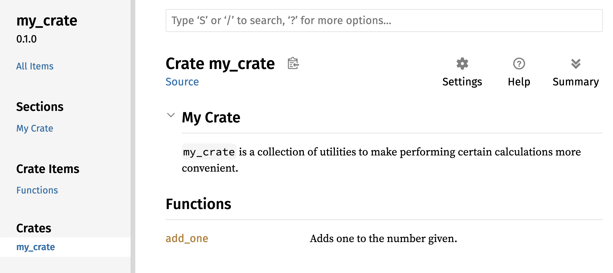

## Publishing a Crate to Crates.io

We’ve used packages from [crates.io](https://crates.io/)<!-- ignore --> as
dependencies of our project, but you can also share your code with other people
by publishing your own packages. The crate registry at
[crates.io](https://crates.io/)<!-- ignore --> distributes the source code of
your packages, so it primarily hosts code that is open source.

Rust and Cargo have features that help make your published package easier for
people to use and to find in the first place. We’ll talk about some of these
features next and then explain how to publish a package.

### Making Useful Documentation Comments

Accurately documenting your packages will help other users know how and when to
use them, so it’s worth investing the time to write documentation. In Chapter
3, we discussed how to comment Rust code using two slashes, `//`. Rust also has
a particular kind of comment for documentation, known conveniently as a
*documentation comment*, that will generate HTML documentation. The HTML
displays the contents of documentation comments for public API items intended
for programmers interested in knowing how to *use* your crate as opposed to how
your crate is *implemented*.

Documentation comments use three slashes, `///`, instead of two and support
Markdown notation for formatting the text. Place documentation comments just
before the item they’re documenting. Listing 14-1 shows documentation comments
for an `add_one` function in a crate named `my_crate`:

<span class="filename">Filename: src/lib.rs</span>

```rust,ignore
{{#rustdoc_include ../listings/ch14-more-about-cargo/listing-14-01/src/lib.rs}}
```

<span class="caption">Listing 14-1: A documentation comment for a
function</span>

Here, we give a description of what the `add_one` function does, start a
section with the heading `Examples`, and then provide code that demonstrates
how to use the `add_one` function. We can generate the HTML documentation from
this documentation comment by running `cargo doc`. This command runs the
`rustdoc` tool distributed with Rust and puts the generated HTML documentation
in the *target/doc* directory.

For convenience, running `cargo doc --open` will build the HTML for your
current crate’s documentation (as well as the documentation for all of your
crate’s dependencies) and open the result in a web browser. Navigate to the
`add_one` function and you’ll see how the text in the documentation comments is
rendered, as shown in Figure 14-1:


<span class="caption">Figure 14-1: HTML documentation for the `add_one`
function</span>

#### Commonly Used Sections

We used the `# Examples` Markdown heading in Listing 14-1 to create a section
in the HTML with the title “Examples.” Here are some other sections that crate
authors commonly use in their documentation:

* **Panics**: The scenarios in which the function being documented could
  panic. Callers of the function who don’t want their programs to panic should
  make sure they don’t call the function in these situations.
* **Errors**: If the function returns a `Result`, describing the kinds of
  errors that might occur and what conditions might cause those errors to be
  returned can be helpful to callers so they can write code to handle the
  different kinds of errors in different ways.
* **Safety**: If the function is `unsafe` to call (we discuss unsafety in
  Chapter 19), there should be a section explaining why the function is unsafe
  and covering the invariants that the function expects callers to uphold.

Most documentation comments don’t need all of these sections, but this is a
good checklist to remind you of the aspects of your code that people calling
your code will be interested in knowing about.

#### Documentation Comments as Tests

Adding example code blocks in your documentation comments can help demonstrate
how to use your library, and doing so has an additional bonus: running `cargo
test` will run the code examples in your documentation as tests! Nothing is
better than documentation with examples. But nothing is worse than examples
that don’t work because the code has changed since the documentation was
written. If we run `cargo test` with the documentation for the `add_one`
function from Listing 14-1, we will see a section in the test results like this:

<!-- manual-regeneration
cd listings/ch14-more-about-cargo/listing-14-01/
cargo test
copy just the doc-tests section below
-->

```text
   Doc-tests my_crate

running 1 test
test src/lib.rs - add_one (line 5) ... ok

test result: ok. 1 passed; 0 failed; 0 ignored; 0 measured; 0 filtered out; finished in 0.27s
```

Now if we change either the function or the example so the `assert_eq!` in the
example panics and run `cargo test` again, we’ll see that the doc tests catch
that the example and the code are out of sync with each other!

#### Commenting Contained Items

Another style of doc comment, `//!`, adds documentation to the item that
contains the comments rather than adding documentation to the items following
the comments. We typically use these doc comments inside the crate root file
(*src/lib.rs* by convention) or inside a module to document the crate or the
module as a whole.

For example, if we want to add documentation that describes the purpose of the
`my_crate` crate that contains the `add_one` function, we can add documentation
comments that start with `//!` to the beginning of the *src/lib.rs* file, as
shown in Listing 14-2:

<span class="filename">Filename: src/lib.rs</span>

```rust,ignore
{{#rustdoc_include ../listings/ch14-more-about-cargo/listing-14-02/src/lib.rs:here}}
```

<span class="caption">Listing 14-2: Documentation for the `my_crate` crate as a
whole</span>

Notice there isn’t any code after the last line that begins with `//!`. Because
we started the comments with `//!` instead of `///`, we’re documenting the item
that contains this comment rather than an item that follows this comment. In
this case, the item that contains this comment is the *src/lib.rs* file, which
is the crate root. These comments describe the entire crate.

When we run `cargo doc --open`, these comments will display on the front
page of the documentation for `my_crate` above the list of public items in the
crate, as shown in Figure 14-2:



<span class="caption">Figure 14-2: Rendered documentation for `my_crate`,
including the comment describing the crate as a whole</span>

Documentation comments within items are useful for describing crates and
modules especially. Use them to explain the overall purpose of the container to
help your users understand the crate’s organization.

### Exporting a Convenient Public API with `pub use`

In Chapter 7, we covered how to organize our code into modules using the `mod`
keyword, how to make items public using the `pub` keyword, and how to bring
items into a scope with the `use` keyword. However, the structure that makes
sense to you while you’re developing a crate might not be very convenient for
your users. You might want to organize your structs in a hierarchy containing
multiple levels, but then people who want to use a type you’ve defined deep in
the hierarchy might have trouble finding out that type exists. They might also
be annoyed at having to enter `use`
`my_crate::some_module::another_module::UsefulType;` rather than `use`
`my_crate::UsefulType;`.

The structure of your public API is a major consideration when publishing a
crate. People who use your crate are less familiar with the structure than you
are and might have difficulty finding the pieces they want to use if your crate
has a large module hierarchy.

The good news is that if the structure *isn’t* convenient for others to use
from another library, you don’t have to rearrange your internal organization:
instead, you can re-export items to make a public structure that’s different
from your private structure by using `pub use`. Re-exporting takes a public
item in one location and makes it public in another location, as if it were
defined in the other location instead.

For example, say we made a library named `art` for modeling artistic concepts.
Within this library are two modules: a `kinds` module containing two enums
named `PrimaryColor` and `SecondaryColor` and a `utils` module containing a
function named `mix`, as shown in Listing 14-3:

<span class="filename">Filename: src/lib.rs</span>

```rust,noplayground,test_harness
{{#rustdoc_include ../listings/ch14-more-about-cargo/listing-14-03/src/lib.rs:here}}
```

<span class="caption">Listing 14-3: An `art` library with items organized into
`kinds` and `utils` modules</span>

Figure 14-3 shows what the front page of the documentation for this crate
generated by `cargo doc` would look like:


<span class="caption">Figure 14-3: Front page of the documentation for `art`
that lists the `kinds` and `utils` modules</span>

Note that the `PrimaryColor` and `SecondaryColor` types aren’t listed on the
front page, nor is the `mix` function. We have to click `kinds` and `utils` to
see them.

Another crate that depends on this library would need `use` statements that
bring the items from `art` into scope, specifying the module structure that’s
currently defined. Listing 14-4 shows an example of a crate that uses the
`PrimaryColor` and `mix` items from the `art` crate:

<span class="filename">Filename: src/main.rs</span>

```rust,ignore
{{#rustdoc_include ../listings/ch14-more-about-cargo/listing-14-04/src/main.rs}}
```

<span class="caption">Listing 14-4: A crate using the `art` crate’s items with
its internal structure exported</span>

The author of the code in Listing 14-4, which uses the `art` crate, had to
figure out that `PrimaryColor` is in the `kinds` module and `mix` is in the
`utils` module. The module structure of the `art` crate is more relevant to
developers working on the `art` crate than to developers using the `art` crate.
The internal structure that organizes parts of the crate into the `kinds`
module and the `utils` module doesn’t contain any useful information for
someone trying to understand how to use the `art` crate. Instead, the `art`
crate’s module structure causes confusion because developers have to figure out
where to look, and the structure is inconvenient because developers must
specify the module names in the `use` statements.

To remove the internal organization from the public API, we can modify the
`art` crate code in Listing 14-3 to add `pub use` statements to re-export the
items at the top level, as shown in Listing 14-5:

<span class="filename">Filename: src/lib.rs</span>

```rust,ignore
{{#rustdoc_include ../listings/ch14-more-about-cargo/listing-14-05/src/lib.rs:here}}
```

<span class="caption">Listing 14-5: Adding `pub use` statements to re-export
items</span>

The API documentation that `cargo doc` generates for this crate will now list
and link re-exports on the front page, as shown in Figure 14-4, making the
`PrimaryColor` and `SecondaryColor` types and the `mix` function easier to find.


<span class="caption">Figure 14-4: The front page of the documentation for `art`
that lists the re-exports</span>

The `art` crate users can still see and use the internal structure from Listing
14-3 as demonstrated in Listing 14-4, or they can use the more convenient
structure in Listing 14-5, as shown in Listing 14-6:

<span class="filename">Filename: src/main.rs</span>

```rust,ignore
{{#rustdoc_include ../listings/ch14-more-about-cargo/listing-14-06/src/main.rs:here}}
```

<span class="caption">Listing 14-6: A program using the re-exported items from
the `art` crate</span>

In cases where there are many nested modules, re-exporting the types at the top
level with `pub use` can make a significant difference in the experience of
people who use the crate.

Creating a useful public API structure is more of an art than a science, and
you can iterate to find the API that works best for your users. Choosing `pub
use` gives you flexibility in how you structure your crate internally and
decouples that internal structure from what you present to your users. Look at
some of the code of crates you’ve installed to see if their internal structure
differs from their public API.

### Setting Up a Crates.io Account

Before you can publish any crates, you need to create an account on
[crates.io](https://crates.io/)<!-- ignore --> and get an API token. To do so,
visit the home page at [crates.io](https://crates.io/)<!-- ignore --> and log in
via a GitHub account. (The GitHub account is currently a requirement, but the
site might support other ways of creating an account in the future.) Once
you’re logged in, visit your account settings at
[https://crates.io/me/](https://crates.io/me/)<!-- ignore --> and retrieve your
API key. Then run the `cargo login` command with your API key, like this:

```console
$ cargo login abcdefghijklmnopqrstuvwxyz012345
```

This command will inform Cargo of your API token and store it locally in
*~/.cargo/credentials*. Note that this token is a *secret*: do not share it
with anyone else. If you do share it with anyone for any reason, you should
revoke it and generate a new token on [crates.io](https://crates.io/)<!-- ignore
-->.

### Adding Metadata to a New Crate

Now that you have an account, let’s say you have a crate you want to publish.
Before publishing, you’ll need to add some metadata to your crate by adding it
to the `[package]` section of the crate’s *Cargo.toml* file.

Your crate will need a unique name. While you’re working on a crate locally,
you can name a crate whatever you’d like. However, crate names on
[crates.io](https://crates.io/)<!-- ignore --> are allocated on a first-come,
first-served basis. Once a crate name is taken, no one else can publish a crate
with that name. Before attempting to publish a crate, search for the name you
want to use on the site. If the name has been used by another crate, you will
need to find another name and edit the `name` field in the *Cargo.toml* file
under the `[package]` section to use the new name for publishing, like so:

<span class="filename">Filename: Cargo.toml</span>

```toml
[package]
name = "guessing_game"
```

Even if you’ve chosen a unique name, when you run `cargo publish` to publish
the crate at this point, you’ll get a warning and then an error:

<!-- manual-regeneration
cd listings/ch14-more-about-cargo/listing-14-01/
cargo publish
copy just the relevant lines below
-->

```console
$ cargo publish
    Updating crates.io index
warning: manifest has no description, license, license-file, documentation, homepage or repository.
See https://doc.rust-lang.org/cargo/reference/manifest.html#package-metadata for more info.
--snip--
error: api errors (status 200 OK): missing or empty metadata fields: description, license. Please see https://doc.rust-lang.org/cargo/reference/manifest.html for how to upload metadata
```

The reason is that you’re missing some crucial information: a description and
license are required so people will know what your crate does and under what
terms they can use it. To rectify this error, you need to include this
information in the *Cargo.toml* file.

Add a description that is just a sentence or two, because it will appear with
your crate in search results. For the `license` field, you need to give a
*license identifier value*. The [Linux Foundation’s Software Package Data
Exchange (SPDX)][spdx] lists the identifiers you can use for this value. For
example, to specify that you’ve licensed your crate using the MIT License, add
the `MIT` identifier:

[spdx]: http://spdx.org/licenses/

<span class="filename">Filename: Cargo.toml</span>

```toml
[package]
name = "guessing_game"
license = "MIT"
```

If you want to use a license that doesn’t appear in the SPDX, you need to place
the text of that license in a file, include the file in your project, and then
use `license-file` to specify the name of that file instead of using the
`license` key.

Guidance on which license is appropriate for your project is beyond the scope
of this book. Many people in the Rust community license their projects in the
same way as Rust by using a dual license of `MIT OR Apache-2.0`. This practice
demonstrates that you can also specify multiple license identifiers separated
by `OR` to have multiple licenses for your project.

With a unique name, the version, your description, and a license added, the
*Cargo.toml* file for a project that is ready to publish might look like this:

<span class="filename">Filename: Cargo.toml</span>

```toml
[package]
name = "guessing_game"
version = "0.1.0"
edition = "2021"
description = "A fun game where you guess what number the computer has chosen."
license = "MIT OR Apache-2.0"

[dependencies]
```

[Cargo’s documentation](https://doc.rust-lang.org/cargo/) describes other
metadata you can specify to ensure others can discover and use your crate more
easily.

### Publishing to Crates.io

Now that you’ve created an account, saved your API token, chosen a name for
your crate, and specified the required metadata, you’re ready to publish!
Publishing a crate uploads a specific version to
[crates.io](https://crates.io/)<!-- ignore --> for others to use.

Be careful when publishing a crate because a publish is *permanent*. The
version can never be overwritten, and the code cannot be deleted. One major
goal of [crates.io](https://crates.io/)<!-- ignore --> is to act as a permanent
archive of code so that builds of all projects that depend on crates from
[crates.io](https://crates.io/)<!-- ignore --> will continue to work. Allowing
version deletions would make fulfilling that goal impossible. However, there is
no limit to the number of crate versions you can publish.

Run the `cargo publish` command again. It should succeed now:

<!-- manual-regeneration
go to some valid crate, publish a new version
cargo publish
copy just the relevant lines below
-->

```console
$ cargo publish
    Updating crates.io index
   Packaging guessing_game v0.1.0 (file:///projects/guessing_game)
   Verifying guessing_game v0.1.0 (file:///projects/guessing_game)
   Compiling guessing_game v0.1.0
(file:///projects/guessing_game/target/package/guessing_game-0.1.0)
    Finished dev [unoptimized + debuginfo] target(s) in 0.19s
   Uploading guessing_game v0.1.0 (file:///projects/guessing_game)
```

Congratulations! You’ve now shared your code with the Rust community, and
anyone can easily add your crate as a dependency of their project.

### Publishing a New Version of an Existing Crate

When you’ve made changes to your crate and are ready to release a new version,
you change the `version` value specified in your *Cargo.toml* file and
republish. Use the [Semantic Versioning rules][semver] to decide what an
appropriate next version number is based on the kinds of changes you’ve made.
Then run `cargo publish` to upload the new version.

[semver]: http://semver.org/

### Removing Versions from Crates.io with `cargo yank`

Although you can’t remove previous versions of a crate, you can prevent any
future projects from adding them as a new dependency. This is useful when a
crate version is broken for one reason or another. In such situations, Cargo
supports *yanking* a crate version.

Yanking a version prevents new projects from starting to depend on that version
while allowing all existing projects that depend on it to continue to download
and depend on that version. Essentially, a yank means that all projects with a
*Cargo.lock* will not break, and any future *Cargo.lock* files generated will
not use the yanked version.

To yank a version of a crate, run `cargo yank` and specify which version you
want to yank:

```console
$ cargo yank --vers 1.0.1
```

By adding `--undo` to the command, you can also undo a yank and allow projects
to start depending on a version again:

```console
$ cargo yank --vers 1.0.1 --undo
```

A yank *does not* delete any code. For example, the yank feature is not
intended for deleting accidentally uploaded secrets. If that happens, you must
reset those secrets immediately.
