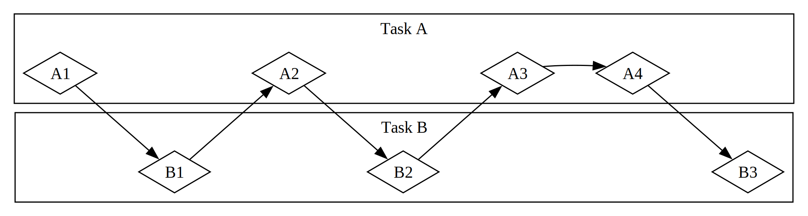
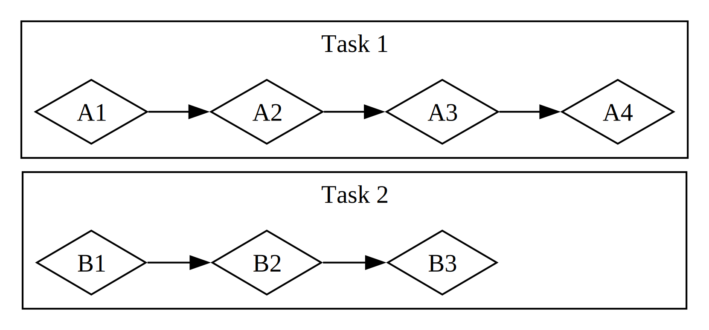

# Async and Await

Many operations we ask the computer to do can take a while to finish. It would
be nice if we could do something else while we are waiting for those
long-running processes to complete.

Let’s consider an example. Say you’re exporting a video you’ve created of a
family celebration, an operation that could take anywhere from minutes to hours.
The video export will use as much CPU and GPU power as it can. If you had only
one CPU core and your operating system didn’t pause that export until it
completed—that is, if it executed the export _synchronously_—you couldn’t do
anything else on your computer while that task was running. That would be a
pretty frustrating experience. Fortunately, your computer’s operating system
can, and does, invisibly interrupt the export often enough to let you get other
work done simultaneously.

Now say you’re downloading a video shared by someone else, which can also take a
while but does not take up as much CPU time. In this case, the CPU has to wait
for data to arrive from the network. While you can start reading the data once
it starts to arrive, it might take some time for all of it to show up. Even once
the data is all present, if the video is quite large, it could take at least a
second or two to load it all. That might not sound like much, but it’s a very
long time for a modern processor, which can perform billions of operations every
second. Again, your operating system will invisibly interrupt your program to
allow the CPU to perform other work while waiting for the network call to
finish.

The video export is an example of a _CPU-bound_ or _compute-bound_ operation.
It’s limited by the computer’s potential data processing speed within the CPU or
GPU, and how much of that speed it can dedicate to the operation. The video
download is an example of an _IO-bound_ operation, because it’s limited by the
speed of the computer’s _input and output_; it can only go as fast as the data
can be sent across the network.

In both of these examples, the operating system’s invisible interrupts provide a
form of concurrency. That concurrency happens only at the level of the entire
program, though: the operating system interrupts one program to let other
programs get work done. In many cases, because we understand our programs at a
much more granular level than the operating system does, we can spot
opportunities for concurrency that the operating system can’t see.

For example, if we’re building a tool to manage file downloads, we should be
able to write our program so that starting one download won’t lock up the UI,
and users should be able to start multiple downloads at the same time. Many
operating system APIs for interacting with the network are _blocking_, though;
that is, they block the program’s progress until the data they’re processing is
completely ready.

> Note: This is how _most_ function calls work, if you think about it. However,
> the term _blocking_ is usually reserved for function calls that interact with
> files, the network, or other resources on the computer, because those are the
> cases where an individual program would benefit from the operation being
> _non_-blocking.

We could avoid blocking our main thread by spawning a dedicated thread to
download each file. However, the overhead of those threads would eventually
become a problem. It would be preferable if the call didn’t block in the first
place. It would also be better if we could write in the same direct style we use
in blocking code, similar to this:

```rust,ignore,does_not_compile
let data = fetch_data_from(url).await;
println!("{data}");
```

That is exactly what Rust’s _async_ (short for _asynchronous_) abstraction gives
us. In this chapter, you’ll learn all about async as we cover the following
topics:

- How to use Rust’s `async` and `await` syntax
- How to use the async model to solve some of the same challenges we looked at
  in Chapter 16
- How multithreading and async provide complementary solutions, that you can
  combine in many cases

Before we see how async works in practice, though, we need to take a short
detour to discuss the differences between parallelism and concurrency.

### Parallelism and Concurrency

We’ve treated parallelism and concurrency as mostly interchangeable so far. Now
we need to distinguish between them more precisely, because the differences will
show up as we start working.

Consider the different ways a team could split up work on a software project.
You could assign a single member multiple tasks, assign each member one task, or
use a mix of the two approaches.

When an individual works on several different tasks before any of them is
complete, this is _concurrency_. Maybe you have two different projects checked
out on your computer, and when you get bored or stuck on one project, you switch
to the other. You’re just one person, so you can’t make progress on both tasks
at the exact same time, but you can multi-task, making progress on one at a time
by switching between them (see Figure 17-1).

<figure>



<figcaption>Figure 17-1: A concurrent workflow, switching between Task A and Task B</figcaption>

</figure>

When the team splits up a group of tasks by having each member take one task and
work on it alone, this is _parallelism_. Each person on the team can make
progress at the exact same time (see Figure 17-2).

<figure>



<figcaption>Figure 17-2: A parallel workflow, where work happens on Task A and Task B independently</figcaption>

</figure>

In both of these workflows, you might have to coordinate between different
tasks. Maybe you _thought_ the task assigned to one person was totally
independent from everyone else’s work, but it actually requires another person
on the team to finish their task first. Some of the work could be done in
parallel, but some of it was actually _serial_: it could only happen in a
series, one task after the other, as in Figure 17-3.

<figure>


<figcaption>Figure 17-3: A partially parallel workflow, where work happens on Task A and Task B independently until Task A3 is blocked on the results of Task B3.</figcaption>

</figure>

Likewise, you might realize that one of your own tasks depends on another of
your tasks. Now your concurrent work has also become serial.

Parallelism and concurrency can intersect with each other, too. If you learn
that a colleague is stuck until you finish one of your tasks, you’ll probably
focus all your efforts on that task to “unblock” your colleague. You and your
coworker are no longer able to work in parallel, and you’re also no longer able
to work concurrently on your own tasks.

The same basic dynamics come into play with software and hardware. On a machine
with a single CPU core, the CPU can perform only one operation at a time, but it
can still work concurrently. Using tools such as threads, processes, and async,
the computer can pause one activity and switch to others before eventually
cycling back to that first activity again. On a machine with multiple CPU cores,
it can also do work in parallel. One core can be performing one task while
another core performs a completely unrelated one, and those operations actually
happen at the same time.

When working with async in Rust, we’re always dealing with concurrency.
Depending on the hardware, the operating system, and the async runtime we are
using (more on async runtimes shortly), that concurrency may also use parallelism
under the hood.

Now, let’s dive into how async programming in Rust actually works.
