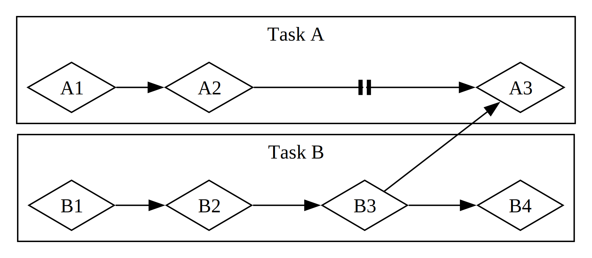

# Asenkron Programlamanın Temelleri: Async, Await, Future ve Stream'ler

Bilgisayardan istediğimiz birçok işlem tamamlanması için zaman alabilir. Bu uzun süren işlemler tamamlanırken başka bir şeyler yapabilsek güzel olurdu. Modern bilgisayarlar, aynı anda birden fazla işlemi yürütmek için iki teknik sunar: paralellik (parallelism) ve eşzamanlılık (concurrency). Ancak, paralel veya eşzamanlı işlemler içeren programlar yazmaya başladığımızda, başlatıldıkları sırayla bitmeyebilen _asenkron programlama_ (asynchronous programming)'ya özgü yeni zorluklarla karşılaşırız. Bu bölüm, 16. bölümde thread'lerle paralellik ve eşzamanlılık konusunu temel alarak, asenkron programlamaya alternatif bir yaklaşım sunar: Rust'ın Future ve Stream'leri, bunları destekleyen `async` ve `await` sözdizimi ve asenkron işlemleri yönetmek ve koordine etmek için kullanılan araçlar.

Bir örnek düşünelim. Diyelim ki bir aile kutlamasının videosunu dışa aktarıyorsunuz; bu işlem dakikalarca hatta saatlerce sürebilir. Video dışa aktarma işlemi, mümkün olan en fazla CPU ve GPU gücünü kullanacaktır. Eğer yalnızca bir CPU çekirdeğiniz olsaydı ve işletim sisteminiz bu dışa aktarma işlemini tamamlanana kadar durdurmasaydı—yani dışa aktarma _senkron_ olarak çalışsaydı—bu görev çalışırken bilgisayarınızda başka hiçbir şey yapamazdınız. Bu oldukça sinir bozucu olurdu. Neyse ki, bilgisayarınızın işletim sistemi, dışa aktarma işlemini görünmez bir şekilde sık sık kesintiye uğratıp, aynı anda başka işler yapabilmenizi sağlar.

Şimdi de başkası tarafından paylaşılan bir videoyu indirdiğinizi düşünün; bu da zaman alabilir, ancak CPU'yu o kadar meşgul etmez. Bu durumda, CPU'nun verinin ağdan gelmesini beklemesi gerekir. Veri gelmeye başladığında okumaya başlayabilirsiniz, ancak tüm verinin gelmesi zaman alabilir. Veri tamamen geldikten sonra bile, video çok büyükse, hepsini yüklemek en az bir-iki saniye sürebilir. Bu kulağa çok uzun gelmeyebilir, ancak modern bir işlemci için, saniyede milyarlarca işlem yapabilen bir donanımda, bu çok uzun bir süredir. Yine, işletim sisteminiz programınızı görünmez bir şekilde kesintiye uğratır ve ağ çağrısının tamamlanmasını beklerken CPU'nun başka işler yapmasına olanak tanır.

Video dışa aktarma işlemi, _CPU-bound_ veya _hesaplama tabanlı_ (compute-bound) bir işlemdir. Bu işlem, bilgisayarın CPU veya GPU'sundaki veri işleme hızına ve bu hızın ne kadarının bu işleme ayrılabildiğine bağlıdır. Video indirme işlemi ise _IO-bound_ bir işlemdir; çünkü bilgisayarın _giriş/çıkış_ (input/output) hızına bağlıdır; veri ağdan ne kadar hızlı gelirse o kadar hızlı ilerler.

Her iki örnekte de, işletim sisteminin görünmez kesintileri bir tür eşzamanlılık sağlar. Ancak bu eşzamanlılık yalnızca tüm program düzeyinde gerçekleşir: işletim sistemi bir programı kesintiye uğratıp diğer programların iş yapmasına izin verir. Çoğu durumda, programlarımızı işletim sisteminden çok daha ayrıntılı bildiğimiz için, işletim sisteminin göremediği eşzamanlılık fırsatlarını biz görebiliriz.

Örneğin, dosya indirmelerini yöneten bir araç geliştiriyorsak, programımızı öyle yazabilmeliyiz ki bir indirme başlatıldığında arayüz (UI) kilitlenmesin ve kullanıcılar aynı anda birden fazla indirme başlatabilsin. Ancak, ağ ile etkileşim için birçok işletim sistemi API'si _bloklayıcıdır_ (blocking); yani, işledikleri veri tamamen hazır olana kadar programın ilerlemesini durdururlar.

> Not: Düşünürseniz, _çoğu_ fonksiyon çağrısı bu şekilde çalışır. Ancak, _bloklayıcı_ terimi genellikle dosya, ağ veya bilgisayardaki diğer kaynaklarla etkileşen fonksiyon çağrıları için kullanılır; çünkü bu durumlarda, bir programın işlemin _bloklayıcı olmaması_ daha faydalı olur.

Ana thread'imizi bloklamaktan kaçınmak için, her dosya indirmesi için ayrı bir thread başlatabiliriz. Ancak, bu thread'lerin yükü bir noktadan sonra sorun olur. Çağrının baştan bloklamaması daha iyi olurdu. Ayrıca, bloklayıcı kodda kullandığımız doğrudan tarzda yazabilsek daha iyi olurdu, örneğin:

```rust,ignore,does_not_compile
let data = fetch_data_from(url).await;
println!("{data}");
```

İşte Rust'ın _async_ (asenkron) soyutlaması tam olarak bunu sağlar. Bu bölümde, aşağıdaki konuları ele alarak async'i tüm yönleriyle öğreneceksiniz:

- Rust'ın `async` ve `await` sözdizimini nasıl kullanacağınız
- Async modeliyle, 16. bölümde ele aldığımız bazı zorlukları nasıl çözebileceğiniz
- Çoklu thread ve async'in birbirini tamamlayan çözümler sunduğu ve çoğu durumda bunları nasıl birleştirebileceğiniz

Ancak, async'in pratikte nasıl çalıştığını görmeden önce, paralellik ve eşzamanlılık arasındaki farkları tartışmak için kısa bir ara vermemiz gerekiyor.

### Paralellik ve Eşzamanlılık

Şimdiye kadar paralellik ve eşzamanlılığı çoğunlukla birbirinin yerine kullandık. Şimdi, aralarındaki farkları daha net ayırt etmemiz gerekiyor; çünkü bu farklar, çalışmaya başladıkça karşımıza çıkacak.

Bir yazılım projesinde bir ekibin işleri nasıl bölebileceğini düşünün. Tek bir üyeye birden fazla görev verebilir, her üyeye bir görev atayabilir veya bu iki yaklaşımı birleştirebilirsiniz.

Bir kişi, hiçbirini tamamlamadan birden fazla görev üzerinde çalışıyorsa, bu _eşzamanlılık_ (concurrency) olur. Belki bilgisayarınızda iki farklı proje üzerinde çalışıyorsunuz ve birinden sıkıldığınızda veya takıldığınızda diğerine geçiyorsunuz. Sadece bir kişisiniz, bu yüzden aynı anda iki işte ilerleme kaydedemezsiniz; ancak birinden diğerine geçerek sırayla ilerleyebilirsiniz (bkz. Şekil 17-1).

<figure>


<figcaption>Şekil 17-1: Görev A ve Görev B arasında geçiş yapılan eşzamanlı bir iş akışı</figcaption>

</figure>

Ekip, görevleri her üyeye bir görev verip, her birinin tek başına çalışmasını sağlarsa, bu _paralellik_ (parallelism) olur. Her ekip üyesi tam olarak aynı anda ilerleme kaydedebilir (bkz. Şekil 17-2).

<figure>


<figcaption>Şekil 17-2: Görev A ve Görev B'nin bağımsız olarak yürütüldüğü paralel bir iş akışı</figcaption>

</figure>

Her iki iş akışında da, farklı görevler arasında koordinasyon gerekebilir. Belki bir kişiye atanan görevin tamamen bağımsız olduğunu _düşündünüz_, ama aslında başka birinin görevini bitirmesini gerektiriyor. İşlerin bir kısmı paralel yapılabilir, ancak bir kısmı aslında _seri_ (serial) olur: yalnızca sırayla, birbiri ardına yapılabilir (bkz. Şekil 17-3).

<figure>



<figcaption>Şekil 17-3: Görev A ve Görev B'nin bağımsız yürütüldüğü, ancak A3'ün B3'ün sonucunu beklediği kısmen paralel bir iş akışı.</figcaption>

</figure>

Aynı şekilde, kendi görevlerinizden birinin diğerine bağlı olduğunu da fark edebilirsiniz. Artık eşzamanlı çalışmanız da seri hale gelmiş olur.

Paralellik ve eşzamanlılık da birbiriyle kesişebilir. Bir iş arkadaşınız, siz bir görevinizi bitirene kadar beklemek zorunda olduğunu öğrenirse, muhtemelen tüm çabanızı o göreve odaklarsınız ve iş arkadaşınızı "açmak" için çalışırsınız. Artık hem paralel hem de eşzamanlı çalışamazsınız.

Aynı temel dinamikler yazılım ve donanımda da geçerlidir. Tek çekirdekli bir makinede, CPU aynı anda yalnızca bir işlem yapabilir, ancak yine de eşzamanlı çalışabilir. Thread, proses ve async gibi araçlarla, bilgisayar bir etkinliği duraklatıp diğerlerine geçebilir ve sonunda ilk etkinliğe geri dönebilir. Çok çekirdekli bir makinede ise, aynı anda paralel olarak da çalışabilir. Bir çekirdek bir görevi yürütürken, başka bir çekirdek tamamen ilgisiz bir görevi yürütebilir ve bu işlemler gerçekten aynı anda gerçekleşir.

Rust'ta async ile çalışırken, her zaman eşzamanlılıkla uğraşıyoruz. Donanıma, işletim sistemine ve kullandığımız async çalışma zamanı ortamına (async runtime) bağlı olarak, bu eşzamanlılık arka planda paralellik de kullanabilir.

Şimdi, Rust'ta asenkron programlamanın nasıl çalıştığına yakından bakalım.
