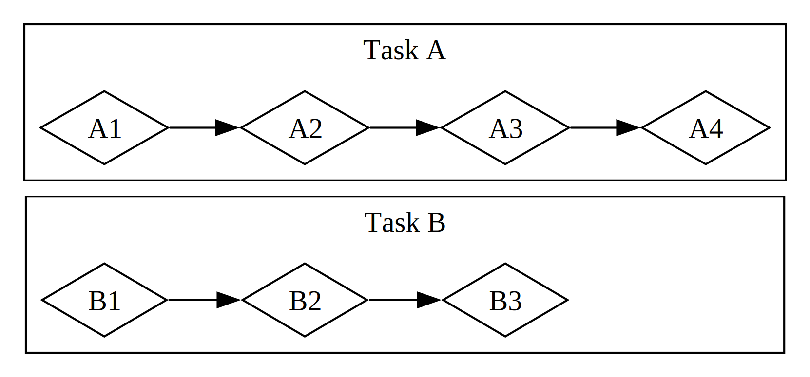

# اصول برنامه‌نویسی ناهمزمان: Async، Await، Futures، و Streams

بسیاری از عملیات‌هایی که از کامپیوتر می‌خواهیم انجام دهد ممکن است مدتی طول بکشد تا کامل شوند. خوب می‌شد اگر می‌توانستیم در حالی که منتظر این فرآیندهای طولانی هستیم، کار دیگری انجام دهیم. کامپیوترهای مدرن دو تکنیک برای انجام هم‌زمان بیش از یک عملیات ارائه می‌دهند: _موازی‌سازی_ و _همزمانی_. اما وقتی شروع به نوشتن برنامه‌هایی می‌کنیم که شامل عملیات موازی یا همزمان هستند، به سرعت با چالش‌های جدیدی مواجه می‌شویم که در ذات _برنامه‌نویسی ناهمزمان_ هستند، جایی که عملیات‌ها ممکن است به ترتیب شروع‌شده تکمیل نشوند. این فصل بر اساس استفاده از Threadها برای موازی‌سازی و همزمانی که در فصل ۱۶ دیدیم، یک رویکرد جایگزین برای برنامه‌نویسی ناهمزمان معرفی می‌کند: Futures، Streams، سینتکس `async` و `await` در Rust، و ابزارهایی برای مدیریت و هماهنگی بین عملیات ناهمزمان.

بیایید یک مثال را بررسی کنیم. فرض کنید در حال خروجی گرفتن از یک ویدئو هستید که از یک جشن خانوادگی ساخته‌اید؛ این عملیات ممکن است از چند دقیقه تا چند ساعت طول بکشد. خروجی ویدئو تا جایی که ممکن است از قدرت CPU و GPU استفاده خواهد کرد. اگر فقط یک هسته CPU داشتید و سیستم‌عامل شما آن خروجی را تا پایان تکمیل متوقف نمی‌کرد—یعنی اگر آن را به صورت _همزمان_ اجرا می‌کرد—در حالی که آن کار در حال اجرا بود نمی‌توانستید هیچ کار دیگری روی کامپیوتر خود انجام دهید. این تجربه بسیار ناامیدکننده‌ای می‌شد. خوشبختانه، سیستم‌عامل کامپیوتر شما می‌تواند و معمولاً هم می‌کند، به طور نامرئی خروجی را به اندازه کافی متوقف می‌کند تا بتوانید همزمان کارهای دیگری انجام دهید.

حالا فرض کنید یک ویدئو که توسط شخص دیگری به اشتراک گذاشته شده است را دانلود می‌کنید، که این نیز ممکن است مدتی طول بکشد اما به اندازه خروجی گرفتن از CPU زمان نمی‌برد. در این حالت، CPU باید منتظر بماند تا داده از شبکه برسد. در حالی که می‌توانید داده را از زمانی که شروع به رسیدن می‌کند بخوانید، ممکن است مدتی طول بکشد تا همه آن برسد. حتی وقتی داده به طور کامل موجود باشد، اگر ویدئو خیلی بزرگ باشد، ممکن است حداقل یک یا دو ثانیه طول بکشد تا همه آن بارگذاری شود. شاید به نظر نرسد زمان زیادی باشد، اما برای یک پردازنده مدرن که می‌تواند میلیاردها عملیات را در هر ثانیه انجام دهد، این زمان بسیار طولانی است. باز هم، سیستم‌عامل برنامه شما را به طور نامرئی متوقف می‌کند تا CPU بتواند در حالی که منتظر تماس شبکه است، کارهای دیگری انجام دهد.

خروجی ویدئو یک مثال از یک عملیات _وابسته به CPU_ یا _وابسته به محاسبه_ (_CPU-bound_) است. این عملیات محدود به سرعت پردازش داده کامپیوتر در CPU یا GPU و میزان توانایی آن برای اختصاص این سرعت به عملیات است. دانلود ویدئو یک مثال از یک عملیات _وابسته به ورودی و خروجی_ (_IO-bound_) است، زیرا محدود به سرعت _ورودی و خروجی_ کامپیوتر است؛ این عملیات فقط به سرعتی که داده می‌تواند از طریق شبکه ارسال شود، وابسته است.

در هر دو این مثال‌ها، وقفه‌های نامرئی سیستم‌عامل نوعی همزمانی فراهم می‌کنند. با این حال، این همزمانی فقط در سطح کل برنامه اتفاق می‌افتد: سیستم‌عامل یک برنامه را متوقف می‌کند تا برنامه‌های دیگر بتوانند کار انجام دهند. در بسیاری از موارد، از آنجا که ما برنامه‌های خود را در سطح بسیار جزئی‌تری نسبت به سیستم‌عامل درک می‌کنیم، می‌توانیم فرصت‌هایی برای همزمانی پیدا کنیم که سیستم‌عامل نمی‌تواند ببیند.

به عنوان مثال، اگر در حال ساخت یک ابزار برای مدیریت دانلود فایل‌ها هستید، باید بتوانید برنامه خود را طوری بنویسید که شروع یک دانلود، رابط کاربری را قفل نکند، و کاربران بتوانند به طور همزمان چندین دانلود را آغاز کنند. بسیاری از APIهای سیستم‌عامل برای تعامل با شبکه _مسدودکننده_ (_blocking_) هستند؛ یعنی پیشرفت برنامه را تا زمانی که داده‌ای که پردازش می‌کنند کاملاً آماده باشد، متوقف می‌کنند.

> نکته: این همان چیزی است که _بیشتر_ فراخوانی‌های توابع انجام می‌دهند، اگر در مورد آن فکر کنید. با این حال، اصطلاح _blocking_ معمولاً برای فراخوانی توابعی که با فایل‌ها، شبکه یا منابع دیگر روی کامپیوتر تعامل دارند استفاده می‌شود، زیرا این مواردی هستند که یک برنامه فردی می‌تواند از غیرمسدودکننده (_non-blocking_) بودن عملیات بهره‌مند شود.

ما می‌توانیم با ایجاد یک Thread اختصاصی برای دانلود هر فایل، از مسدود شدن Thread اصلی جلوگیری کنیم. با این حال، سربار آن Threadها در نهایت به مشکل تبدیل خواهد شد. بهتر است که فراخوانی از ابتدا مسدودکننده نباشد. همچنین بهتر است که بتوانیم به همان سبک مستقیم کدی که در کد مسدودکننده استفاده می‌کنیم، بنویسیم، شبیه به این:

```rust,ignore,does_not_compile
let data = fetch_data_from(url).await;
println!("{data}");
```

این دقیقاً همان چیزی است که انتزاع _async_ (مخفف _asynchronous_) در Rust به ما می‌دهد. در این فصل، همه چیز درباره async را یاد خواهید گرفت و موضوعات زیر را پوشش خواهیم داد:

- نحوه استفاده از سینتکس `async` و `await` در Rust
- نحوه استفاده از مدل async برای حل برخی از چالش‌هایی که در فصل ۱۶ بررسی کردیم
- چگونگی ارائه راه‌حل‌های مکمل توسط multithreading و async، که در بسیاری از موارد می‌توانید آن‌ها را با هم ترکیب کنید

با این حال، قبل از اینکه ببینیم async در عمل چگونه کار می‌کند، باید یک توقف کوتاه برای بحث درباره تفاوت‌های بین موازی‌سازی و همزمانی داشته باشیم.

### تفاوت بین موازی‌سازی و همزمانی

ما تاکنون همزمانی (_concurrency_) و موازی‌سازی (_parallelism_) را تقریباً به جای هم در نظر گرفته‌ایم. اکنون باید آن‌ها را به طور دقیق‌تر از هم متمایز کنیم، زیرا تفاوت‌هایشان در هنگام کار مشخص خواهد شد.

به روش‌های مختلفی که یک تیم می‌تواند کار بر روی یک پروژه نرم‌افزاری را تقسیم کند فکر کنید. می‌توانید چندین وظیفه را به یک عضو اختصاص دهید، به هر عضو یک وظیفه اختصاص دهید، یا ترکیبی از این دو روش را استفاده کنید.

وقتی یک فرد روی چندین وظیفه مختلف قبل از اتمام هر یک از آن‌ها کار می‌کند، این _همزمانی_ است. شاید شما دو پروژه مختلف را روی کامپیوتر خود باز کرده‌اید و وقتی از یکی خسته یا در آن گیر کردید، به دیگری تغییر می‌دهید. شما فقط یک نفر هستید، بنابراین نمی‌توانید به طور همزمان روی هر دو وظیفه پیشرفت کنید، اما می‌توانید چندوظیفه‌ای (_multi-tasking_) کنید و با جابه‌جا شدن بین آن‌ها، یکی یکی پیشرفت کنید (نگاه کنید به شکل ۱۷-۱).

<figure>


<figcaption>شکل ۱۷-۱: یک جریان کاری همزمان، که بین وظیفه A و وظیفه B جابه‌جا می‌شود.</figcaption>

</figure>

وقتی تیم گروهی از وظایف را به این صورت تقسیم می‌کند که هر عضو یک وظیفه را بر عهده می‌گیرد و به تنهایی روی آن کار می‌کند، این _موازی‌سازی_ است. هر فرد در تیم می‌تواند دقیقاً به طور همزمان پیشرفت کند (نگاه کنید به شکل ۱۷-۲).

<figure>



<figcaption>شکل ۱۷-۲: یک جریان کاری موازی، که در آن کار روی وظیفه A و وظیفه B به طور مستقل انجام می‌شود.</figcaption>

</figure>

در هر دو این جریان‌های کاری، ممکن است نیاز به هماهنگی بین وظایف مختلف داشته باشید. شاید _فکر_ می‌کردید وظیفه‌ای که به یک نفر اختصاص داده شده کاملاً مستقل از کار سایر اعضای تیم است، اما در واقع نیاز دارد که یک نفر دیگر در تیم ابتدا وظیفه خود را به پایان برساند. بخشی از کار می‌تواند به صورت موازی انجام شود، اما بخشی از آن در واقع _سریالی_ است: فقط می‌تواند به صورت متوالی انجام شود، یک وظیفه پس از دیگری، همان‌طور که در شکل ۱۷-۳ نشان داده شده است.

<figure>


<figcaption>شکل ۱۷-۳: یک جریان کاری نیمه موازی، که در آن کار روی وظیفه A و وظیفه B به طور مستقل انجام می‌شود تا زمانی که A3 به نتایج B3 وابسته باشد.</figcaption>

</figure>

به همین ترتیب، ممکن است متوجه شوید که یکی از وظایف شما به وظیفه دیگری از کارهای شما بستگی دارد. اکنون کار همزمان شما نیز سریالی شده است.

موازی‌سازی و همزمانی می‌توانند با یکدیگر تقاطع داشته باشند. اگر متوجه شوید که یک همکار تا زمانی که یکی از وظایف شما به پایان نرسیده گیر کرده است، احتمالاً تمام تلاش خود را روی آن وظیفه متمرکز می‌کنید تا "همکارتان را از بن‌بست خارج کنید." شما و همکارتان دیگر نمی‌توانید به صورت موازی کار کنید، و همچنین دیگر نمی‌توانید به صورت همزمان روی وظایف خودتان کار کنید.

همان دینامیک‌های اساسی در نرم‌افزار و سخت‌افزار نیز وجود دارند. روی ماشینی با یک هسته CPU، CPU فقط می‌تواند یک عملیات را در هر لحظه انجام دهد، اما همچنان می‌تواند به صورت همزمان کار کند. با استفاده از ابزارهایی مانند Threads، فرآیندها (_processes_) و async، کامپیوتر می‌تواند یک فعالیت را متوقف کند و به فعالیت‌های دیگر تغییر دهد، و در نهایت دوباره به فعالیت اول بازگردد. روی ماشینی با چندین هسته CPU، می‌تواند کارها را به صورت موازی نیز انجام دهد. یک هسته می‌تواند یک وظیفه را اجرا کند در حالی که هسته دیگری وظیفه‌ای کاملاً نامرتبط را اجرا می‌کند، و این عملیات‌ها واقعاً در یک زمان اتفاق می‌افتند.

هنگام کار با async در Rust، همیشه با همزمانی سر و کار داریم. بسته به سخت‌افزار، سیستم‌عامل، و Runtime async که استفاده می‌کنیم (که در ادامه درباره Runtimeهای async بیشتر صحبت خواهیم کرد)، این همزمانی ممکن است در پس‌زمینه از موازی‌سازی نیز استفاده کند.

حالا بیایید به این بپردازیم که برنامه‌نویسی async در Rust در عمل چگونه کار می‌کند.
