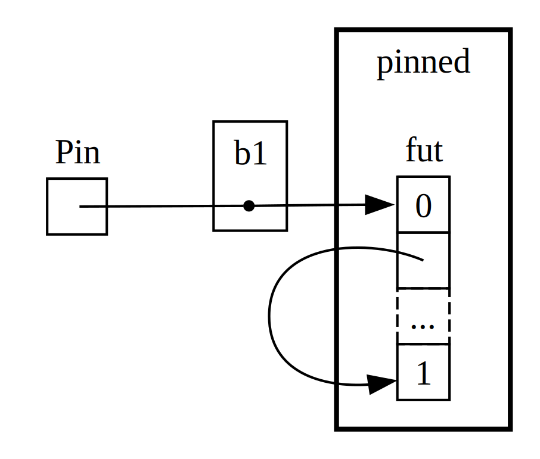

## A Closer Look at the Traits for Async

<!-- Old headings. Do not remove or links may break. -->
<a id="digging-into-the-traits-for-async"></a>

Throughout the chapter, we’ve used the `Future`, `Pin`, `Unpin`, `Stream`, and
### Future
`StreamExt` traits in various ways. So far, though, we’ve avoided getting too
far into the details of how they work or how they fit together, which is fine
most of the time for your day-to-day Rust work. Sometimes, though, you’ll
encounter situations where you’ll need to understand a few more of these
details. In this section, we’ll dig in just enough to help in those scenarios,
still leaving the _really_ deep dive for other documentation.


Back in [“Futures and the Async Syntax”][futures-syntax]<!-- ignore -->, we
noted that `Future` is a trait. Let’s start by taking a closer look at how it
works. Here is how Rust defines a `Future`:

```rust
use std::pin::Pin;
use std::task::{Context, Poll};

pub trait Future {
    type Output;

    fn poll(self: Pin<&mut Self>, cx: &mut Context<'_>) -> Poll<Self::Output>;
}
```

That trait definition includes a bunch of new types and also some syntax we
haven’t seen before, so let’s walk through the definition piece by piece.

First, `Future`’s associated type `Output` says what the future resolves to.
This is analogous to the `Item` associated type for the `Iterator` trait.
Second, `Future` also has the `poll` method, which takes a special `Pin`
reference for its `self` parameter and a mutable reference to a `Context` type,
and returns a `Poll<Self::Output>`. We’ll talk a little more about `Pin` and
`Context` later in the section. For now, let’s focus on what the method returns,
the `Poll` type:

```rust
enum Poll<T> {
    Ready(T),
    Pending,
}
```

This `Poll` type is similar to an `Option`: it has one variant which has a value
(`Ready(T)`), and one which does not (`Pending`). It means something quite
different, though! The `Pending` variant indicates that the future still has
work to do, so the caller will need to check again later. The `Ready` variant
indicates that the `Future` has finished its work and the `T` value is
available.

> Note: With most futures, the caller should not call `poll` again after the
> future has returned `Ready`. Many futures will panic if polled again after
> becoming ready! Futures which are safe to poll again will say so explicitly in
> their documentation. This is similar to how `Iterator::next` behaves!

Under the hood, when you see code which uses `await`, Rust compiles that to code
which calls `poll`. If you look back at Listing 17-4, where we printed out the
page title for a single URL once it resolved, Rust compiles it into something
kind of (although not exactly) like this:

```rust,ignore
match page_title(url).poll() {
    Ready(page_title) => match page_title {
        Some(title) => println!("The title for {url} was {title}"),
        None => println!("{url} had no title"),
    }
    Pending => {
        // But what goes here?
    }
}
```

What should we do when the `Future` is still `Pending`? We need some way to try
again… and again, and again, until the future is finally ready. In other words,
a loop:

```rust,ignore
let mut page_title_fut = page_title(url);
loop {
    match page_title_fut.poll() {
        Ready(value) => match page_title {
            Some(title) => println!("The title for {url} was {title}"),
            None => println!("{url} had no title"),
        }
        Pending => {
            // continue
        }
    }
}
```

If Rust compiled it to exactly that code, though, every `await` would be
blocking—exactly the opposite of what we were going for! Instead, Rust makes
sure that the loop can hand off control to something which can pause work on
this future and work on other futures and check this one again later. That
“something” is an async runtime, and this scheduling and coordination work is
one of the main jobs for a runtime.

Recall our description (in the [Counting][counting] section) of waiting on
`rx.recv`. The `recv` call returns a `Future`, and awaiting it polls it. In our
initial discussion, we noted that a runtime will pause the future until it’s
ready with either `Some(message)` or `None` when the channel closes. With our
deeper understanding of `Future` in place, and specifically `Future::poll`, we
can see how that works. The runtime knows the future isn’t ready when it
returns `Poll::Pending`. Conversely, the runtime knows the future is ready and
advances it when `poll` returns `Poll::Ready(Some(message))` or
`Poll::Ready(None)`.

The exact details of how a runtime does that are more than we will cover in even
this deep dive section. The key here is to see the basic mechanic of futures: a
runtime _polls_ each future it is responsible for, putting it back to sleep when
it is not yet ready.

### Pinning and the Pin and Unpin Traits

When we introduced the idea of pinning while working on Listing 17-16, we ran
into a very gnarly error message. Here is the relevant part of it again:

<!-- manual-regeneration
cd listings/ch17-async-await/listing-17-16
cargo build
copy *only* the final `error` block from the errors
-->

```text
error[E0277]: `{async block@src/main.rs:10:23: 10:33}` cannot be unpinned
  --> src/main.rs:48:33
   |
48 |         trpl::join_all(futures).await;
   |                                 ^^^^^ the trait `Unpin` is not implemented for `{async block@src/main.rs:10:23: 10:33}`, which is required by `Box<{async block@src/main.rs:10:23: 10:33}>: Future`
   |
   = note: consider using the `pin!` macro
           consider using `Box::pin` if you need to access the pinned value outside of the current scope
   = note: required for `Box<{async block@src/main.rs:10:23: 10:33}>` to implement `Future`
note: required by a bound in `futures_util::future::join_all::JoinAll`
  --> file:///home/.cargo/registry/src/index.crates.io-6f17d22bba15001f/futures-util-0.3.30/src/future/join_all.rs:29:8
   |
27 | pub struct JoinAll<F>
   |            ------- required by a bound in this struct
28 | where
29 |     F: Future,
   |        ^^^^^^ required by this bound in `JoinAll`
```

When we read this error message carefully, it not only tells us that we need to
pin the values, but also tells us why pinning is required. The `trpl::join_all`
function returns a struct called `JoinAll`. That struct is generic over a type
`F`, which is constrained to implement the `Future` trait. Directly awaiting a
future with `await` pins the future implicitly. That’s why we don’t need to use
`pin!` everywhere we want to await futures.

However, we’re not directly awaiting a future here. Instead, we construct a new
future, `JoinAll`, by passing a collection of futures to the `join_all`
function. The signature for `join_all` requires that the type of the items in
the collection all implement the `Future` trait, and `Box<T>` only implements
`Future` if the `T` that it wraps is a future which implements the `Unpin`
trait.

That’s a lot! But we can understand it, if we dive a little further into how the
`Future` type actually works, in particular around _pinning_.

Let’s look again at the definition of `Future`:

```rust
use std::pin::Pin;
use std::task::{Context, Poll};

pub trait Future {
    type Output;

    // Required method
    fn poll(self: Pin<&mut Self>, cx: &mut Context<'_>) -> Poll<Self::Output>;
}
```

The `cx` parameter and its `Context` type is the key to how a runtime actually
knows when to check any given future, while still being lazy. The details of how
that works are beyond the scope of this chapter, though: you generally only need
to worry about it when writing a custom `Future` implementation.

Instead, we’ll focus on the type for `self`. This is the first time we’ve seen
a method where `self` has a type annotation. A type annotation for `self` is
similar to type annotations for other function parameters, with two key
differences. First, when we specify the type of `self` in this way, we’re
telling Rust what type `self` must be to call this method. Second, a type
annotation on `self` can’t be just any type. It’s only allowed to be the type
on which the method is implemented, a reference or smart pointer to that type,
or a `Pin` wrapping a reference to that type. We’ll see more on this syntax in
Chapter 18. For now, it’s enough to know that if we want to poll a future (to
check whether it is `Pending` or `Ready(Output)`), we need a mutable reference
to the type, which is wrapped in a `Pin`.

`Pin` is a wrapper type. In some ways, it’s similar to the `Box`, `Rc`, and
other smart pointer types we saw in Chapter 15, which also wrap other types.
Unlike those, however, `Pin` only works with _pointer types_ such as references
(`&` and `&mut`) and smart pointers (`Box`, `Rc`, and so on). To be precise,
`Pin` works with types which implement the `Deref` or `DerefMut` traits, which
we covered in Chapter 15. You can think of this restriction as equivalent to
only working with pointers, though, because implementing `Deref` or `DerefMut`
means your type behaves similarly to a pointer type. `Pin` is also not a pointer
itself, and it doesn’t have any behavior of its own the way `Rc` and `Arc` do
with ref counting. It’s purely a tool the compiler can use to uphold the
relevant guarantees, by wrapping pointers in the type.

Recalling that `await` is implemented in terms of calls to `poll`, this starts
to explain the error message we saw above—but that was in terms of `Unpin`, not
`Pin`. So what exactly are `Pin` and `Unpin`, how do they relate, and why does
`Future` need `self` to be in a `Pin` type to call `poll`?

In [Our First Async Program][first-async], we described how a series of await
points in a future get compiled into a state machine—and noted how the compiler
helps make sure that state machine follows all of Rust’s normal rules around
safety, including borrowing and ownership. To make that work, Rust looks at what
data is needed between each await point and the next await point or the end of
the async block. It then creates a corresponding variant in the state machine it
creates. Each variant gets the access it needs to the data that will be used in
that section of the source code, whether by taking ownership of that data or by
getting a mutable or immutable reference to it.

So far so good: if we get anything wrong about the ownership or references in a
given async block, the borrow checker will tell us. When we want to move around
the future that corresponds to that block—like moving it into a `Vec` to pass
to `join_all`, the way we did back in the [“Working With Any Number of
Futures”][any-number-futures]<!-- ignore --> section—things get trickier.

When we move a future—whether by pushing into a data structure to use as an
iterator with `join_all`, or returning them from a function—that actually means
moving the state machine Rust creates for us. And unlike most other types in
Rust, the futures Rust creates for async blocks can end up with references to
themselves in the fields of any given variant, as in Figure 17-4 (a simplified
illustration to help you get a feel for the idea, rather than digging into what
are often fairly complicated details).

<figure>


<figcaption>Figure 17-4: A self-referential data type.</figcaption>

</figure>

By default, though, any object which has a reference to itself is unsafe to
move, because references always point to the actual memory address of the thing
they refer to. If you move the data structure itself, those internal references
will be left pointing to the old location. However, that memory location is now
invalid. For one thing, its value will not be updated when you make changes to
the data structure. For another—and more importantly!—the computer is now free
to reuse that memory for other things! You could end up reading completely
unrelated data later.

<figure>


<figcaption>Figure 17-5: The unsafe result of moving a self-referential data type.</figcaption>

</figure>

In principle, the Rust compiler could try to update every reference to an object
every time it gets moved. That would potentially be a lot of performance
overhead, especially given there can be a whole web of references that need
updating. On the other hand, if we could make sure the data structure in
question _doesn’t move in memory_, we don’t have to update any references.
This is exactly what Rust’s borrow checker requires: you can’t move an item
which has any active references to it using safe code.

`Pin` builds on that to give us the exact guarantee we need. When we _pin_ a
value by wrapping a pointer to that value in `Pin`, it can no longer move. Thus,
if you have `Pin<Box<SomeType>>`, you actually pin the `SomeType` value, _not_
the `Box` pointer. Figure 17-6 illustrates this:

<figure>



<figcaption>Figure 17-6: Pinning a `Box` which points to a self-referential future type.</figcaption>

</figure>

In fact, the `Box` pointer can still move around freely. Remember: we care about
making sure the data ultimately being referenced stays in its place. If a
pointer moves around, but the data it points to is in the same place, as in
Figure 17-7, there’s no potential problem. (How you would do this with a `Pin`
wrapping a `Box` is more than we’ll get into in this particular discussion,
but it would make for a good exercise! If you look at the docs for the types as
well as the `std::pin` module, you might be able to work out how you would do
that.) The key is that the self-referential type itself cannot move, because it
is still pinned.

<figure>


<figcaption>Figure 17-7: Moving a `Box` which points to a self-referential future type.</figcaption>

</figure>

However, most types are perfectly safe to move around, even if they happen to
be behind a `Pin` pointer. We only need to think about pinning when items have
internal references. Primitive values such as numbers and booleans don’t have
any internal references, so they’re obviously safe. Neither do most types you
normally work with in Rust. A `Vec`, for example, doesn’t have any internal
references it needs to keep up to date this way, so you can move it around
without worrying. If you have a `Pin<Vec<String>>`, you’d have to do everything
via the safe but restrictive APIs provided by `Pin`, even though a
`Vec<String>` is always safe to move if there are no other references to it. We
need a way to tell the compiler that it’s actually just fine to move items
around in cases such as these. For that, we have `Unpin`.

`Unpin` is a marker trait, similar to the `Send` and `Sync` traits we saw in
Chapter 16. Recall that marker traits have no functionality of their own. They
exist only to tell the compiler that it’s safe to use the type which implements
a given trait in a particular context. `Unpin` informs the compiler that a given
type does _not_ need to uphold any particular guarantees about whether the value
in question can be moved.

Just as with `Send` and `Sync`, the compiler implements `Unpin` automatically
for all types where it can prove it is safe. The special case, again similar to
`Send` and `Sync`, is the case where `Unpin` is _not_ implemented for a type.
The notation for this is `impl !Unpin for SomeType`, where `SomeType` is the
name of a type which _does_ need to uphold those guarantees to be safe whenever
a pointer to that type is used in a `Pin`.

In other words, there are two things to keep in mind about the relationship
between `Pin` and `Unpin`. First, `Unpin` is the “normal” case, and `!Unpin` is
the special case. Second, whether a type implements `Unpin` or `!Unpin` _only_
matters when using a pinned pointer to that type like `Pin<&mut SomeType>`.

To make that concrete, think about a `String`: it has a length and the Unicode
characters which make it up. We can wrap a `String` in `Pin`, as seen in Figure
17-8. However, `String` automatically implements `Unpin`, the same as most other
types in Rust.

<figure>


<figcaption>Figure 17-8: Pinning a String, with a dotted line indicating that the String implements the `Unpin` trait, so it is not pinned.</figcaption>

</figure>

As a result, we can do things which would be illegal if `String` implemented
`!Unpin` instead, such as replace one string with another at the exact same
location in memory as in Figure 17-9. This doesn’t violate the `Pin` contract,
because `String` has no internal references that make it unsafe to move around!
That is precisely why it implements `Unpin` rather than `!Unpin`.

<figure>


<figcaption>Figure 17-9: Replacing the String with an entirely different String in memory.</figcaption>

</figure>

Now we know enough to understand the errors reported for that `join_all` call
from back in Listing 17-17. We originally tried to move the futures produced by
async blocks into a `Vec<Box<dyn Future<Output = ()>>>`, but as we’ve seen,
those futures may have internal references, so they don’t implement `Unpin`.
They need to be pinned, and then we can pass the `Pin` type into the `Vec`,
confident that the underlying data in the futures will _not_ be moved.

`Pin` and `Unpin` are mostly important for building lower-level libraries, or
when you’re building a runtime itself, rather than for day to day Rust code.
When you see these traits in error messages, though, now you’ll have a better
idea of how to fix the code!

> Note: This combination of `Pin` and `Unpin` allows a whole class of complex
> types to be safe in Rust which are otherwise difficult to implement because
> they’re self-referential. Types which require `Pin` show up _most_ commonly
> in async Rust today, but you might—very rarely!—see it in other contexts, too.
>
> The specifics of how `Pin` and `Unpin` work, and the rules they’re required
> to uphold, are covered extensively in the API documentation for `std::pin`, so
> if you’d like to understand them more deeply, that’s a great place to start.
>
> If you want to understand how things work “under the hood” in even more
> detail, the official [_Asynchronous Programming in Rust_][async-book] book has
> you covered:
>
> - [Chapter 2: Under the Hood: Executing Futures and Tasks][under-the-hood]
> - [Chapter 4: Pinning][pinning]

### The Stream Trait

Now that we have a deeper grasp on the `Future`, `Pin`, and `Unpin` traits, we
can turn our attention to the `Stream` trait. As described in the section
introducing streams, streams are similar to asynchronous iterators. Unlike
`Iterator` and `Future`, there is no definition of a `Stream` trait in the
standard library as of the time of writing, but there _is_ a very common
definition from the `futures` crate used throughout the ecosystem.

Let’s review the definitions of the `Iterator` and `Future` traits, so we can
build up to how a `Stream` trait that merges them together might look. From
`Iterator`, we have the idea of a sequence: its `next` method provides an
`Option<Self::Item>`. From `Future`, we have the idea of readiness over time:
its `poll` method provides a `Poll<Self::Output>`. To represent a sequence of
items which become ready over time, we define a `Stream` trait which puts those
features together:

```rust
use std::pin::Pin;
use std::task::{Context, Poll};

trait Stream {
    type Item;

    fn poll_next(
        self: Pin<&mut Self>,
        cx: &mut Context<'_>
    ) -> Poll<Option<Self::Item>>;
}
```

The `Stream` trait defines an associated type `Item` for the type of the items
produced by the stream. This is similar to `Iterator`: there may be zero to
many of these, and unlike `Future`, where there is always a single `Output`
(even if it’s the unit type `()`).

`Stream` also defines a method to get those items. We call it `poll_next`, to
make it clear that it polls in the same way `Future::poll` does and produces a
sequence of items in the same way `Iterator::next` does. Its return type
combines `Poll` with `Option`. The outer type is `Poll`, because it has to be
checked for readiness, just as a future does. The inner type is `Option`,
because it needs to signal whether there are more messages, just as an iterator
does.

Something very similar to this will likely end up standardized as part of Rust’s
standard library. In the meantime, it’s part of the toolkit of most runtimes,
so you can rely on it, and everything we cover below should generally apply!

In the example we saw in the section on streaming, though, we didn’t use
`poll_next` _or_ `Stream`, but instead used `next` and `StreamExt`. We _could_
work directly in terms of the `poll_next` API by hand-writing our own `Stream`
state machines, of course, just as we _could_ work with futures directly via
their `poll` method. Using `await` is much nicer, though, so the `StreamExt`
trait supplies the `next` method so we can do just that.

```rust
{{#rustdoc_include ../listings/ch17-async-await/no-listing-stream-ext/src/lib.rs:here}}
```

<!--
TODO: update this if/when tokio/etc. update their MSRV and switch to using async functions
in traits, since the lack thereof is the reason they do not yet have this.
-->

> Note: The actual definition we used earlier in the chapter looks slightly
> different than this, because it supports versions of Rust which did not yet
> support using async functions in traits. As a result, it looks like this:
>
> ```rust,ignore
> fn next(&mut self) -> Next<'_, Self> where Self: Unpin;
> ```
>
> That `Next` type is a `struct` which implements `Future` and gives a way to
> name the lifetime of the reference to `self` with `Next<'_, Self>`, so that
> `await` can work with this method!

The `StreamExt` trait is also the home of all the interesting methods available
to use with streams. `StreamExt` is automatically implemented for every type
which implements `Stream`, but these traits are defined separately so that the
community can iterate on the foundational trait distinctly from the convenience
APIs.

In the version of `StreamExt` used in the `trpl` crate, the trait not only
defines the `next` method, it also supplies an implementation of `next`, which
correctly handles the details of calling `Stream::poll_next`. This means that
even when you need to write your own streaming data type, you _only_ have to
implement `Stream`, and then anyone who uses your data type can use `StreamExt`
and its methods with it automatically.

That’s all we’re going to cover for the lower-level details on these traits. To
wrap up, let’s consider how futures (including streams), tasks, and threads all
fit together!

[futures-syntax]: ch17-01-futures-and-syntax.html
[counting]: ch17-02-concurrency-with-async.html
[async-book]: https://rust-lang.github.io/async-book/
[under-the-hood]: https://rust-lang.github.io/async-book/02_execution/01_chapter.html
[pinning]: https://rust-lang.github.io/async-book/04_pinning/01_chapter.html
[first-async]: ch17-01-futures-and-syntax.html#our-first-async-program
[any-number-futures]: ch17-03-more-futures.html#working-with-any-number-of-futures
