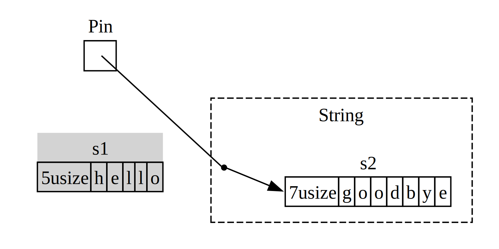

## A Closer Look at the Traits for Async

<!-- Old headings. Do not remove or links may break. -->
<a id="digging-into-the-traits-for-async"></a>

Throughout the chapter, we’ve used the `Future`, `Pin`, `Unpin`, `Stream`, and
`StreamExt` traits in various ways. So far, though, we’ve avoided getting too
far into the details of how they work or how they fit together, which is fine
most of the time for your day-to-day Rust work. Sometimes, though, you’ll
encounter situations where you’ll need to understand a few more of these
details. In this section, we’ll dig in just enough to help in those scenarios,
still leaving the _really_ deep dive for other documentation.

<!-- Old headings. Do not remove or links may break. -->
<a id="future"></a>

### The `Future` Trait

Let’s start by taking a closer look at how the `Future` trait works. Here’s how
Rust defines it:

```rust
use std::pin::Pin;
use std::task::{Context, Poll};

pub trait Future {
    type Output;

    fn poll(self: Pin<&mut Self>, cx: &mut Context<'_>) -> Poll<Self::Output>;
}
```

That trait definition includes a bunch of new types and also some syntax we
haven’t seen before, so let’s walk through the definition piece by piece.

First, `Future`’s associated type `Output` says what the future resolves to.
This is analogous to the `Item` associated type for the `Iterator` trait.
Second, `Future` also has the `poll` method, which takes a special `Pin`
reference for its `self` parameter and a mutable reference to a `Context` type,
and returns a `Poll<Self::Output>`. We’ll talk more about `Pin` and
`Context` in a moment. For now, let’s focus on what the method returns,
the `Poll` type:

```rust
enum Poll<T> {
    Ready(T),
    Pending,
}
```

This `Poll` type is similar to an `Option`. It has one variant that has a value,
`Ready(T)`, and one which does not, `Pending`. It means something quite
different, though! The `Pending` variant indicates that the future still has
work to do, so the caller will need to check again later. The `Ready` variant
indicates that the `Future` has finished its work and the `T` value is
available.

> Note: With most futures, the caller should not call `poll` again after the
> future has returned `Ready`. Many futures will panic if polled again after
> becoming ready. Futures that are safe to poll again will say so explicitly in
> their documentation. This is similar to how `Iterator::next` behaves.

When you see code that uses `await`, Rust compiles it under the hood to code
that calls `poll`. If you look back at Listing 17-4, where we printed out the
page title for a single URL once it resolved, Rust compiles it into something
kind of (although not exactly) like this:

```rust,ignore
match page_title(url).poll() {
    Ready(page_title) => match page_title {
        Some(title) => println!("The title for {url} was {title}"),
        None => println!("{url} had no title"),
    }
    Pending => {
        // But what goes here?
    }
}
```

What should we do when the `Future` is still `Pending`? We need some way to try
again, and again, and again, until the future is finally ready. In other words,
we need a loop:

```rust,ignore
let mut page_title_fut = page_title(url);
loop {
    match page_title_fut.poll() {
        Ready(value) => match page_title {
            Some(title) => println!("The title for {url} was {title}"),
            None => println!("{url} had no title"),
        }
        Pending => {
            // continue
        }
    }
}
```

If Rust compiled it to exactly that code, though, every `await` would be
blocking—exactly the opposite of what we were going for! Instead, Rust makes
sure that the loop can hand off control to something that can pause work on this
future to work on other futures and then check this one again later. As we’ve
seen, that something is an async runtime, and this scheduling and coordination
work is one of its main jobs.

Earlier in the chapter, we described waiting on `rx.recv`. The `recv` call
returns a future, and awaiting the future polls it. We noted that a runtime will
pause the future until it’s ready with either `Some(message)` or `None` when the
channel closes. With our deeper understanding of the `Future` trait, and
specifically `Future::poll`, we can see how that works. The runtime knows the
future isn’t ready when it returns `Poll::Pending`. Conversely, the runtime
knows the future _is_ ready and advances it when `poll` returns
`Poll::Ready(Some(message))` or `Poll::Ready(None)`.

The exact details of how a runtime does that are beyond the scope of this book,
but the key is to see the basic mechanics of futures: a runtime _polls_ each
future it is responsible for, putting the future back to sleep when it is not
yet ready.

<!-- Old headings. Do not remove or links may break. -->
<a id="pinning-and-the-pin-and-unpin-traits"></a>

### The `Pin` and `Unpin` Traits

When we introduced the idea of pinning while working on Listing 17-16, we ran
into a very gnarly error message. Here is the relevant part of it again:

<!-- manual-regeneration
cd listings/ch17-async-await/listing-17-16
cargo build
copy *only* the final `error` block from the errors
-->

```text
error[E0277]: `{async block@src/main.rs:10:23: 10:33}` cannot be unpinned
  --> src/main.rs:48:33
   |
48 |         trpl::join_all(futures).await;
   |                                 ^^^^^ the trait `Unpin` is not implemented for `{async block@src/main.rs:10:23: 10:33}`, which is required by `Box<{async block@src/main.rs:10:23: 10:33}>: Future`
   |
   = note: consider using the `pin!` macro
           consider using `Box::pin` if you need to access the pinned value outside of the current scope
   = note: required for `Box<{async block@src/main.rs:10:23: 10:33}>` to implement `Future`
note: required by a bound in `futures_util::future::join_all::JoinAll`
  --> file:///home/.cargo/registry/src/index.crates.io-6f17d22bba15001f/futures-util-0.3.30/src/future/join_all.rs:29:8
   |
27 | pub struct JoinAll<F>
   |            ------- required by a bound in this struct
28 | where
29 |     F: Future,
   |        ^^^^^^ required by this bound in `JoinAll`
```

This error message tells us not only that we need to pin the values but also why
pinning is required. The `trpl::join_all` function returns a struct called
`JoinAll`. That struct is generic over a type `F`, which is constrained to
implement the `Future` trait. Directly awaiting a future with `await` pins the
future implicitly. That’s why we don’t need to use `pin!` everywhere we want to
await futures.

However, we’re not directly awaiting a future here. Instead, we construct a new
future, `JoinAll`, by passing a collection of futures to the `join_all`
function. The signature for `join_all` requires that the types of the items in
the collection all implement the `Future` trait, and `Box<T>` implements
`Future` only if the `T` it wraps is a future that implements the `Unpin` trait.

That’s a lot to absorb! To really understand it, let’s we dive a little further
into how the `Future` trait actually works, in particular around _pinning_.

Look again at the definition of the `Future` trait:

```rust
use std::pin::Pin;
use std::task::{Context, Poll};

pub trait Future {
    type Output;

    // Required method
    fn poll(self: Pin<&mut Self>, cx: &mut Context<'_>) -> Poll<Self::Output>;
}
```

The `cx` parameter and its `Context` type are the key to how a runtime actually
knows when to check any given future while still being lazy. Again, the details
of how that works are beyond the scope of this chapter, and you generally only
need to think about this when writing a custom `Future` implementation. We’ll
focus instead on the type for `self`, as this is the first time we’ve seen a
method where `self` has a type annotation. A type annotation for `self` is works
like type annotations for other function parameters, but with two key
differences:

- It tells Rust what type `self` must be for the method to be called.

- It can’t be just any type. It’s restricted to the type on which the method is
  implemented, a reference or smart pointer to that type, or a `Pin` wrapping a
  reference to that type.

We’ll see more on this syntax in [Chapter 18][ch-18]<!-- ignore -->. For now,
it’s enough to know that if we want to poll a future to check whether it is
`Pending` or `Ready(Output)`, we need a `Pin`-wrapped mutable reference to the
type.

`Pin` is a wrapper for pointer-like types such as `&`, `&mut`, `Box`, and `Rc`.
(Technically, `Pin` works with types that implement the `Deref` or `DerefMut`
traits, but this is effectively equivalent to working only with pointers.) `Pin`
is not a pointer itself and doesn’t have any behavior of its own like `Rc` and
`Arc` do with reference counting; it’s purely a tool the compiler can use to
enforce constraints on pointer usage.

Recalling that `await` is implemented in terms of calls to `poll` starts to
explain the error message we saw earlier, but that was in terms of `Unpin`, not
`Pin`. So how exactly does `Pin` relate to  `Unpin`, and why does `Future` need
`self` to be in a `Pin` type to call `poll`?

Remember from earlier in this chapter a series of await points in a future get
compiled into a state machine, and the compiler makes sure that state machine
follows all of Rust’s normal rules around safety, including borrowing and
ownership. To make that work, Rust looks at what data is needed between one
await point and either the next await point or the end of the async block. It
then creates a corresponding variant in the compiled state machine. Each variant
gets the access it needs to the data that will be used in that section of the
source code, whether by taking ownership of that data or by getting a mutable or
immutable reference to it.

So far, so good: if we get anything wrong about the ownership or references in a
given async block, the borrow checker will tell us. When we want to move around
the future that corresponds to that block—like moving it into a `Vec` to pass to
`join_all`—things get trickier.

When we move a future—whether by pushing it into a data structure to use as an
iterator with `join_all` or by returning it from a function—that actually means
moving the state machine Rust creates for us. And unlike most other types in
Rust, the futures Rust creates for async blocks can end up with references to
themselves in the fields of any given variant, as shown in the simplified illustration in Figure 17-4.

<figure>


<figcaption>Figure 17-4: A self-referential data type.</figcaption>

</figure>

By default, though, any object that has a reference to itself is unsafe to move,
because references always point to the actual memory address of whatever they
refer to (see Figure 17-5). If you move the data structure itself, those
internal references will be left pointing to the old location. However, that
memory location is now invalid. For one thing, its value will not be updated
when you make changes to the data structure. For another—more important—thing,
the computer is now free to reuse that memory for other purposes! You could end
up reading completely unrelated data later.

<figure>


<figcaption>Figure 17-5: The unsafe result of moving a self-referential data type</figcaption>

</figure>

Theoretically, the Rust compiler could try to update every reference to an
object whenever it gets moved, but that could add a lot of performance overhead,
especially if a whole web of references needs updating. If we could instead make
sure the data structure in question _doesn’t move in memory_, we wouldn’t have
to update any references. This is exactly what Rust’s borrow checker requires:
in safe code, it prevents you from moving any item with an active reference to
it.

`Pin` builds on that to give us the exact guarantee we need. When we _pin_ a
value by wrapping a pointer to that value in `Pin`, it can no longer move. Thus,
if you have `Pin<Box<SomeType>>`, you actually pin the `SomeType` value, _not_
the `Box` pointer. Figure 17-6 illustrates this process.

<figure>


<figcaption>Figure 17-6: Pinning a `Box` that points to a self-referential future type.</figcaption>

</figure>

In fact, the `Box` pointer can still move around freely. Remember: we care about
making sure the data ultimately being referenced stays in place. If a pointer
moves around, _but the data it points to is in the same place_, as in Figure
17-7, there’s no potential problem. As an independent exercise, look at the docs
for the types as well as the `std::pin` module and try to work out how you’d do
this with a `Pin` wrapping a `Box`.) The key is that the self-referential type
itself cannot move, because it is still pinned.

<figure>


<figcaption>Figure 17-7: Moving a `Box` which points to a self-referential future type.</figcaption>

</figure>

However, most types are perfectly safe to move around, even if they happen to be
behind a `Pin` pointer. We only need to think about pinning when items have
internal references. Primitive values such as numbers and Booleans are safe
since they obviously don’t have any internal references, so they’re obviously
safe. Neither do most types you normally work with in Rust. You can move around
a `Vec`, for example, without worrying. Given only what we have seen so far, if
you have a `Pin<Vec<String>>`, you’d have to do everything via the safe but
restrictive APIs provided by `Pin`, even though a `Vec<String>` is always safe
to move if there are no other references to it. We need a way to tell the
compiler that it’s fine to move items around in cases like this—and there’s
where `Unpin` comes into play.

`Unpin` is a marker trait, similar to the `Send` and `Sync` traits we saw in
Chapter 16, and thus has no functionality of its own. Marker traits exist only
to tell the compiler it’s safe to use the type implementing a given trait in a
particular context. `Unpin` informs the compiler that a given type does _not_
need to uphold any guarantees about whether the value in question can be safely
moved.

<!--
  The inline `<code>` in the next block is to allow the inline `<em>` inside it,
  matching what NoStarch does style-wise, and emphasizing within the text here
  that it is something distinct from a normal type.
-->

Just as with `Send` and `Sync`, the compiler implements `Unpin` automatically
for all types where it can prove it is safe. A special case, again similar to
`Send` and `Sync`, is where `Unpin` is _not_ implemented for a type. The
notation for this is <code>impl !Unpin for <em>SomeType</em></code>, where
<code><em>SomeType</em></code> is the name of a type that _does_ need to uphold
those guarantees to be safe whenever a pointer to that type is used in a `Pin`.

In other words, there are two things to keep in mind about the relationship
between `Pin` and `Unpin`. First, `Unpin` is the “normal” case, and `!Unpin` is
the special case. Second, whether a type implements `Unpin` or `!Unpin` _only_
matters when you’re using a pinned pointer to that type like <code>Pin<&mut
<em>SomeType</em>></code>.

To make that concrete, think about a `String`: it has a length and the Unicode
characters that make it up. We can wrap a `String` in `Pin`, as seen in Figure
17-8. However, `String` automatically implements `Unpin`, as do most other types
in Rust.

<figure>


<figcaption>Figure 17-8: Pinning a `String`; the dotted line indicates that the `String` implements the `Unpin` trait, and thus is not pinned.</figcaption>

</figure>

As a result, we can do things that would be illegal if `String` implemented
`!Unpin` instead, such as replacing one string with another at the exact same
location in memory as in Figure 17-9. This doesn’t violate the `Pin` contract,
because `String` has no internal references that make it unsafe to move around!
That is precisely why it implements `Unpin` rather than `!Unpin`.

<figure>



<figcaption>Figure 17-9: Replacing the `String` with an entirely different `String` in memory.</figcaption>

</figure>

Now we know enough to understand the errors reported for that `join_all` call
from back in Listing 17-17. We originally tried to move the futures produced by
async blocks into a `Vec<Box<dyn Future<Output = ()>>>`, but as we’ve seen,
those futures may have internal references, so they don’t implement `Unpin`.
They need to be pinned, and then we can pass the `Pin` type into the `Vec`,
confident that the underlying data in the futures will _not_ be moved.

`Pin` and `Unpin` are mostly important for building lower-level libraries, or
when you’re building a runtime itself, rather than for day-to-day Rust code.
When you see these traits in error messages, though, now you’ll have a better
idea of how to fix your code!

> Note: This combination of `Pin` and `Unpin` makes it possible to safely
> implement a whole class of complex types in Rust that would otherwise prove
> challenging because they’re self-referential. Types that require `Pin` show up
> most commonly in async Rust today, but every once in a while, you might see
> them in other contexts, too.
>
> The specifics of how `Pin` and `Unpin` work, and the rules they’re required
> to uphold, are covered extensively in the API documentation for `std::pin`, so
> if you’re interested in learning more, that’s a great place to start.
>
> If you want to understand how things work under the hood in even more detail,
> see Chapters [2][under-the-hood] and [4][pinning] of [_Asynchronous
> Programming in Rust_][async-book].

### The Stream Trait

Now that you have a deeper grasp on the `Future`, `Pin`, and `Unpin` traits, we
can turn our attention to the `Stream` trait. As you learned earlier in the
chapter, streams are similar to asynchronous iterators. Unlike `Iterator` and
`Future`, however, `Stream` has no definition in the standard library as of this
writing, but there _is_ a very common definition from the `futures` crate used
throughout the ecosystem.

Let’s review the definitions of the `Iterator` and `Future` traits before
looking at how a `Stream` trait might merge them together. From `Iterator`, we
have the idea of a sequence: its `next` method provides an `Option<Self::Item>`.
From `Future`, we have the idea of readiness over time: its `poll` method
provides a `Poll<Self::Output>`. To represent a sequence of items that become
ready over time, we define a `Stream` trait that puts those features together:

```rust
use std::pin::Pin;
use std::task::{Context, Poll};

trait Stream {
    type Item;

    fn poll_next(
        self: Pin<&mut Self>,
        cx: &mut Context<'_>
    ) -> Poll<Option<Self::Item>>;
}
```

The `Stream` trait defines an associated type called `Item` for the type of the items
produced by the stream. This is similar to `Iterator`, where there may be zero to
many items, and unlike `Future`, where there is always a single `Output`,
even if it’s the unit type `()`.

`Stream` also defines a method to get those items. We call it `poll_next`, to
make it clear that it polls in the same way `Future::poll` does and produces a
sequence of items in the same way `Iterator::next` does. Its return type
combines `Poll` with `Option`. The outer type is `Poll`, because it has to be
checked for readiness, just as a future does. The inner type is `Option`,
because it needs to signal whether there are more messages, just as an iterator
does.

Something very similar to this definition will likely end up as part of Rust’s
standard library. In the meantime, it’s part of the toolkit of most runtimes, so
you can rely on it, and everything we cover next should generally apply!

In the example we saw in the section on streaming, though, we didn’t use
`poll_next` _or_ `Stream`, but instead used `next` and `StreamExt`. We _could_
work directly in terms of the `poll_next` API by hand-writing our own `Stream`
state machines, of course, just as we _could_ work with futures directly via
their `poll` method. Using `await` is much nicer, though, and the `StreamExt`
trait supplies the `next` method so we can do just that.

```rust
{{#rustdoc_include ../listings/ch17-async-await/no-listing-stream-ext/src/lib.rs:here}}
```

<!--
TODO: update this if/when tokio/etc. update their MSRV and switch to using async functions
in traits, since the lack thereof is the reason they do not yet have this.
-->

> Note: The actual definition we used earlier in the chapter looks slightly
> different than this, because it supports versions of Rust that did not yet
> support using async functions in traits. As a result, it looks like this:
>
> ```rust,ignore
> fn next(&mut self) -> Next<'_, Self> where Self: Unpin;
> ```
>
> That `Next` type is a `struct` that implements `Future` and allows us to name
> the lifetime of the reference to `self` with `Next<'_, Self>`, so that `await`
> can work with this method.

The `StreamExt` trait is also the home of all the interesting methods available
to use with streams. `StreamExt` is automatically implemented for every type
that implements `Stream`, but these traits are defined separately to enable the
community to iterate on convenience APIs without affecting the foundational
trait.

In the version of `StreamExt` used in the `trpl` crate, the trait not only
defines the `next` method but also supplies a default implementation of `next`
that correctly handles the details of calling `Stream::poll_next`. This means
that even when you need to write your own streaming data type, you _only_ have
to implement `Stream`, and then anyone who uses your data type can use
`StreamExt` and its methods with it automatically.

That’s all we’re going to cover for the lower-level details on these traits. To
wrap up, let’s consider how futures (including streams), tasks, and threads all
fit together!

[ch-18]: 00-oop.html
[async-book]: https://rust-lang.github.io/async-book/
[under-the-hood]: https://rust-lang.github.io/async-book/02_execution/01_chapter.html
[pinning]: https://rust-lang.github.io/async-book/04_pinning/01_chapter.html
[first-async]: ch17-01-futures-and-syntax.html#our-first-async-program
[any-number-futures]: ch17-03-more-futures.html#working-with-any-number-of-futures
