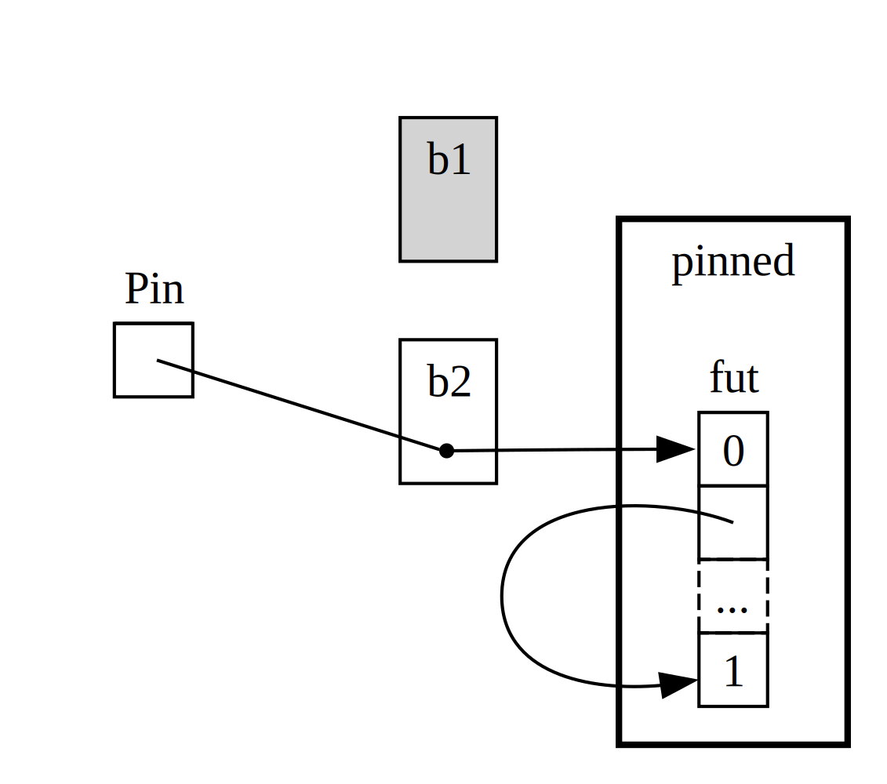

## A Closer Look at Traits for Async

<!-- Old headings. Please do not delete, links may break. -->

<a id="digging-into-the-traits-for-async"></a>

Throughout this chapter, we've used the `Future`, `Pin`, `Unpin`, `Stream`, and `StreamExt` traits in various ways. So far, we haven't delved much into how they work or fit together; for most of your daily Rust work, that's fine. But sometimes, you'll encounter situations where you need to understand a bit more detail. In this section, we'll go deep enough to help in those scenarios; for a _really_ in-depth look, we'll leave that to other documentation.

<!-- Old headings. Please do not delete, links may break. -->

<a id="future"></a>

### The `Future` Trait

First, let's take a closer look at how the `Future` trait works. Rust defines it like this:

```rust
use std::pin::Pin;
use std::task::{Context, Poll};

pub trait Future {
    type Output;

    fn poll(self: Pin<&mut Self>, cx: &mut Context<'_>) -> Poll<Self::Output>;
}
```

This trait definition contains a number of new types and some syntax we haven't seen before, so let's break it down piece by piece.

First, the associated type `Output` of `Future` specifies what the future will resolve to. This is similar to the `Item` associated type of the `Iterator` trait. Second, `Future` also has a special `poll` method that takes a `Pin` reference and a mutable reference to a `Context`, and returns a `Poll<Self::Output>`. We'll get to `Pin` and `Context` in a moment. For now, let's focus on the `Poll` type returned by the method:

```rust
enum Poll<T> {
    Ready(T),
    Pending,
}
```

This `Poll` type is somewhat like an `Option`. It has a `Ready(T)` variant with a value, and a `Pending` variant without one. But `Poll` means something quite different from `Option`! The `Pending` variant indicates that the future still has work to do and the caller should check back later. The `Ready` variant means the future is done and the value `T` is ready.

> Note: For most futures, you should not call `poll` again after the future returns `Ready`. Many futures will panic if polled again after being ready. Futures that can be polled again will state so explicitly in their documentation. This is similar to the behavior of `Iterator::next`.

When you use `await` in your code, Rust compiles it down to code that calls `poll` behind the scenes. If you look at the example in 17-4 where we printed a URL's title when it resolved, Rust compiles it to something roughly (though not exactly) like this:

```rust,ignore
match page_title(url).poll() {
    Ready(page_title) => match page_title {
        Some(title) => println!("The title for {url} was {title}"),
        None => println!("{url} had no title"),
    }
    Pending => {
        // But what happens here?
    }
}
```

If the future is still `Pending`, what should we do? We need a way to try again—so we need a loop:

```rust,ignore
let mut page_title_fut = page_title(url);
loop {
    match page_title_fut.poll() {
        Ready(value) => match page_title {
            Some(title) => println!("The title for {url} was {title}"),
            None => println!("{url} had no title"),
        }
        Pending => {
            // keep going
        }
    }
}
```

But if Rust compiled it exactly like this, every `await` point would be blocking—the exact opposite of what we want! Instead, Rust allows the loop to yield control to something else that can work on another future and then come back to check this one again. As we've seen, that something is an async runtime, and this scheduling and coordination is one of its main jobs.

Earlier in the chapter, we talked about waiting for `rx.recv`. The `recv` call returns a future, and awaiting the future polls it. The runtime will suspend the future until it's ready, and when the channel closes, it will return either `Some(message)` or `None`. Now that we understand the `Future` trait and especially `Future::poll` better, we can see how this works. The runtime knows the future isn't ready when `poll` returns `Poll::Pending`. Conversely, when `poll` returns `Poll::Ready(Some(message))` or `Poll::Ready(None)`, the future is ready and the runtime can proceed.

Exactly how a runtime does this is outside the scope of this book, but it's important to see the basic mechanics of futures: the runtime _polls_ each future it's responsible for, and if the future isn't ready yet, it puts it back to sleep.

<!-- Old headings. Please do not delete, links may break. -->

<a id="pinning-and-the-pin-and-unpin-traits"></a>

### The `Pin` and `Unpin` Traits

When we introduced the concept of pinning in Listing 17-16, we encountered a rather complex error message. Here's the relevant part again:

<!-- manual-regeneration
cd listings/ch17-async-await/listing-17-16
cargo build
copy *only* the final `error` block from the errors
-->

```text
error[E0277]: `{async block@src/main.rs:10:23: 10:33}` cannot be unpinned
  --> src/main.rs:48:33
   |
48 |         trpl::join_all(futures).await;
   |                                 ^^^^^ the trait `Unpin` is not implemented for `{async block@src/main.rs:10:23: 10:33}`
   |
   = note: consider using the `pin!` macro
           consider using `Box::pin` if you need to access the pinned value outside of the current scope
   = note: required for `Box<{async block@src/main.rs:10:23: 10:33}>` to implement `Future`
note: required by a bound in `futures_util::future::join_all::JoinAll`
  --> file:///home/.cargo/registry/src/index.crates.io-1949cf8c6b5b557f/futures-util-0.3.30/src/future/join_all.rs:29:8
   |
27 | pub struct JoinAll<F>
   |            ------- required by a bound in this struct
28 | where
29 |     F: Future,
   |        ^^^^^^ required by this bound in `JoinAll`
```

This error message not only tells us that we need to pin values, but also why pinning is necessary. The `trpl::join_all` function returns a struct called `JoinAll`. This struct is generic over a type `F`, which must implement the `Future` trait. Awaiting a future directly implicitly pins it, so you don't need to use `pin!` everywhere you want to await a future.

But here, we're not awaiting a future directly. Instead, we're giving a collection of futures to `join_all`, which creates a new future called `JoinAll`. The signature of `join_all` requires that the items in the collection implement `Future`, and `Box<T>` only implements `Future` if the wrapped `T` future implements the `Unpin` trait.

That's a lot of information! To really understand, let's look a bit more closely at how the _pinning_ part of the `Future` trait works.

Look again at the definition of the `Future` trait:

```rust
use std::pin::Pin;
use std::task::{Context, Poll};

pub trait Future {
    type Output;

    // Required method
    fn poll(self: Pin<&mut Self>, cx: &mut Context<'_>) -> Poll<Self::Output>;
}
```

The `cx` parameter and its `Context` type are the key to how a runtime knows when to check any given future. The details of how this works are outside the scope of this section and usually only matter when writing a custom `Future` implementation. Instead, let's focus on the syntax where a method takes a type annotation for `self` for the first time. The type annotation for `self` works like other function parameter type annotations, but with two important differences:

- It tells Rust what type `self` must be for the method to be called.
- It can't be just any type. It can only be the type the method is implemented for, a reference to that type, a smart pointer, or a `Pin` wrapping a reference to that type.

You'll see more of this syntax in [Chapter 18][ch-18]<!-- ignore -->. For now, what you need to know is that to check whether a future is `Pending` or `Ready(Output)`, you need a mutable reference to the type wrapped in `Pin`.

`Pin` is a wrapper for pointer-like types such as `&`, `&mut`, `Box`, and `Rc`. (Technically, `Pin` works with types that implement the `Deref` or `DerefMut` traits, but in practice, this means pointers.) `Pin` itself is not a pointer and doesn't have its own behavior like `Rc` or `Arc`; it's just a tool to help the compiler enforce restrictions on pointer usage.

Remembering that `await` is implemented behind the scenes with `poll` calls helps explain the error message we saw earlier; but that error was about `Unpin`, not `Pin`. So, how exactly is `Pin` related to `Unpin`, and why does the `Future`'s `poll` call require `self` to be of type `Pin`?

Earlier in this section, we said that await points in a future are compiled into a state machine, and the compiler ensures that this state machine follows Rust's usual safety rules (ownership, borrowing). To do this, Rust looks at what data is needed between one await point and the next, or the end of the async block. Then, it creates a corresponding variant in the compiled state machine. Each variant gets access to the data needed at that point in the source code, either by taking ownership or by borrowing mutably or immutably.

So far, so good: if you make a mistake with ownership or references in an async block, the borrow checker will catch it. But when you want to move the future itself—say, by putting it in a `Vec` and using `join_all`, or by returning it from a function—things get tricky.

Moving a future—whether putting it in a data structure or returning it from a function—actually means moving the state machine that Rust created for you. And unlike most types in Rust, futures compiled from async blocks can contain references to themselves in the fields of any variant (see Figure 17-4).

<figure>


<figcaption>Figure 17-4: A self-referential data type.</figcaption>

</figure>

But any self-referential object is unsafe to move by default, because references always point to the actual memory address they refer to (see Figure 17-5). If you move the data structure and the internal references still point to the old location, that memory is now invalid. Changes to that location won't affect the new data structure, and more importantly, the computer might use that memory for something else! You could end up reading completely unrelated data later.

<figure>


<figcaption>Figure 17-5: The unsafe result of moving a self-referential data type.</figcaption>

</figure>

In theory, the Rust compiler could try to update all references when an object is moved, but that would be a big performance hit, especially if there's a web of references. Instead, if we ensure the relevant data structure is _not moved in memory_, we don't need to update the references. Rust's borrow checker requires exactly this: in safe code, any item with an active reference cannot be moved.

`Pin` gives us exactly the guarantee we need. By wrapping a pointer to a value in `Pin`, we _pin_ the value so it can't be moved. So, if you have a `Pin<Box<SomeType>>`, you're actually pinning the value of `SomeType`, not the _Box_ pointer. Figure 17-6 shows this.

<figure>


<figcaption>Figure 17-6: Pinning a Box pointing to a self-referential future type.</figcaption>

</figure>

In fact, the Box pointer itself can still be moved freely. What's important is that the data it points to stays in the same place. As long as the pointer moves but the data it points to doesn't (see Figure 17-7), that's fine. (On your own, try looking at the documentation for types and the `std::pin` module to see how you can do this by wrapping a `Box` in a `Pin`.) The key point is that the self-referential type itself can't be moved, because it's still pinned.

<figure>



<figcaption>Figure 17-7: Moving a Box pointing to a self-referential future type.</figcaption>

</figure>

However, most types are perfectly safe to move even if they're wrapped in a pin. We only need to think about pinning for types with internal references. Primitive values like numbers and booleans are safe because they don't have internal references. Most types you use in Rust don't have internal references either. For example, you can move a `Vec` however you like. If you had a `Pin<Vec<String>>`, you'd have to use the safe but restrictive API provided by `Pin`, but moving a `Vec<String>` is always safe if there are no other references. We need a way to tell the compiler that it's okay to move items in these cases—this is where `Unpin` comes in.

`Unpin` is a marker trait, like the `Send` and `Sync` traits we saw in Chapter 16, and it doesn't do anything on its own. Marker traits exist only to tell the compiler that a type is safe to use in a certain context. `Unpin` tells the compiler that it's okay to move the type in question.

<!--
  The inline `<code>` in the block below is just to emphasize the `<em>` inside, per NoStarch style.
-->

Just like `Send` and `Sync`, the compiler automatically implements `Unpin` for all types it can prove are safe. The special case, as with `Send` and `Sync`, is when a type does _not_ implement `Unpin`. This is shown as <code>impl !Unpin for <em>SomeType</em></code>; here, <code><em>SomeType</em></code> is a type that needs to provide these guarantees to be safe when used with a pointer.

So, keep two things in mind about the relationship between `Pin` and `Unpin`. First, `Unpin` is the "normal" case, and `!Unpin` is the special case. Second, whether a type implements `Unpin` or `!Unpin` only matters when you use a pointer wrapped in `Pin` to that type, like <code>Pin<&mut <em>SomeType</em>></code>.

To make this concrete, consider a `String`: it has a length and characters. We can wrap a `String` in a `Pin` (see Figure 17-8). But `String` automatically implements `Unpin`, as do most types in Rust.

<figure>


<figcaption>Figure 17-8: Pinning a `String`; the dashed line shows that `String` implements `Unpin` and thus is not actually pinned.</figcaption>

</figure>

As a result, we can do things that would be forbidden if `String` implemented `!Unpin`, like replacing a string in memory with a completely different string (see Figure 17-9). This doesn't violate the `Pin` contract, because `String` doesn't have internal references that would make moving it unsafe! That's exactly why it implements `Unpin`, not `!Unpin`.

<figure>


<figcaption>Figure 17-9: Replacing a `String` in memory with a completely different `String`.</figcaption>

</figure>

Now, we know enough to understand the errors reported for the `join_all` call in 17-17. We tried to move futures produced from async blocks into a `Vec<Box<dyn Future<Output = ()>>>`, but as we've seen, these futures may have internal references, so they don't implement `Unpin`. We need to pin them, and then put the `Pin` type into the `Vec`, so the underlying data in the futures is _not moved_.

`Pin` and `Unpin` mostly matter when building low-level libraries or a runtime; you usually don't need them in everyday Rust code. But when you see these traits in error messages, you'll now have a better idea of how to fix your code!

> Note: This combination of `Pin` and `Unpin` makes it possible to safely implement complex types in Rust that would otherwise be difficult because they're self-referential. Types that require pinning are most common in async Rust today, but you may see them in other contexts as well.
>
> The details of how `Pin` and `Unpin` work and the rules they must follow are explained in detail in the `std::pin` API documentation; start there if you want to learn more.
>
> For an even deeper understanding, see Chapters [2.][under-the-hood] and [4.][pinning] of the [_Asynchronous Programming in Rust_][async-book] book.

### The `Stream` Trait

Now that you have a better understanding of the `Future`, `Pin`, and `Unpin` traits, let's focus on the `Stream` trait. As you learned earlier in the chapter, streams are like asynchronous iterators. However, unlike `Iterator` and `Future`, there is currently no definition of `Stream` in the standard library; but a widely used definition exists in the `futures` crate.

Let's review the definitions of the `Iterator` and `Future` traits, then see how a `Stream` trait can combine them. From `Iterator`, we get the idea of a sequence: the `next` method returns an `Option<Self::Item>`. From `Future`, we get the idea of readiness over time: the `poll` method returns a `Poll<Self::Output>`. To represent a sequence of items that become ready over time, we define a `Stream` trait that combines these features:

```rust
use std::pin::Pin;
use std::task::{Context, Poll};

trait Stream {
    type Item;

    fn poll_next(
        self: Pin<&mut Self>,
        cx: &mut Context<'_>
    ) -> Poll<Option<Self::Item>>;
}
```

The `Stream` trait defines an associated type called `Item`, which specifies the type of items the stream produces. This is similar to `Iterator`, since there can be zero or more items; in `Future`, there's always a single `Output`, even if it's the unit type `()`.

`Stream` also defines a method to get these items. We call it `poll_next`, to emphasize that it both polls like `Future::poll` and produces a sequence like `Iterator::next`. The return type combines `Poll` and `Option`. The outer type is `Poll`, because we need to check readiness like a future. The inner type is `Option`, because we need to indicate whether there are more messages, like an iterator.

Something very similar to this will likely become part of Rust's standard library. For now, it's available in most runtime toolkits, so you can use it with confidence, and what we say next will generally apply!

In the example we saw in the streams section, we didn't use `poll_next` or `Stream` directly; instead, we used `next` and `StreamExt`. Of course, we could have written our own stream state machines and worked directly with the `poll_next` API, just as we could work directly with the `poll` method for futures. But using `await` is much nicer, and the `StreamExt` trait provides the `next` method so we can do just that:

```rust
{{#rustdoc_include ../listings/ch17-async-await/no-listing-stream-ext/src/lib.rs:here}}
```

<!--
TODO: When crates like tokio update MSRV and support async functions in traits, update this section.
-->

> Note: The actual definition we used earlier in the chapter looks a bit different, because it also supports Rust versions that don't support async functions in traits. As a result, it looks like this:
>
> ```rust,ignore
> fn next(&mut self) -> Next<'_, Self> where Self: Unpin;
> ```
>
> This `Next` type is a `struct` that implements `Future`, and the lifetime in `Next<'_, Self>` allows us to name the reference's lifetime, so we can use `await` with this method.

The `StreamExt` trait is also home to all the interesting methods you can use with streams. `StreamExt` is automatically implemented for any type that implements `Stream`; but these traits are defined separately so the community can develop helper APIs without affecting the core trait.

In the version of `StreamExt` used in the `trpl` crate, the trait not only defines the `next` method, but also provides a default implementation of `next` that correctly calls `Stream::poll_next`. So, even if you write your own stream data type, you only need to implement `Stream`, and anyone using your type can automatically use `StreamExt` and its methods.

That's all we have to say about the low-level details of these traits. Finally, let's think about how futures (including streams), tasks, and threads fit together!

[ch-18]: ch18-00-oop.html
[async-book]: https://rust-lang.github.io/async-book/
[under-the-hood]: https://rust-lang.github.io/async-book/02_execution/01_chapter.html
[pinning]: https://rust-lang.github.io/async-book/04_pinning/01_chapter.html
[first-async]: ch17-01-futures-and-syntax.html#our-first-async-program
[any-number-futures]: ch17-03-more-futures.html#working-with-any-number-of-futures
