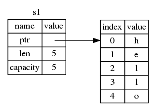
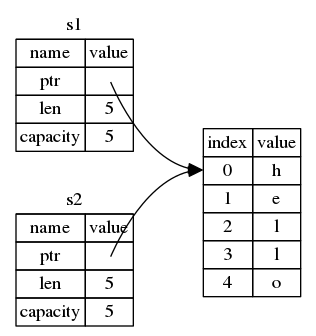
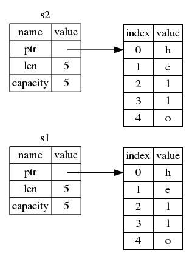
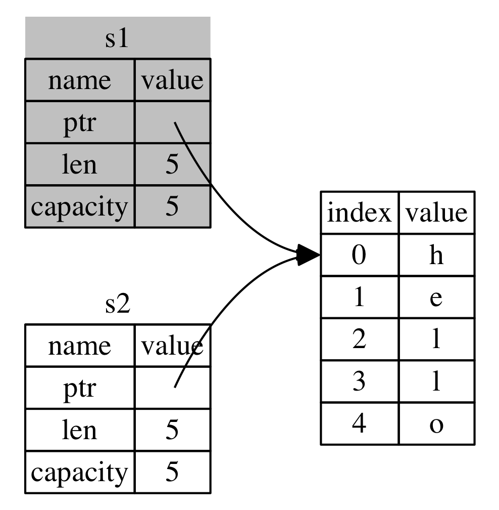

# Ownership

Rust’s central feature is called ‘ownership’. It is a feature that is
straightforward to explain, but has deep implications for the rest of the
language. 

Rust is committed to both safety and speed. One of the key tools for balancing
between them is “zero-cost abstractions”: the various abstractions in Rust do
not pose a global performance penalty. The ownership system is a prime example
of a zero-cost abstraction. All of the analysis we’ll talk about in this guide
is done at compile time. You do not pay any run-time cost for any of these
features.

However, this system does have a certain cost: learning curve. Many new
Rustaceans experience something we like to call ‘fighting with the borrow
checker’, where the Rust compiler refuses to compile a program that the author
thinks is valid. This can happen because the programmer isn’t used to thinking
carefully about ownership, or is thinking about it differently from the way
that Rust does. You probably will experience similar things at first. There is
good news, however: more experienced Rust developers report that once they work
with the rules of the ownership system for a period of time, they fight the
borrow checker less and less. Keep at it!

This chapter will give you a foundation for understanding the rest of the
language. To do so, we’re going to learn through examples, focused around a
very common data structure: strings.

## Variable binding scope

Let’s take a step back and look at the very basics again. Now that we’re past
basic syntax, we won’t include all of the `fn main() {` stuff in examples, so
if you’re following along, you will have to add that yourself. It will be a bit
more concise, letting us focus on the actual example.

Anyway, here it is:

```rust
let s = "hello";
```

This variable binding refers to a string literal. It’s valid from the point at
which it’s declared, until the end of the current _scope_. That is:

```rust
{                      // s is not valid here, it’s not yet in scope
    let s = "hello";   // s is valid from this point forward

    // do stuff with s
}                      // this scope is now over, and s is no longer valid
```

In other words, there are two important points in time here:

- When `s` comes ‘into scope’, it is valid.
- It remains so until it ‘goes out of scope’.

At this point, things are similar to other programming languages. Let’s build
on top of this understanding by introducing a new type: `String`.

## Strings

String literals are convenient, but they aren’t the only way that you use strings.
For one thing, they’re immutable. This will not work:

```rust,ignore
let mut s = "hello";

s = s + ", world!";
```

It gives us an error:

```text
4:10 error: binary operation `+` cannot be applied to type `&str` [E0369]
 s = s + ", world!";
     ^
```

No dice. Also, not every string is literal: what about taking user input and
storing it in a string?

For this, Rust has a second string type, `String`. You can create a `String` from
a string literal using the `from` function:

```rust
let s = String::from("hello");
```

The double colon (`::`) is a kind of scope operator, allowing us to namespace this
particular `from()` function under the `String` type itself, rather than using
some sort of name like `string_from()`.

This kind of string can be mutated:

```rust
let mut s = String::from("hello");

s = s + ", world!";
```

## Memory and allocation

So, what’s the difference here? Why can `String` be mutated, but literals
cannot? The difference comes down to how these two types deal with memory.

In the case of a string literal, because we know the contents of the string at
compile time, we can put the text of the string directly into the final
executable. This means that string literals are quite fast and efficient. But
these properties only come from its immutability; we can’t put an
arbitrary-sized blob of memory into the binary for each string!

With `String`, to support a mutable, growable string, we need to allocate an
un-known chunk of memory to hold the contents. This means two things:

1. The memory must be requested from the operating system at runtime.
2. We need a way of giving this memory back to the operating system when we’re
   done with our `String`.

That first part is done by us: when we call `String::from()`, its
implementation requests the memory it needs. This is pretty much universal in
programming languages.

The second case, however, is different. In languages with a garbage collector,
the GC handles that second case, and we, as the programmer, don’t need to think
about it. Languages without a garbage collector often force you to call a
second function to give the memory back. Part of the difficulty of using such
languages is knowing exactly when to do so. If we forget, we will leak memory.
If we do it too early, we will have an invalid variable. If we do it twice,
that’s a bug too. We need to pair exactly one ‘allocate’ with exactly one
‘free’.

Rust takes a different path. Remember our example? Here’s a version with
`String`:

```rust
{
    let s = String::from("hello"); // s is valid from this point forward

    // do stuff with s
}                                  // this scope is now over, and s is no longer valid
```

We have a natural point at which we can return the memory `String` needs back
to the operating system: when it goes out of scope! When a variable goes out of
scope, a special function is called. This function is called `drop()`, and it
is where the author of `String` can put the code to return the memory.

> Aside: This pattern is sometimes called “Resource Aquisition Is
> Initialization” in C++, or “RAII” for short. While they are very similar,
> Rust’s take on this concept has a number of differences, and so we don’t tend
> to use the same term. If you’re familliar with this idea, keep in mind that it
> is _roughly_ similar in Rust, but not identical.

This pattern has a profound impact on the way that Rust code is written. It may
seem obvious right now, but things can get tricky in more advanced situations!
Let’s go over the first one of those right now.

## Move

What would you expect this code to do?

```rust
let x = 5;
let y = x;
```

You might say “Make a copy of `5`.” That’d be correct! We now have two
bindings, `x` and `y`, and both equal `5`.

Now let’s look at `String`. What would you expect this code to do?

```rust
let s1 = String::from("hello");
let s2 = s1;
```

You might say “copy the `String`!” This is both correct and incorrect at the
same time. It does a _shallow_ copy of the `String`. What’s that mean? Well,
let’s take a look at what `String` looks like under the covers:



A `String` is made up of three parts: a pointer to the memory that holds the
contents of the string, a length, and a capacity. The length is how long the
`String`’s contents currently are. The capacity is the total amount of memory
the `String` has gotten from the operating system. The difference between
length and capacity matters, but not in this context, so don’t worry about it
too much if it doesn’t make sense, and just ignore the capacity.

> We’ve talked about two kinds of composite types: arrays and tuples. `String`
> is a third type: a `struct`, which we will cover the details of in the next
> chapter of the book. For now, thinking about `String` as a tuple is close
> enough.

When  we assign `s1` to `s2`, the `String` itself is copied. But not all kinds
of copying are the same. Many people draw distinctions between ‘shallow
copying’ and ‘deep copying’. We don’t use these terms in Rust. We instead say
that something is ‘moved’ or ‘cloned’. Assignment in Rust causes a ‘move’. In
other words, it looks like this:



_Not_ this:



When moving, Rust makes a copy of the data structure itself, the contents of
`s1` are copied, but if `s1` contains a reference, like it does in this case,
Rust will not copy the things that those references refer to.

There’s a problem here! Both `data` pointers are pointing to the same place.
Why is this a problem? Well, when `s2` goes out of scope, it will free the
memory that `data` points to. And then `s1` goes out of scope, and it will
_also_ try to free the memory that `data` points to! That’s bad.

So what’s the solution? Here, we stand at a crossroads. There are a few options
here. One would be to declare that assignment will also copy out any data. This
works, but is inefficient: what if our `String` contained a novel? Also, it
only works for memory. What if, instead of a `String`, we had a
`TcpConnection`? Opening and closing a network connection is very similar to
allocating and freeing memory. The solution that we could use there is to
create a callback, similar to `drop()`, that runs when we assign something.
That would work, but now, an `=` can run arbitrary code. That’s also not good,
and it doesn’t solve our efficiency concerns either.

Let’s take a step back: the root of the problem is that `s1` and `s2` both
think that they have control of the memory, and therefore, need to free it.
Instead of trying to copy the memory, we could say that `s1` is no longer
valid, and therefore, doesn’t need to free anything. This is in fact the
choice that Rust makes. Check it out what happens when you try to use `s1`
after `s2` is created:

```rust,ignore
let s1 = String::from("hello");
let s2 = s1;

println!("{}", s1);
```

You’ll get an error like this:

```text
5:22 error: use of moved value: `s1` [E0382]
println!("{}", s1);
               ^~
5:24 note: in this expansion of println! (defined in <std macros>)
3:11 note: `s1` moved here because it has type `collections::string::String`, which is moved by default
 let s2 = s1;
     ^~
```

We say that `s1` was _moved_ into `s2`. When a value moves, its data is copied,
but the original variable binding is no longer usable. That solves our problem:



With only `s2` valid, when it goes out of scope, it will free the memory, and we’re done!

## Ownership Rules

This leads us to the Ownership Rules:

> 1. Each value in Rust has a variable binding that’s called it’s ‘owner’.
> 2. There can only be one owner at a time.
> 3. When the owner goes out of scope, the value will be `drop()`ped.

Furthermore, there’s a design choice that’s implied by this: Rust will never
automatically create ‘deep’ copies of your data. Any automatic copying must be
inexpensive.

## Clone

But what if we _do_ want to deeply copy the `String`’s data, and not just the
`String` itself? There’s a common method for that: `clone()`. Here’s an example
of `clone()` in action:

```rust
let s1 = String::from("hello");
let s2 = s1.clone();

println!("{}", s1);
```

This will work just fine. Remember our diagram from before? In this case,
it _is_ doing this:


When you see a call to `clone()`, you know that some arbitrary code is being
executed, which may be expensive. It’s a visual indicator that something
different is going on here.

## Copy

There’s one last wrinkle that we haven’t talked about yet. This code works:

```rust
let x = 5;
let y = x;

println!("{}", x);
```

But why? We don’t have a call to `clone()`. Why didn’t `x` get moved into `y`?

For types that do not have any kind of complex storage requirements, like
integers, typing `clone()` is busy work. There’s no reason we would ever want
to prevent `x` from being valid here, as there’s no situation in which it’s
incorrect. In other words, there’s no difference between deep and shallow
copying here, so calling `clone()` wouldn’t do anything differently from the
usual shallow copying.

Rust has a special annotation that you can place on types, called `Copy`. If
a type is `Copy`, an older binding is still usable after assignment. Integers
are an example of such a type; most of the primitive types are `Copy`.

While we haven’t talked about how to mark a type as `Copy` yet, you might ask
yourself “what happens if we made `String` `Copy`?” The answer is, you cannot.
Remember `drop()`? Rust will not let you mark any type which has `drop()`
implemented as `Copy`. If you need to do something special when the value goes
out of scope, being `Copy` will be an error.

So what types are `Copy`? You can check the documentation for the given type to
be sure, but as a rule of thumb, any group of simple scalar values can be
Copy, but nothing that requires allocation or is some form of resource is copy.
And you can’t get it wrong: the compiler will throw an error if you try to use
a type that moves incorrectly, as we saw above.

## Ownership and functions

Passing a value to a function has similar semantics as assigning it:

```rust
fn main() {
    let s = String::from("hello");

    takes_ownership(s);

    let x = 5;

    makes_copy(x);
}

fn takes_ownership(some_string: String) {
    println!("{}", some_string);
}

fn makes_copy(some_integer: i32) {
    println!("{}", some_integer);
}
```

Passing a binding to a function will move or copy, just like assignment. Here’s
the same example, but with some annotations showing where things go into and
out of scope:

```rust
fn main() {
    let s = String::from("hello");  // s goes into scope.

    takes_ownership(s);             // s moves into the function...
                                    // ... and so is no longer valid here.
    let x = 5;                      // x goes into scope.

    makes_copy(x);                  // x would move into the function,
                                    // but i32 is Copy, so it’s okay to still
                                    // use x afterward.

} // Here, x goes out of scope, then s. But since s was moved, nothing special
  // happens.

fn takes_ownership(some_string: String) { // some_string comes into scope.
    println!("{}", some_string);
} // Here, some_string goes out of scope and `drop()` is called. The backing
  // memory is freed.

fn makes_copy(some_integer: i32) { // some_integer comes into scope.
    println!("{}", some_integer);
} // Here, some_integer goes out of scope.
```

Remember: If we tried to use `s` after the call to `takes_ownership()`, Rust
would throw a compile-time error! These static checks protect us from mistakes.

Returning values can also transfer ownership:

```rust
fn main() {
    let s1 = gives_ownership();

    let s2 = String::from("hello");

    let s3 = takes_and_gives_back(s2);
}

fn gives_ownership() -> String {
    let some_string = String::from("hello");

    some_string
}

fn takes_and_gives_back(a_string: String) -> String {

    a_string
}
```

With simililar annotations:

```rust
fn main() {
    let s1 = gives_ownership();         // gives_ownership moves its return
                                        // value into s1.

    let s2 = String::from("hello");     // s2 comes into scope

    let s3 = takes_and_gives_back(s2);  // s2 is moved into
                                        // takes_and_gives_back, which also
                                        // moves its return value into s3.
} // Here, s3 goes out of scope, and is dropped. s2 goes out of scope, but was
  // moved, so nothing happens. s1 goes out of scope, and is dropped.

fn gives_ownership() -> String {             // gives_ownership will move its
                                             // return value into the function
                                             // that calls it.

    let some_string = String::from("hello"); // some_string comes into scope.

    some_string                              // some_string is returned, and
                                             // moves out to the calling
                                             // function.
}

// takes_and_gives_back will both take a String and return one
fn takes_and_gives_back(a_string: String) -> String { // a_string comes into scope

    a_string  // a_string is returned, and moves out to the calling function
}
```

It’s the same pattern, every time: assigning something moves it, and when an
owner goes out of scope, if it hasn’t been moved, it will `drop()`.

This might seem a bit tedious, and it is. What if I want to let a function use
a value, but not take ownership? It’s quite annoying that anything I pass in
also needs passed back. Look at this function:

```rust
fn main() {
    let s1 = String::from("hello");

    let (s2, len) = calculate_length(s1);

    println!("The length of '{}' is {}.", s2, len);
}

fn calculate_length(s: String) -> (String, usize) {
    let length = s.len(); // len() returns the length of a String.

    (s, length)
}
```

This is too much ceremony: we have to use a tuple to give back the `String` as
well as the length. It’s a lot of work for a pattern that should be common.

Luckily for us, Rust has such a feature, and it’s what the next section is about.
